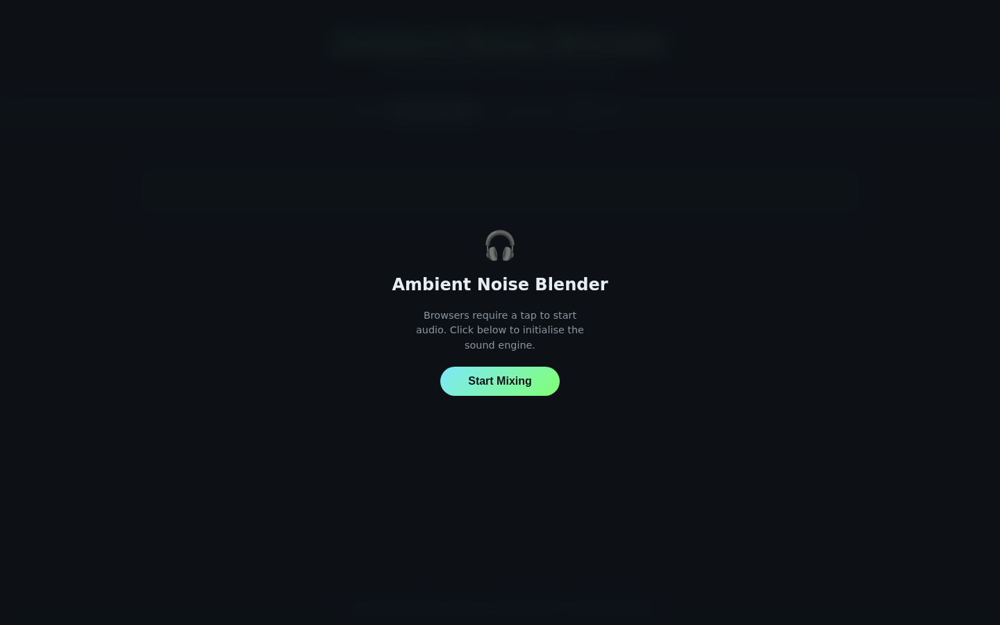
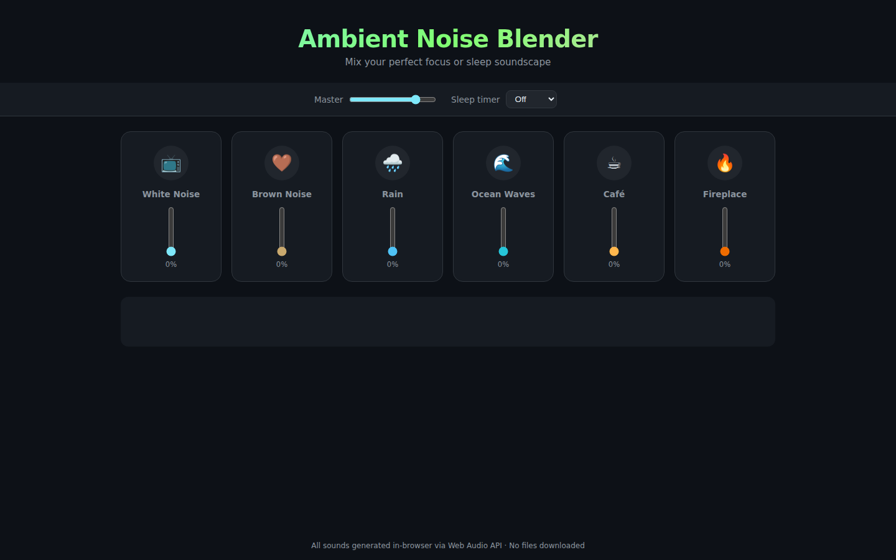

# Ambient Noise Blender

A browser-based soundscape mixer that blends 6 procedurally generated noise channels into your perfect focus or sleep environment. No audio files, no backend — everything runs in the browser via the Web Audio API.

| Start overlay | Mixer |
|:---:|:---:|
|  |  |

## Features

- **6 noise channels** — White Noise, Brown Noise, Rain, Ocean Waves, Café, Fireplace
- **Independent volume sliders** per channel with smooth gain curves
- **Master volume** control
- **Sleep timer** — 15 / 30 / 60 / 90 min with automatic 30-second fade-out
- **Live visualizer** — frequency spectrum bar display driven by a Web Audio AnalyserNode
- **Zero dependencies** — single HTML file, no assets downloaded

## How to run

```bash
cd ambient-noise
python3 -m http.server 8080
# open http://localhost:8080
```

ES modules require an HTTP server — `file://` URLs won't work.

## Stack

| Layer | Technology |
|---|---|
| Markup & Style | HTML5, CSS3 |
| Audio | Web Audio API (BufferSourceNode, BiquadFilterNode, OscillatorNode, AnalyserNode) |
| Visualizer | Canvas 2D |
| Server | `python -m http.server` (static) |

## Audio design notes

| Channel | Technique |
|---|---|
| White Noise | Random buffer looped |
| Brown Noise | Leaky-integrator filtered white noise |
| Rain | Double low-pass filtered white noise (~900 Hz cutoff) |
| Ocean Waves | Band-pass noise with LFO-modulated centre frequency |
| Café | High/low-pass filtered noise + random-pitch oscillator bursts |
| Fireplace | Low-pass brown noise + random click bursts for crackle |
