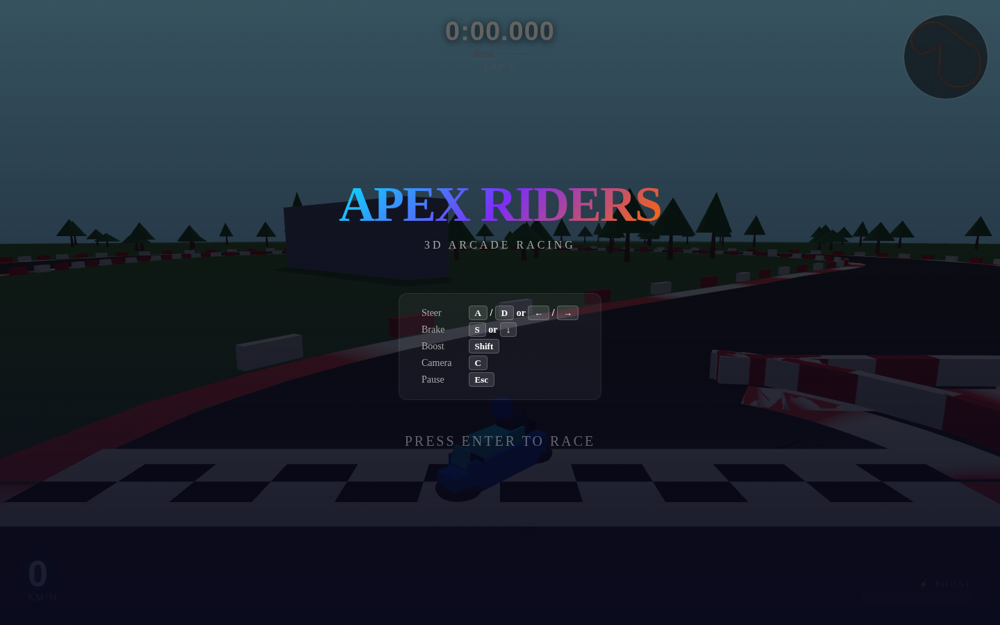
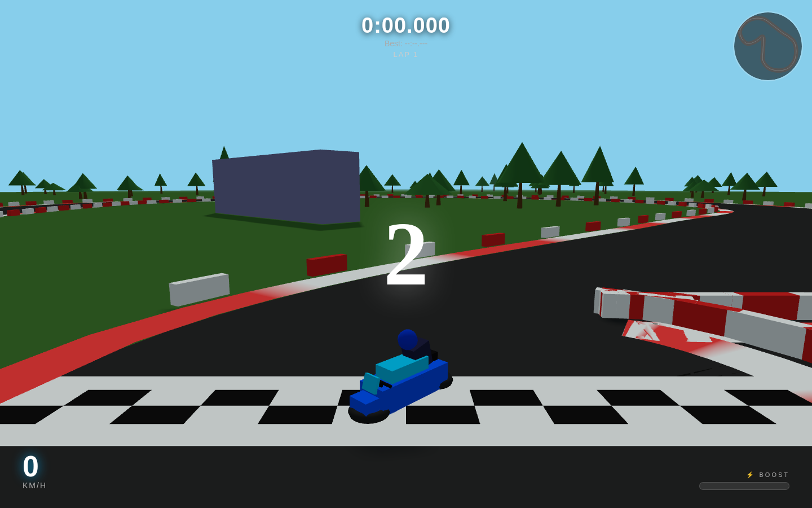
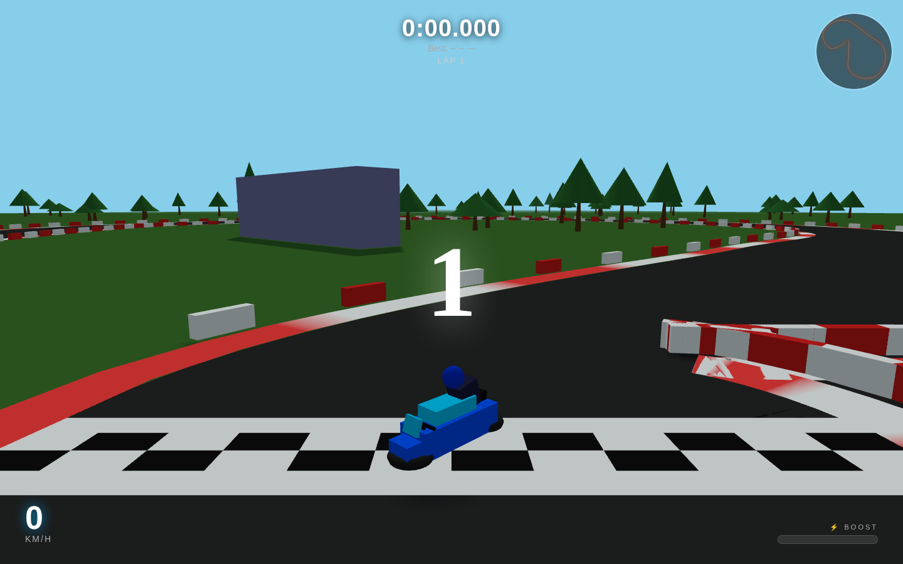

# Apex Riders

A 3D arcade motorcycle racing game that runs entirely in the browser. Lean into corners, drift to charge your boost meter, and chase lap times on **Circuit Apex** — a hand-designed road course with a hairpin, back straight, and chicane.

Built as the **Phase 0 prototype** from the Apex Riders PRD: the goal is to validate that the core handling feels fun before adding bikes, AI opponents, or multiplayer.

| Menu screen | Racing |
|:---:|:---:|
|  |  |

| Cornering | Drifting |
|:---:|:---:|
|  |  |

---

## How to run

```bash
cd apex-riders
npm install
npm run dev        # dev server at http://localhost:5173
# or
npm run build && npm run preview
```

**Requires WebGL2.** Works in all modern browsers (Chrome, Edge, Firefox, Safari 16+).

---

## Controls

| Action | Key |
|--------|-----|
| Steer left / right | `A`/`D` or `←`/`→` |
| Brake | `S` or `↓` |
| Boost (when meter is charged) | `Shift` |
| Cycle camera | `C` |
| Pause | `Esc` |
| Start / restart | `Enter` |

**Auto-accelerate is on by default** — just steer and brake. Drift by holding a hard steer at speed; your boost meter fills while sliding.

---

## Physics model

The bike uses an **arcade lean model** (not a physics sim):

- `heading` — which way the front wheel is pointing (yaw)
- `velocityHeading` — which way the bike is actually travelling
- In grip mode the two align quickly; in drift mode they diverge, creating the slide angle
- Turn rate scales with speed: nimble in hairpins, stable on straights
- Off-track surface slows you down; re-entry restores grip immediately
- Boost: granted by drifting, consumed on `Shift`; gives a 50 m/s top-speed burst

---

## Stack

| Layer | Tech |
|-------|------|
| Rendering | Three.js r169 (WebGL2) |
| Language | TypeScript 5 |
| Build | Vite 5 |
| Physics | Custom arcade model (no external physics engine) |
| UI / HUD | DOM + CSS overlay |

---

## Project structure

```
apex-riders/
├── index.html          HTML shell, HUD elements, overlay screens
├── src/
│   ├── main.ts         Entry point
│   ├── game.ts         Scene setup, game loop, state machine
│   ├── track.ts        Circuit geometry, mesh generation, spatial queries
│   ├── bike.ts         Bike model (procedural meshes) + arcade physics
│   ├── camera.ts       Chase / low / first-person camera with smoothing
│   ├── hud.ts          DOM HUD: speed, boost, timer, minimap
│   ├── input.ts        Keyboard input manager
│   └── utils.ts        Math helpers (angleDiff, lerp, formatTime…)
└── screenshots/
```

---

## Roadmap (per PRD)

- **Phase 0 ✅** — Single bike, single track, arcade physics, keyboard controls, lap timer
- **Phase 1** — 5–6 bikes, 3–4 tracks, touch + gamepad, quality settings, full HUD, `localStorage` progression
- **Phase 2** — AI opponents, Single Race + Grand Prix modes, adaptive music
- **Phase 3** — Real-time multiplayer (≤8 players), accounts, cosmetic monetization
