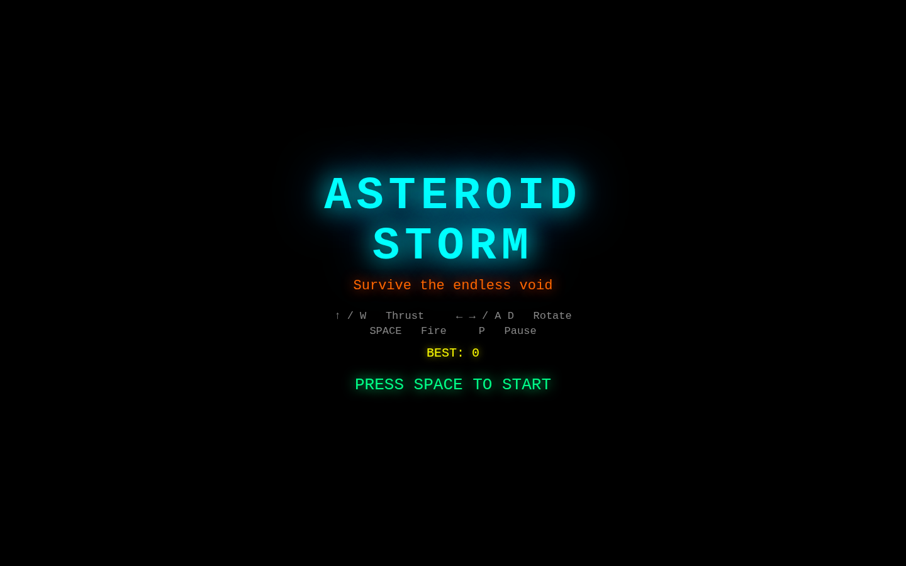
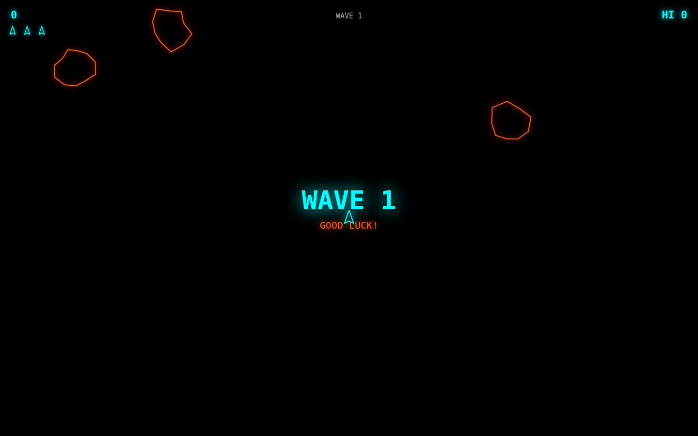
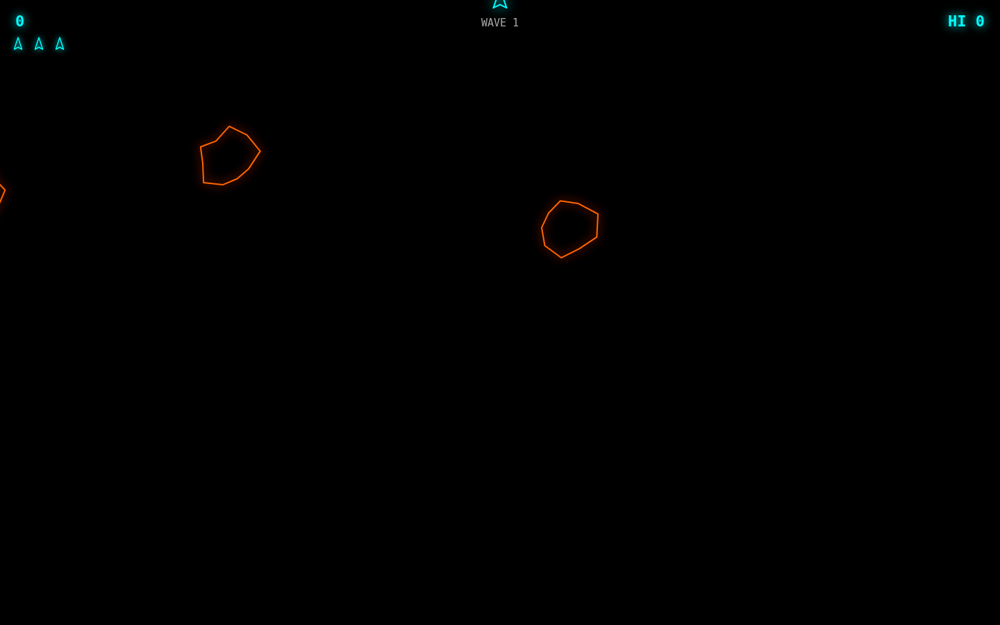

# Asteroid Storm

A modern neon arcade space shooter. Blast through endless waves of asteroids, collect power-ups, and post the highest score you can.

| Menu | Wave Announcement | Gameplay |
|:---:|:---:|:---:|
|  |  |  |

## How to Run

```bash
cd asteroid-storm
python3 -m http.server 8080
# Open http://localhost:8080
```

Requires an HTTP server — ES modules don't work over `file://`.

## Controls

| Key | Action |
|-----|--------|
| ↑ / W | Thrust |
| ← / A | Rotate left |
| → / D | Rotate right |
| Space / Z / X | Fire |
| P / Escape | Pause |

## Gameplay

- Asteroids split when shot: **Large → 2 Medium → 2 Small → destroyed**
- Screen wraps — objects leaving one edge reappear at the opposite
- Each wave adds more asteroids; they move faster as tiers increase
- Lose a life on collision; 3 lives total — respawn at center with brief invincibility

## Power-Ups

Power-ups drop randomly from destroyed large/medium asteroids and float briefly before disappearing.

| Icon | Name | Effect |
|------|------|--------|
| **S** (blue octagon) | Shield | Absorbs the next asteroid collision |
| **3** (magenta octagon) | Triple Shot | Fires a 3-bullet spread for 6 seconds |

## Scoring

| Target | Points |
|--------|--------|
| Large asteroid | 20 |
| Medium asteroid | 50 |
| Small asteroid | 100 |

High score is saved in `localStorage`.

## Stack

Vanilla JS + HTML5 Canvas, zero dependencies. ~350 lines of game logic across one JS file.
