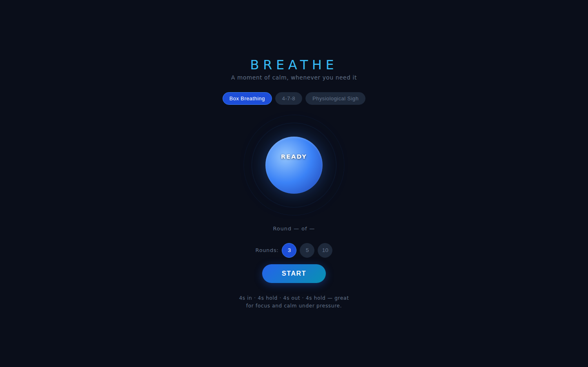
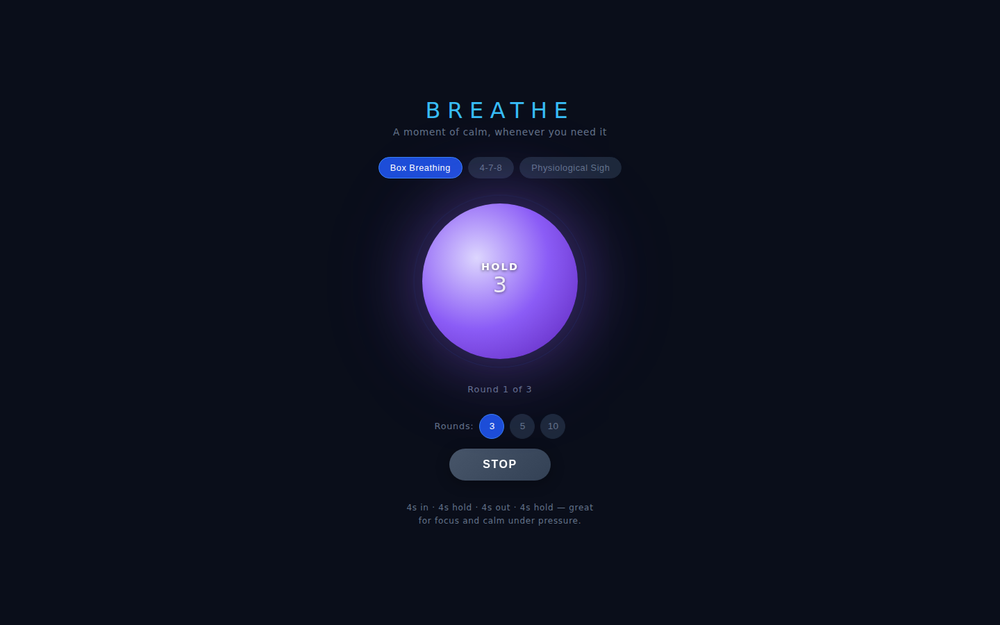

# Breathe

A zero-friction breathing exercise guide. Open it, pick a technique, press Start — the animated orb leads you through every inhale, hold, and exhale.

| Ready | Session in progress |
|:---:|:---:|
|  |  |

## What it does

- **Three breathing techniques** — Box Breathing (4-4-4-4), 4-7-8, and Physiological Sigh
- **Animated breathing orb** — smoothly expands on inhale, contracts on exhale; colour shifts per phase (blue → purple → green)
- **Phase label + live countdown** — so you always know what to do and for how long
- **Configurable rounds** — 3, 5, or 10 rounds per session
- **No accounts, no ads, no audio permissions** — just open and breathe

## How to run

```bash
cd breathe
python3 -m http.server 8080
# open http://localhost:8080
```

## Stack

Vanilla HTML · CSS (keyframe animations + CSS transitions) · ES-module JS. No dependencies.

## Breathing techniques

| Technique | Pattern | Best for |
|---|---|---|
| Box Breathing | 4s in · 4s hold · 4s out · 4s hold | Focus, calm under pressure |
| 4-7-8 | 4s in · 7s hold · 8s out | Sleep, anxiety relief |
| Physiological Sigh | 2s in · 1s sniff · 4s out | Fastest acute stress reset |
