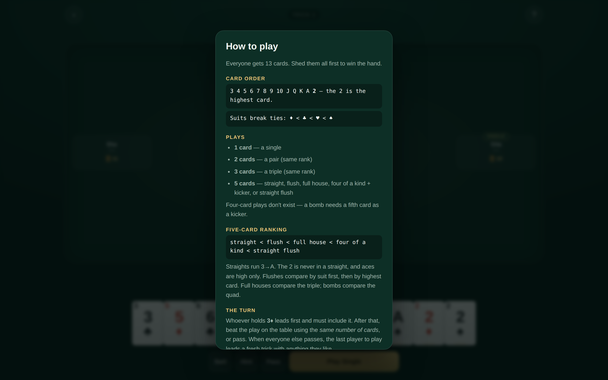

# Capsa

Capsa — also called Big Two, Deuces, or Capsa Banting — is a four-player shedding
card game. The whole deck is dealt out, whoever holds 3♦ leads, and you race to
empty your hand by beating the play on the table with a stronger combination of
the same size. First hand to zero wins.

This build has **cross-device online rooms** and **AI opponents**, and is designed
portrait-first for phones with a genuinely different desktop layout rather than a
stretched one.

| Desktop table | Phone, in an online room |
|:---:|:---:|
|  |  |

| Menu | Hand result | Rules sheet |
|:---:|:---:|:---:|
|  |  |  |

## Where this lives

Capsa sits at `/capsa` in the repository root rather than under
`showcase/apps/`, because it needs a serverless function and a Redis store that
the static showcase deliberately does not carry. **It deploys as its own Vercel
project**, separate from the showcase — see [Deploying](#deploying).

Its screenshots stay in `showcase/apps/capsa/screenshots/` so the arcade
launcher can read them without pointing above its own folder.

## Running it

Solo play against bots needs nothing but a static server:

```bash
cd capsa
python3 -m http.server 8080
# open http://localhost:8080
```

ES modules require HTTP — `file://` will not work.

Online rooms additionally need the serverless API at `/api/capsa`. That only
runs on Vercel (or `vercel dev`); with a plain static server the app detects
the missing API, says so on the menu, and stays fully playable solo.

## Deploying

Two separate Vercel projects are created from this one repository:

| Project | Root Directory | What it serves |
|---|---|---|
| showcase | `showcase` | the static arcade launcher, no functions |
| capsa | `capsa` | this game **plus** `/api/capsa` |

For the Capsa project:

1. New Project → import this repository.
2. Set **Root Directory** to `capsa`.
3. Framework Preset **Other**; leave build, output and install commands empty.
4. Deploy. `capsa/vercel.json` handles the rest.

Then add the store: **Storage → Marketplace → Upstash Redis → Create**, connect
it to the Capsa project, and redeploy. It injects `KV_REST_API_URL` and
`KV_REST_API_TOKEN` automatically — there is no schema and nothing to migrate.

Check it worked at `https://<capsa-project>.vercel.app/api/capsa?action=health`:

| Response | Meaning |
|---|---|
| `{"ok":true,"store":"redis"}` | fully working, cross-device rooms live |
| `{"ok":true,"store":"memory"}` | deployed, but Redis not connected yet |
| `404` | Root Directory is wrong — it must be `capsa` |

Finally, paste the deployment URL into `CAPSA_URL` at the top of
`showcase/data/projects.js` to switch the arcade card's Launch button on.

## Playing

| | |
|---|---|
| **Tap / click a card** | select it; tap again to deselect |
| **Play** | plays the selection — the label names the combination it makes |
| **Pass** | give up the trick (disabled when you are leading — there is nothing to beat) |
| **Hint** | selects the lowest legal play, or tells you that you have to pass |
| **Sort** | clears the selection and re-tidies the hand |

On desktop: `Enter` play, `Space` pass, `H` hint, `Esc` clear, `1`–`0` toggle
cards. Cards you could legally play are marked with a small gold underline when
it is your turn.

## Rules as implemented

Rank order is `3 4 5 6 7 8 9 10 J Q K A 2` — the 2 is the **highest** card. Suits
break every tie: `♦ < ♣ < ♥ < ♠`, so no two cards are ever equal.

Legal plays are 1, 2, 3 or 5 cards. **Four-card plays do not exist** — a bomb
needs a fifth card as a kicker.

Five-card hands rank `straight < flush < full house < four of a kind < straight
flush`. Within a category: straights and straight flushes compare their highest
card; flushes compare **suit first**, then highest rank; full houses compare the
triple; bombs compare the quad.

Straights run 3→A. **The 2 is never part of a straight** and aces are high only,
so `A-2-3-4-5` and `J-Q-K-A-2` are not straights. This rule varies by region —
this build states its choice in the in-game rules sheet.

Whoever holds 3♦ leads first and must include it. After that, beat the table with
the same number of cards or pass. When the other three all pass, the last player
to play leads a fresh trick with anything.

Losers score their remaining cards as penalty points — ×2 at 8 cards, ×3 at 10,
×4 if they never played at all. The winner takes the negative of the total, so
every hand is zero-sum and low score wins.

## Opponents

| Difficulty | Behaviour |
|---|---|
| **Casual** | Plays its lowest legal combination, passes when it cannot beat you. |
| **Sharp** | Weighs what a play destroys, not just its strength — holds 2s and bombs back, and won't break a pair to win a trick it doesn't need. |
| **Ruthless** | Sharp, plus lookahead: ranks candidate moves by how many turns the hand it leaves behind would still need, and spends its strongest hand to stop a player on their last card. |

The ladder was tuned by simulation rather than by feel. Measured over 800
seat-rotated games per pairing, win rate per seat (25% is parity):

| Matchup | Result |
|---|---|
| Ruthless vs Sharp | **26.2%** vs 23.8% |
| Sharp vs Casual | **35.6%** vs 14.4% |
| Ruthless vs Casual | **34.3%** vs 15.7% |

A counting heuristic — leading cards nothing left in the deck can beat — was
tried and **removed**: it lost 2.5 points of win rate at every hand-size
threshold tested, because winning tricks one card at a time sheds slower than
just playing combinations.

## Online rooms

Create a room and you get a 4-letter code; tap it to share an invite link.
The three empty seats play as bots until real players take them, so a room is
playable from the moment it exists — there is no lobby to wait in.

The design constraint is that Vercel serverless functions cannot hold a
WebSocket open. Capsa is turn-based with think-times in seconds, so it does not
need one:

- **The server is authoritative.** Clients send intents; `api/capsa.js`
  re-validates every one against the same engine module the browser imports.
- **Hidden information is never sent.** The state each client receives is
  redacted for its seat — your 13 cards, and only *counts* for everyone else.
- **Transport is adaptive polling** — ~900 ms while a turn is live, 2.5 s
  otherwise, paused entirely when the tab is hidden, backing off on errors.
- **Writes are compare-and-set** via a Redis Lua script, so two players acting on
  the same tick cannot corrupt a room.
- **Bots run inside whatever request arrives.** No background worker and no
  dependence on the host keeping a tab open. The same mechanism covers
  disconnects: a seat that goes 25 s without a poll is marked away and played by
  the bot policy until it returns, so one closed tab never freezes the other
  three.

Rooms are stored under `capsa:room:<CODE>` with a 2-hour TTL, refreshed on write.

### Storage configuration

The API uses Upstash Redis when these are present, and an in-memory map
otherwise:

| Variable | Notes |
|---|---|
| `KV_REST_API_URL` | injected by the Vercel Upstash/KV integration |
| `KV_REST_API_TOKEN` | injected by the Vercel Upstash/KV integration |

`UPSTASH_REDIS_REST_URL` / `UPSTASH_REDIS_REST_TOKEN` are accepted as aliases.
Without them the API still works, but each serverless instance has its own map,
so rooms will not reliably survive across devices — the menu reports this rather
than failing silently. `GET /api/capsa?action=health` returns which backend is
live.

## Layout

The phone layout is the design. Opponents sit in a compact row up top, the play
area is a framed landing zone in the middle, and the hand fans across the bottom
above a sticky action bar that respects the safe-area inset. Overlap is computed
from the container width so 13 cards fit without the page ever scrolling
sideways — verified from 320 px up.

At 900 px the layout changes rather than stretches: opponents move to the left,
top and right edges of a real felt table, cards grow, hover-lift appears, and the
hand lays out with far less overlap.

Cards are drawn with CSS and text, not images — crisp at any density with
nothing to load. Suits never rely on colour alone. `prefers-reduced-motion` is
honoured.

## Files

```
capsa/                      ← Vercel Root Directory for this project
├── vercel.json             function config (bundles js/ with the API)
├── index.html              screens and dialogs
├── style.css               mobile-first, desktop variant at 900px
├── main.js                 menu, session lifecycle, overlays
├── api/
│   └── capsa.js            the one serverless function: rooms, moves, bots
└── js/
    ├── engine.js           rules: combinations, comparison, turn flow, scoring
    ├── bot.js              three policies over one evaluation core
    ├── cards.js            card rendering and hand-fan geometry
    ├── ui.js               table rendering, selection, keyboard
    ├── local-game.js       solo session driving bots in-tab
    └── net-game.js         online session: polling, reconnect, backoff
```

`js/engine.js` is imported by both the browser and `api/capsa.js`, so the rules
cannot drift between client and server. Screenshots live in
`showcase/apps/capsa/screenshots/`.

No dependencies, no build step, no third-party network calls.
