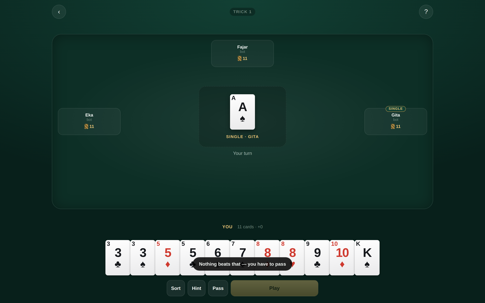
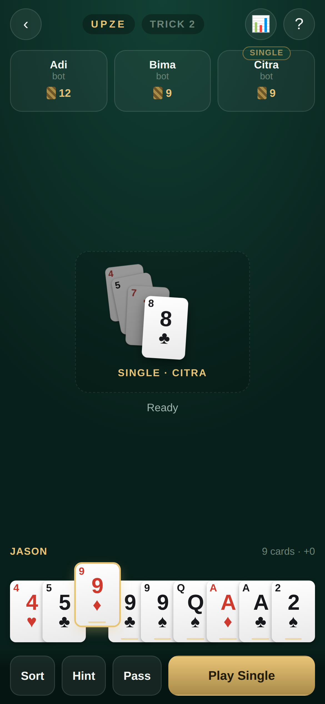
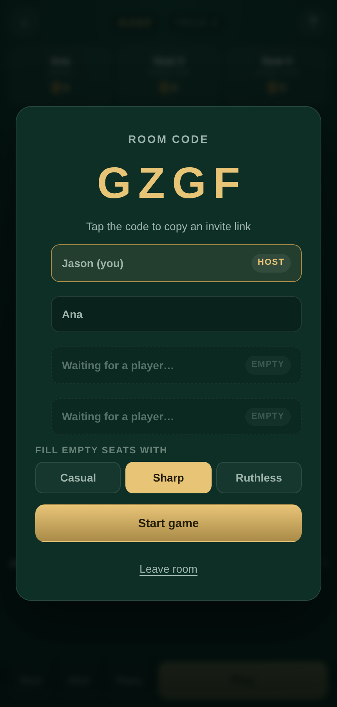
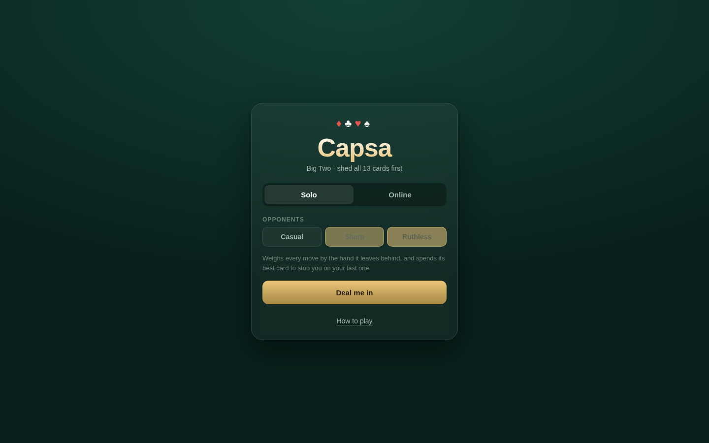
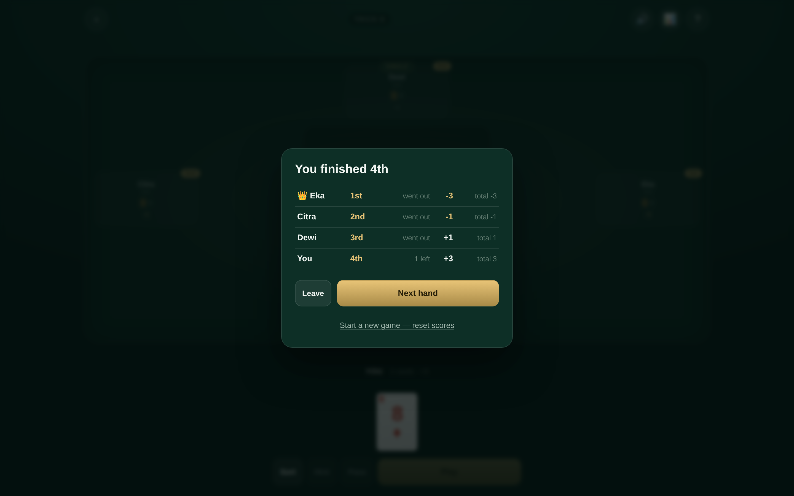
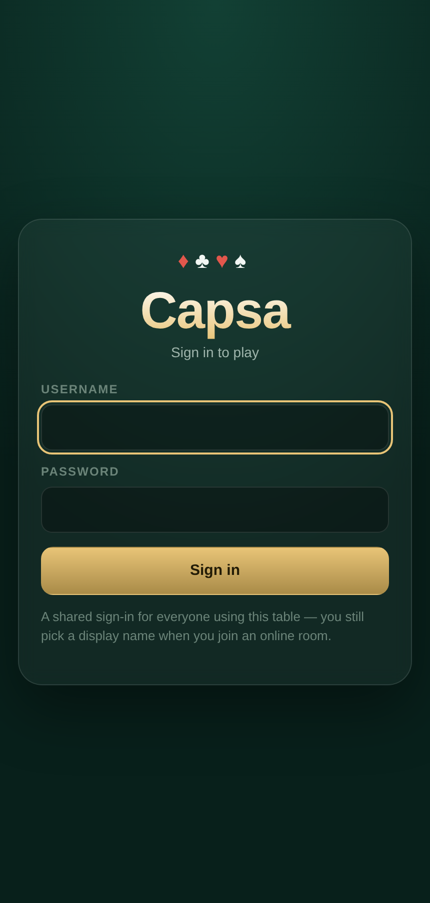
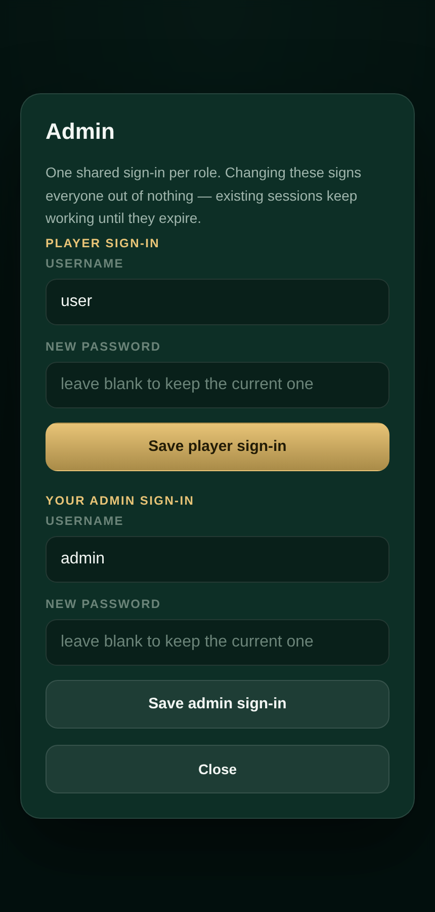
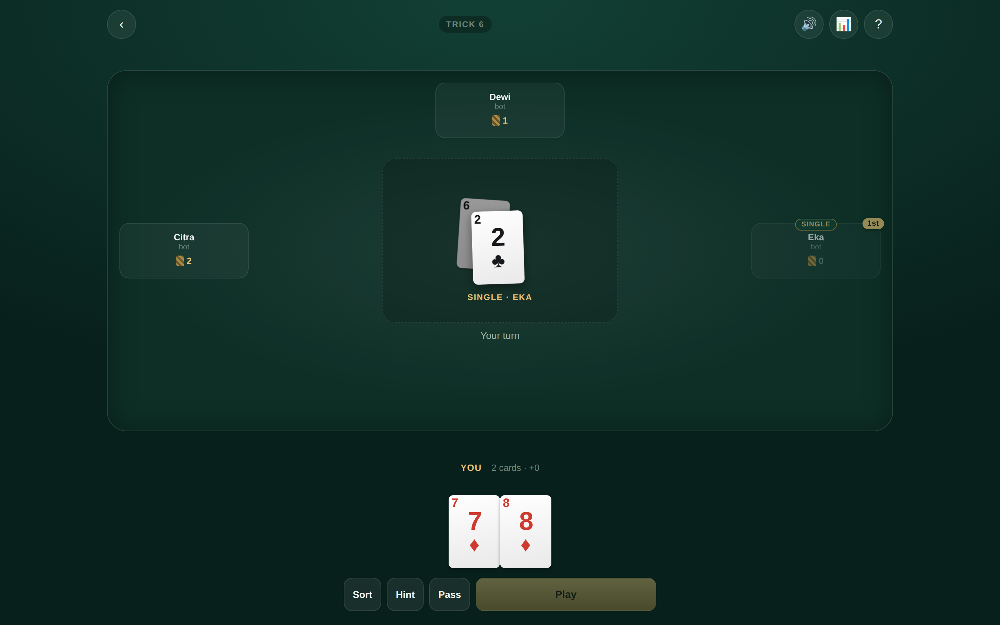

# Capsa

Capsa — also called Big Two, Deuces, or Capsa Banting — is a four-player shedding
card game. The whole deck is dealt out, whoever holds 3♦ leads, and you race to
empty your hand by beating the play on the table with a stronger combination of
the same size. First hand to zero wins.

This build has **cross-device online rooms** and **AI opponents**, and is designed
portrait-first for phones with a genuinely different desktop layout rather than a
stretched one.

| Desktop table | Phone, in an online room |
|:---:|:---:|
|  |  |

| Lobby — the host decides when to start | Menu | Hand result |
|:---:|:---:|:---:|
|  |  |  |

## Where this lives

Capsa sits at `/capsa` in the repository root rather than under
`showcase/apps/`, because it needs a serverless function and a Redis store that
the static showcase deliberately does not carry. **It deploys as its own Vercel
project**, separate from the showcase — see [Deploying](#deploying).

Its screenshots stay in `showcase/apps/capsa/screenshots/` so the arcade
launcher can read them without pointing above its own folder.

## Running it

Solo play against bots needs nothing but a static server:

```bash
cd capsa
python3 -m http.server 8080
# open http://localhost:8080
```

ES modules require HTTP — `file://` will not work.

Online rooms additionally need the serverless API at `/api/capsa`. That only
runs on Vercel (or `vercel dev`); with a plain static server the app detects
the missing API, says so on the menu, and stays fully playable solo.

## Deploying

Two separate Vercel projects are created from this one repository:

| Project | Root Directory | What it serves |
|---|---|---|
| showcase | `showcase` | the static arcade launcher, no functions |
| capsa | `capsa` | this game **plus** `/api/capsa` |

For the Capsa project:

1. New Project → import this repository.
2. Set **Root Directory** to `capsa`.
3. Framework Preset **Other**; leave build, output and install commands empty.
4. Deploy. `capsa/vercel.json` handles the rest.

Then add the store: **Storage → Marketplace → Upstash Redis → Create**, connect
it to the Capsa project, and redeploy. It injects `KV_REST_API_URL` and
`KV_REST_API_TOKEN` automatically — there is no schema and nothing to migrate.

Only **one** Vercel project should be connected to this repository for Capsa.
Importing it twice means every push builds twice and each copy needs its own
Redis and its own credentials — they will not share sign-ins or rooms.

Check it worked at `https://<capsa-project>.vercel.app/api/capsa?action=health`:

| Response | Meaning |
|---|---|
| `{"ok":true,"store":"redis"}` | fully working, cross-device rooms live |
| `{"ok":true,"store":"memory"}` | deployed, but Redis not connected yet |
| `404` | Root Directory is wrong — it must be `capsa` |

Finally, paste the deployment URL into `CAPSA_URL` at the top of
`showcase/data/projects.js` to switch the arcade card's Launch button on.

## Signing in

The game sits behind a shared sign-in. This is a **gate into the game, not a set
of per-person accounts** — everyone who plays uses the same player credentials,
and each person still types their own display name when they create or join an
online room.

There are two roles:

| Role | Default username | Default password | Can |
|---|---|---|---|
| Player | `user` | `magang124` | play everything |
| Admin | `admin` | `p455w0rd` | play everything, plus change the sign-in details |

Signing in as admin adds an **Admin** link to the menu. From there you can change
the player username and password, and rotate your own admin credentials. Leave a
password field blank to rename without changing the password.

### What this does and does not protect

The gate is enforced **by the server**. Every room endpoint — create, join,
state, play, pass, start, next, newgame, leave — requires a session token issued
by `login`, and returns `401` without one. That is the part that actually holds:
a static page can never police itself, because anyone can read its JavaScript.
Hiding the menu behind a login screen is a convenience for honest users; the
server refusing to answer is the control.

Specifically:

- Passwords are stored only as a PBKDF2-SHA256 digest (120k rounds) with a
  per-record salt, and compared in constant time. Nothing stored can be turned
  back into a password.
- Failed logins are counted per IP; after 10 in 15 minutes that address is
  refused for the rest of the window.
- A wrong username and a wrong password give the identical error, so the form
  cannot be used to discover which usernames exist.
- Sessions last 12 hours and are revoked on sign-out.
- **Solo play against bots is not protected and cannot be**, since it runs
  entirely in the browser with no server involved. There is nothing at stake in
  it — no shared state, no other players. With no API at all (a plain static
  host) the app says sign-in is unavailable and offers solo play only.

### Change the defaults

These defaults are published in this README and in a public repository, so treat
them as a starting point, not a secret. Sign in as admin and change the player
password once, and the change persists in Redis across redeploys.

You can also seed different starting credentials so the published ones are never
live, by setting these before the **first** run against an empty store:

| Variable | Effect |
|---|---|
| `CAPSA_PLAYER_PASSWORD` | seeds the player password instead of the default |
| `CAPSA_ADMIN_PASSWORD` | seeds the admin password instead of the default |

They only apply when no credential record exists yet — once seeded, the admin
owns the credentials and these variables are ignored. To force a reseed, delete
the `capsa:auth` key from Redis.

Without Redis the credential record lives in per-instance memory, so it resets
whenever the function cold-starts. That is fine for local development and
another reason the store is worth connecting.

## Playing

| | |
|---|---|
| **Tap / click a card** | select it; tap again to deselect |
| **Play** | plays the selection — the label names the combination it makes |
| **Pass** | give up the trick (disabled when you are leading — there is nothing to beat) |
| **Hint** | selects the lowest legal play, or tells you that you have to pass |
| **Sort** | clears the selection and re-tidies the hand |
| **📊 Scores** | running totals plus a hand-by-hand breakdown, and the New game button |
| **🔊 Sound** | mute or unmute; the choice is remembered |

Screenshots of the sign-in and admin screens:

| Sign in | Admin |
|:---:|:---:|
|  |  |

On desktop: `Enter` play, `Space` pass, `H` hint, `Esc` clear, `1`–`0` toggle
cards. Cards you could legally play are marked with a small gold underline when
it is your turn.

## Two rule sets

Pick one before the hand starts — in the solo menu, or in the lobby, where the
host chooses and everyone sees which one they are about to play.

### First out wins *(default)*

The hand stops the moment someone sheds their last card. Everyone else scores
the cards left in their hand — ×2 at 8 cards, ×3 at 10, ×4 if they never played
— and the winner takes the negative of that total.

### Play to the end

Going out does **not** stop the hand. The remaining players keep going for 2nd
and 3rd, and whoever is left still holding cards comes 4th. You get a real
finishing order rather than one winner and three losers.

Scoring switches to position, because card counts cannot rank a hand that was
played out — everybody except the last player finishes on zero:

| Place | Points |
|---|---|
| 1st | −3 |
| 2nd | −1 |
| 3rd | +1 |
| 4th | +3 |

Both are zero-sum, and the lowest total still wins the match.

Two rules change once players can be out mid-hand, and both are handled:

- **A player who is out is skipped entirely** — not merely passed for the trick.
- **Going out can end a trick.** If nobody left holding cards can answer the
  play, the trick closes; and because its winner has no cards, the lead moves on
  to the next player still in the hand rather than stalling on an empty seat.

A seat that has finished keeps its place at the table, dimmed, with the position
it took:

| Play-to-the-end, mid-hand | Final ranking |
|:---:|:---:|
|  |  |

## The table

Plays are not replaced one at a time — every play in the current trick stays on
the table and cascades up and to the left as it is buried, so you can read back
what the trick has been. Each earlier play keeps its rank corner visible; the
live play sits on top at full brightness. Three plays back are kept and anything
older is trimmed, since past that it is clutter rather than information. When
the trick closes the whole pile is lifted away rather than blinking out.

Cards fly in from the direction of the seat that played them, your hand deals in
with a stagger, the active seat's ring breathes so it is findable at a glance,
and your score bumps when it changes. All of it is decorative and all of it is
disabled under `prefers-reduced-motion`.

## Sound

Every sound is **synthesised at runtime** — there are no audio files to
download, so the game stays self-contained and works offline. A card sound is
mostly a short burst of broadband noise shaped by a filter, so that is exactly
how these are built: a flick is bright and fast, a card landing on felt is
duller with a little low-frequency body underneath it.

| Sound | When |
|---|---|
| Flick run | dealing — one flick per card, in step with the fan animation |
| Snap + thud | a card landing, one per card in the play, lightly staggered |
| Dull knock | a player passing |
| Filter sweep | the trick being gathered off the table |
| Two-note nudge | your turn |
| Rising arpeggio | you win the hand · falling one when you lose it |
| Low buzz | a move the server rejected |
| Tick | picking a card up or putting it down |

Each hit gets a small random variation in playback rate and filter frequency, so
a run of cards never sounds like a loop.

The 🔊 button in the top bar mutes and unmutes, and the choice is remembered.
Browsers block audio until the page has been interacted with, so the context is
created on your first press — signing in or dealing — rather than on load.
Sound is driven by state *transitions*, never by re-renders, so a table that
polls once a second stays quiet until something actually happens.

## Turn alerts

Waiting on three other people means the moment that matters usually arrives
while you are looking at something else. The alert works in layers, so it lands
whether or not you are watching, and none of it is required:

| Layer | When | Needs permission |
|---|---|---|
| On-screen banner | your turn, in an online game or after a long wait | no |
| Two-note sound | every turn | no |
| Vibration | your turn, on a phone | no |
| Tab title → `🔔 Your turn — Capsa` | your turn, tab in the background | no |
| System notification | your turn, tab in the background | yes — offered in the lobby |

The banner sits at the foot of the felt, next to the hand you are about to play
from, rather than at the top where the opposite seat is. It clears the moment
you play or pass, so it never outlives the turn it announced — as does the title
and any system notification, which are also cleared as soon as you look at the
tab again.

Permission is asked for **in the lobby**, where there is time to read the offer
and the click is the user gesture browsers require. Decline it and everything
except the system notification still works.

Solo play does not show the banner unless the wait ran past four seconds — the
turn comes back every few seconds against bots, and a banner that often is just
noise. The background layers still fire in solo.

### One thing this required

A backgrounded tab used to stop polling entirely to save battery and quota.
That would have made the whole feature useless: the client would not learn it
was your turn until you looked, which is exactly when you no longer need
telling. A hidden tab now keeps polling at 6 s instead of 900 ms — slow enough
to stay cheap, awake enough to alert you.

## Scores

The 📊 button opens a running tracker: totals sorted best-first with the leader
marked, and a hand-by-hand table showing what each player scored in each hand
(the winner's figure in gold). Opponents also carry their running total on their
seat once it is non-zero.

**New game** resets every score and the history and deals a fresh hand on the
same seats — no need to leave and share a new room code. Online it is host-only
and refuses to run mid-hand, like Start and Next hand.

## Rules as implemented

Rank order is `3 4 5 6 7 8 9 10 J Q K A 2` — the 2 is the **highest** card. Suits
break every tie: `♦ < ♣ < ♥ < ♠`, so no two cards are ever equal.

Legal plays are 1, 2, 3 or 5 cards. **Four-card plays do not exist** — a bomb
needs a fifth card as a kicker.

Five-card hands rank `straight < flush < full house < four of a kind < straight
flush`. Within a category: straights and straight flushes compare their highest
card; flushes compare **suit first**, then highest rank; full houses compare the
triple; bombs compare the quad.

Straights run 3→A. **The 2 is never part of a straight** and aces are high only,
so `A-2-3-4-5` and `J-Q-K-A-2` are not straights. This rule varies by region —
this build states its choice in the in-game rules sheet.

Whoever holds 3♦ leads first and must include it. After that, beat the table with
the same number of cards or pass. When the other three all pass, the last player
to play leads a fresh trick with anything.

How the hand ends and how it scores depends on the rule set — see
[Two rule sets](#two-rule-sets). Either way the totals are zero-sum and the
lowest total wins.

## Opponents

| Difficulty | Behaviour |
|---|---|
| **Casual** | Plays its lowest legal combination, passes when it cannot beat you. |
| **Sharp** | Weighs what a play destroys, not just its strength — holds 2s and bombs back, and won't break a pair to win a trick it doesn't need. |
| **Ruthless** | Sharp, plus lookahead: ranks candidate moves by how many turns the hand it leaves behind would still need, and spends its strongest hand to stop a player on their last card. |

The ladder was tuned by simulation rather than by feel. Measured over 800
seat-rotated games per pairing, win rate per seat (25% is parity):

| Matchup | Result |
|---|---|
| Ruthless vs Sharp | **26.2%** vs 23.8% |
| Sharp vs Casual | **35.6%** vs 14.4% |
| Ruthless vs Casual | **34.3%** vs 15.7% |

A counting heuristic — leading cards nothing left in the deck can beat — was
tried and **removed**: it lost 2.5 points of win rate at every hand-size
threshold tested, because winning tricks one card at a time sheds slower than
just playing combinations.

## Online rooms

Create a room and you get a 4-letter code; tap it to share an invite link. The
room opens as a **lobby** and nothing is dealt until the host presses Start, so
you can wait for people to arrive.

- Players joining with the code (or the invite link) take the empty seats and
  see the same lobby, with a note that they are waiting for the host.
- The host chooses a bot difficulty for whatever seats are still empty at the
  moment they start — a room can be started with one human and three bots, or
  with four humans and no bots at all.
- **Only the host** can choose the rule set, start the game, deal the next hand,
  or reset the match with New game. All of them are rejected server-side, not
  merely hidden in the UI.
- If the host leaves, the host role migrates to another human in the room, so a
  lobby can never be left with nobody able to start it.
- Joining a room whose hand is already running is still allowed — you take over
  a bot seat and its cards.

An invite link only seats you automatically once the app knows your name;
otherwise it pre-fills the code and asks for one first, so a lobby never fills
up with four players all called "Player". The name is remembered for next time.

The design constraint is that Vercel serverless functions cannot hold a
WebSocket open. Capsa is turn-based with think-times in seconds, so it does not
need one:

- **The server is authoritative.** Clients send intents; `api/capsa.js`
  re-validates every one against the same engine module the browser imports.
- **Hidden information is never sent.** The state each client receives is
  redacted for its seat — your 13 cards, and only *counts* for everyone else.
- **Transport is adaptive polling** — ~900 ms while a turn is live, 2.5 s
  otherwise, paused entirely when the tab is hidden, backing off on errors.
- **Writes are compare-and-set** via a Redis Lua script, so two players acting on
  the same tick cannot corrupt a room.
- **Bots run inside whatever request arrives.** No background worker and no
  dependence on the host keeping a tab open. The same mechanism covers
  disconnects: a seat that goes 25 s without a poll is marked away and played by
  the bot policy until it returns, so one closed tab never freezes the other
  three.

Rooms are stored under `capsa:room:<CODE>` with a 2-hour TTL, refreshed on write.

### Storage configuration

The API uses Upstash Redis when these are present, and an in-memory map
otherwise:

| Variable | Notes |
|---|---|
| `KV_REST_API_URL` | injected by the Vercel Upstash/KV integration |
| `KV_REST_API_TOKEN` | injected by the Vercel Upstash/KV integration |
| `CAPSA_PLAYER_PASSWORD` | optional — seeds the player password on first run |
| `CAPSA_ADMIN_PASSWORD` | optional — seeds the admin password on first run |

`UPSTASH_REDIS_REST_URL` / `UPSTASH_REDIS_REST_TOKEN` are accepted as aliases.
`GET /api/capsa?action=health` returns which backend is live.

**Online rooms need the store.** Without it every serverless instance keeps its
own map, so a session token and a room created on one instance do not exist on
the next. Measured against three instances, two thirds of requests carrying a
perfectly valid token came back `401`. The menu therefore disables Create and
Join and names the missing variables, instead of letting people into a game that
will drop them every few seconds.

### If the game keeps losing contact with the server

Check `GET /api/capsa?action=health` first — it distinguishes the two causes.

- **`"store":"memory"`** — the deployment has no Upstash credentials. Set
  `KV_REST_API_URL` and `KV_REST_API_TOKEN` and redeploy. Note that Vercel only
  applies new environment variables to *new* deployments, so setting them
  without redeploying changes nothing.
- **`"store":"redis"`** — check the Upstash usage dashboard. Polling costs about
  one command per player per poll: four players at the live cadence is roughly
  4 commands/second, near 16,000 an hour. A tight quota will start rejecting
  commands mid-game, which surfaces to players as exactly this symptom.

An expired session no longer presents as a connection problem: the client
distinguishes terminal rejections (`401`, `403`, `404`) from transient ones,
stops polling, and returns to the sign-in screen with an explanation.

### Polling cost

`action=state` is by far the commonest request, so it avoids writing whenever
the room has not changed: `lastSeen` is refreshed on a 10 s heartbeat rather
than every poll, and validated sessions are cached on the instance for 30 s. A
poll that changes nothing costs a single read and leaves `version` alone, which
also stops every client redrawing a table that did not move.

Measured over 30 s of four-player play, this took the store from 391 commands
(131 of them writes) to 163 commands (18 writes), and cut redraws from 114 of
118 polls to 14 of 128.

## Layout

The phone layout is the design. Opponents sit in a compact row up top, the play
area is a framed landing zone in the middle, and the hand fans across the bottom
above a sticky action bar that respects the safe-area inset. Overlap is computed
from the container width so 13 cards fit without the page ever scrolling
sideways — verified from 320 px up.

At 900 px the layout changes rather than stretches: opponents move to the left,
top and right edges of a real felt table, cards grow, hover-lift appears, and the
hand lays out with far less overlap.

Cards are drawn with CSS and text, not images — crisp at any density with
nothing to load. Suits never rely on colour alone. `prefers-reduced-motion` is
honoured.

## Files

```
capsa/                      ← Vercel Root Directory for this project
├── vercel.json             function config (bundles js/ with the API)
├── index.html              screens and dialogs
├── style.css               mobile-first, desktop variant at 900px
├── main.js                 menu, session lifecycle, overlays
├── api/
│   └── capsa.js            the one serverless function: rooms, moves, bots
└── js/
    ├── auth.js             sign-in, session token, admin credential calls
    ├── engine.js           rules: combinations, comparison, turn flow, scoring
    ├── bot.js              three policies over one evaluation core
    ├── cards.js            card rendering and hand-fan geometry
    ├── sound.js            synthesised card sounds — no audio files
    ├── ui.js               table rendering, selection, keyboard
    ├── local-game.js       solo session driving bots in-tab
    └── net-game.js         online session: polling, reconnect, backoff
```

`js/engine.js` is imported by both the browser and `api/capsa.js`, so the rules
cannot drift between client and server. Screenshots live in
`showcase/apps/capsa/screenshots/`.

No dependencies, no build step, no third-party network calls.
