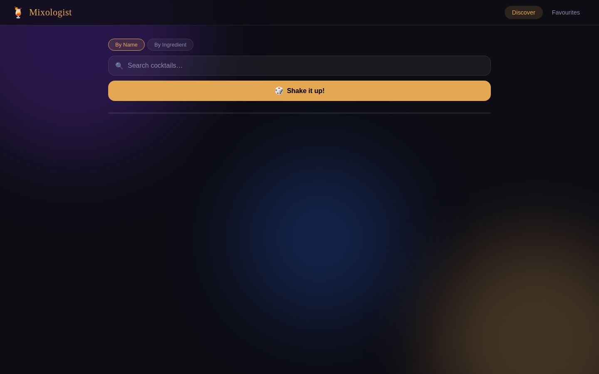
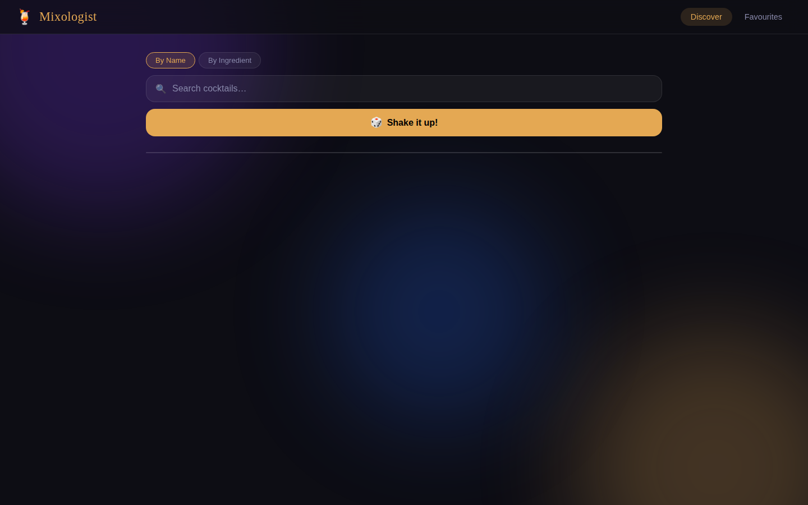

# Mixologist — Cocktail Recipe Finder

Discover, search, and save cocktail recipes. Hit **Shake it up!** for a random cocktail, search by name or ingredient, star your favourites, and copy the full recipe to your clipboard — all in one beautiful page with no account required.

| Early state | Settled state |
|:---:|:---:|
|  |  |

## Features

- **Random cocktail** — loads a surprise cocktail on every click
- **Search by name** — live debounced search across the full CocktailDB catalogue
- **Search by ingredient** — find cocktails that use a specific spirit or mixer
- **Favourites** — star any cocktail to save it to localStorage; persists across reloads
- **Copy recipe** — one click copies the full ingredient list and instructions as plain text
- **Glass & category badges** — quick-glance metadata on every cocktail card

## How to run

```bash
cd cocktail-finder
python3 -m http.server 8080
# open http://localhost:8080
```

Requires an HTTP server (ES modules don't work over `file://`).

## Dependencies

- No npm packages or build step required
- Data: [TheCocktailDB](https://www.thecocktaildb.com/api.php) free public API (no API key needed)
- Font: Google Fonts — Playfair Display + Inter (loaded from CDN)

## Stack

Vanilla HTML · CSS3 · JavaScript ES Modules · localStorage
