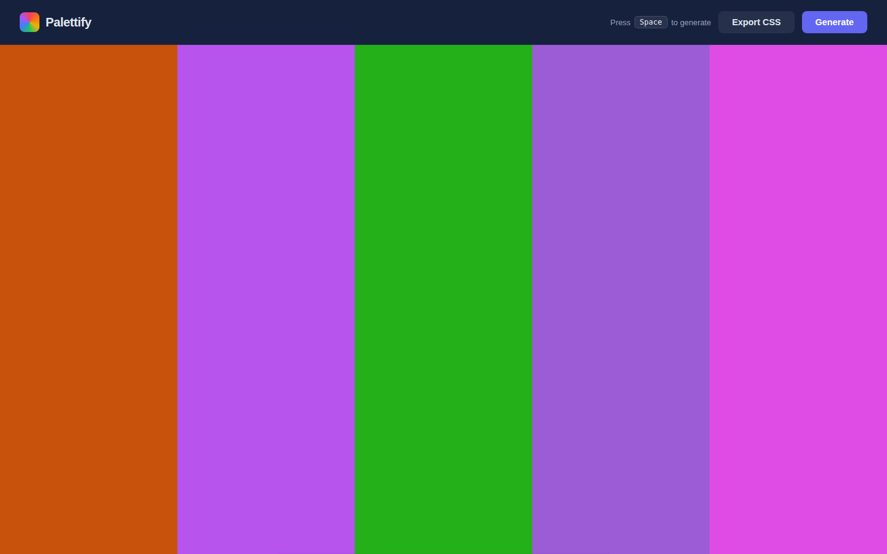
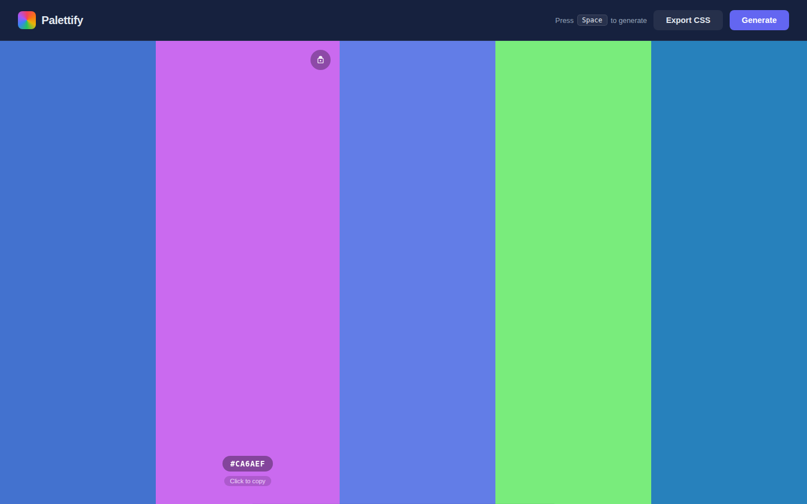

# Palettify — Color Palette Generator

Generate beautiful 5-color palettes instantly. Press **Space** or click **Generate**, lock the colors you love, and copy hex codes with a single click. Designers and developers can also export the whole palette as CSS custom properties.

| Fresh palette | With hover / lock |
|:---:|:---:|
|  |  |

## Features

- **Instant generation** — Space bar or Generate button creates a new 5-color palette
- **Lock colors** — Hover any swatch and click the lock icon; locked colors survive the next generate
- **Copy hex** — Click any swatch to copy its hex code to clipboard
- **Export CSS** — One click exports all colors as `--color-1` … `--color-5` CSS variables
- **Accessible labels** — Hex text auto-switches black/white based on contrast with the background

## How to run locally

```bash
cd color-palette-gen
python3 -m http.server 8080
# open http://localhost:8080
```

## Stack

- Vanilla HTML + CSS + JavaScript (ES modules, no build step)
- Zero external dependencies
- Works in Chrome, Firefox, and Safari

## Key parameters

| Parameter | Value | Where |
|-----------|-------|-------|
| Palette size | 5 colors | `PALETTE_SIZE` constant in `index.html` |
| Saturation range | 45–95% HSL | `randomHex()` function |
| Lightness range | 35–70% HSL | `randomHex()` function |
