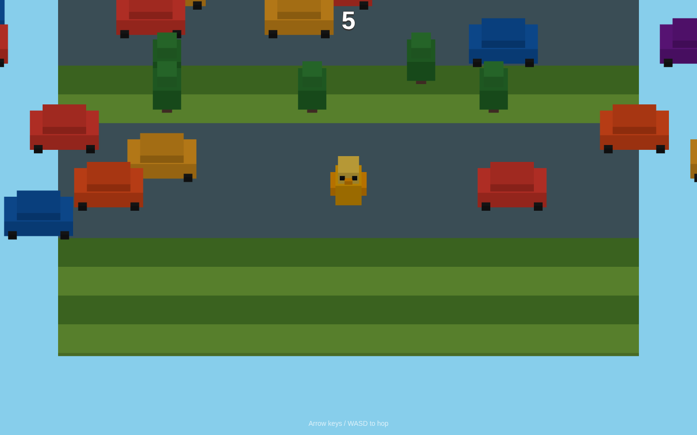
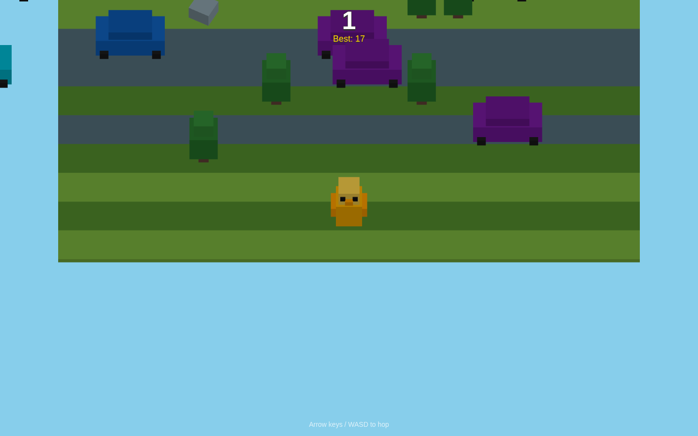

# Crossy Road Clone

A browser-based 3D endless hopper built with Three.js. Guide your blocky chicken across
infinite lanes of traffic — hop one grid cell at a time, go as far as possible, and beat
your high score. No internet required at runtime.

| Early state | Settled state |
|:---:|:---:|
|  |  |

## How to run

```bash
cd crossy-road
python3 -m http.server 8080
# open http://localhost:8080
```

ES modules require an HTTP server — `file://` URLs will not work.

## Controls

| Input | Action |
|-------|--------|
| `↑` / `W` | Hop forward |
| `↓` / `S` | Hop backward |
| `←` / `A` | Hop left |
| `→` / `D` | Hop right |
| Any hop key | Start / restart from menu or game-over screen |

One input is queued while a hop is mid-animation so the game feels snappy without being laggy.

## Gameplay

- **Score** = furthest row reached (moving back doesn't reduce it)
- **Best score** is persisted in `localStorage` and survives refreshes
- **Grass lanes** — safe, may contain trees or rocks that block movement
- **Road lanes** — vehicles move left or right; overlap = instant death
- **Road-heavy by design** — after a short safe start, most lanes are traffic
- **Difficulty** ramps as you advance: more roads, faster and denser traffic
- **Fall-behind death** — an auto-advancing camera slowly pushes forward; idle too long and you're gone

## Difficulty

Pick **Easy**, **Normal**, or **Hard** from the menu — your choice is saved to
`localStorage`. Each preset tunes how road-heavy and fast the world is:

| Setting | Safe rows | Road chance (base → max) | Top speed | Max cars/lane | Camera push |
|---------|:---:|:---:|:---:|:---:|:---:|
| **Easy** | 4 | 45% → 75% | 6.0 | 3 | slow |
| **Normal** | 3 | 65% → 85% | 7.5 | 4 | medium |
| **Hard** | 2 | 82% → 94% | 9.5 | 5 | fast |

All presets live in `DIFFICULTIES` in `js/lanes.js` — tweak any value to taste.

## Tech stack

- Three.js r163 (bundled locally in `vendor/` — no CDN dependencies)
- Vanilla JS ES modules
- Single `index.html` entry point
- DOM overlay for HUD (score, best, game-over, restart)

## Key parameters (in `js/main.js` and `js/lanes.js`)

| Constant | Default | Effect |
|----------|---------|--------|
| `DIFFICULTIES.*.autoAdvance` | `0.22`–`0.50` rows/sec | Camera push speed per difficulty — lower = more forgiving idle time |
| `KILL_BEHIND` | `4` rows | How far behind camera before death |
| `HOP_DURATION` | `0.13` s | Hop animation speed |
| `ARC_HEIGHT` | `0.55` | Jump arc height |

## Architecture

```
js/
├── main.js       — game state machine (menu → playing → dead) + main loop
├── scene.js      — Three.js renderer, orthographic camera, lights
├── player.js     — player mesh, hop tween, input queue, squash-stretch
├── lanes.js      — lane generation, object pooling, vehicle movement
├── collision.js  — per-frame AABB overlap checks
└── hud.js        — DOM overlay (score, best, game-over, restart)
vendor/
└── three.module.js  — Three.js r163 ES module build (offline bundle)
```

## What's next (v1.1)

- River lanes with floating logs
- Mobile swipe / tap controls
- Train tracks with warning signals
- Coin collectibles and character skins
