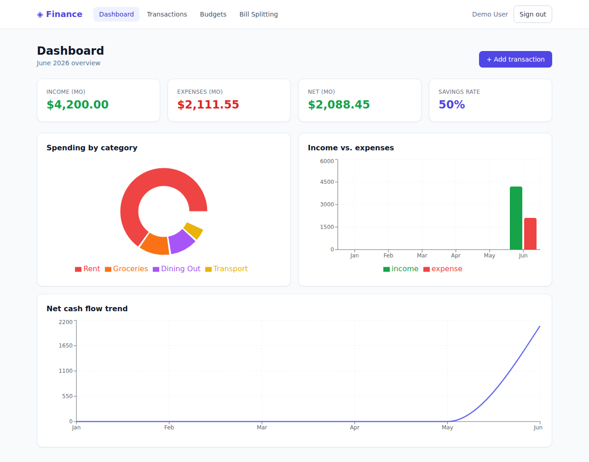
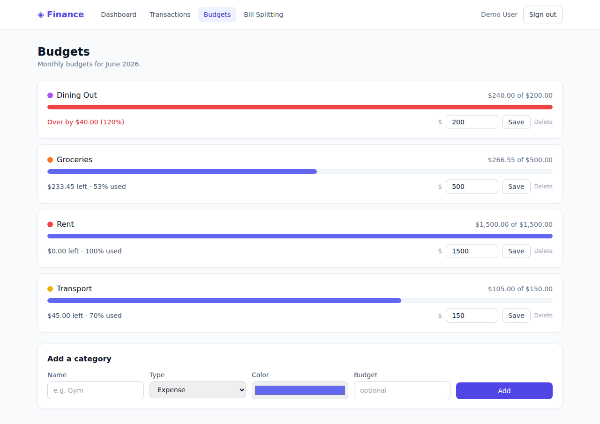
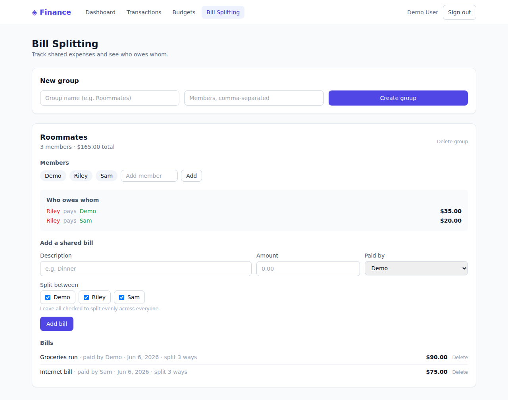

# Finance Dashboard

A full-stack **personal finance dashboard**: sign up, log income and expenses, set
per-category monthly budgets, visualize your money with charts, and split shared bills
with friends or roommates.



| Budgets | Bill splitting |
|:---:|:---:|
|  |  |

## Features

- **Accounts** — email + password sign-up/login (passwords hashed with bcrypt, sessions via Auth.js JWT). Every user's data is fully isolated.
- **Expense & income tracking** — add/delete transactions with categories, dates, and notes.
- **Budgets** — set a monthly budget per expense category; progress bars and an over-budget warning when you go past 100%.
- **Charts & insights** — spend-by-category donut, income-vs-expense bars, and a net cash-flow trend line (last 6 months) plus headline stat cards (income, expenses, net, savings rate).
- **Bill splitting** — create groups, add members, log shared bills split evenly (with exact cent rounding), and get a minimal **"who owes whom"** settlement summary.

## Stack

| Layer | Choice |
|-------|--------|
| Framework | Next.js 14 (App Router) + TypeScript |
| Styling | Tailwind CSS |
| Auth | Auth.js (next-auth v5), Credentials provider, JWT sessions |
| Database | Prisma ORM + SQLite (local); swap to Postgres for production |
| Charts | Recharts |
| Tests | Vitest (pure money-math in `src/lib/finance.ts`) |

## Running locally

```bash
cd finance-dashboard
npm install
cp .env.example .env          # then set AUTH_SECRET (e.g. `npx auth secret`)
npm run db:push               # create the SQLite schema
npm run db:seed               # optional: demo user demo@example.com / password123
npm run dev                   # http://localhost:3000
```

Open http://localhost:3000, create an account (new accounts come with starter
categories), or log in with the seeded demo user.

## Tests

```bash
npm test
```

Covers the core logic: income/expense summaries, per-category monthly spend, budget
status, equal-split rounding (shares always sum exactly to the bill total), net member
balances, and the greedy minimal-settlement algorithm.

## Deploying to production (Postgres)

SQLite is great for local dev but serverless platforms (e.g. Vercel) have ephemeral
filesystems, so use Postgres in production:

1. In `prisma/schema.prisma`, set `datasource db { provider = "postgresql" }`.
2. Point `DATABASE_URL` at a hosted Postgres instance (Neon, Supabase, Vercel Postgres, …).
3. Set `AUTH_SECRET` (and `AUTH_TRUST_HOST=true`) in the platform's env vars.
4. `npm run build` runs `prisma generate`; run `prisma db push` (or migrations) against the DB.

## Project layout

```
finance-dashboard/
├── prisma/schema.prisma        # User, Category, Transaction, Group, GroupMember, SharedBill, BillShare
├── prisma/seed.ts              # optional demo data
└── src/
    ├── auth.ts, auth.config.ts # Auth.js config (split for edge-safe middleware)
    ├── middleware.ts           # route protection
    ├── lib/finance.ts          # pure money math (unit-tested)
    ├── lib/{prisma,session,format}.ts
    ├── app/(app)/{dashboard,transactions,budgets,splits}/  # feature pages + server actions
    ├── app/{login,register}/   # auth pages + server actions
    └── components/             # nav, auth form
```
