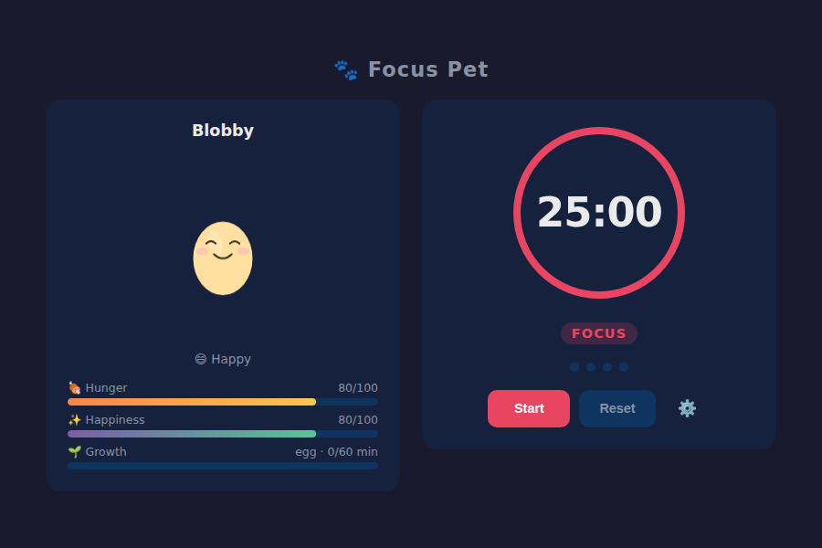
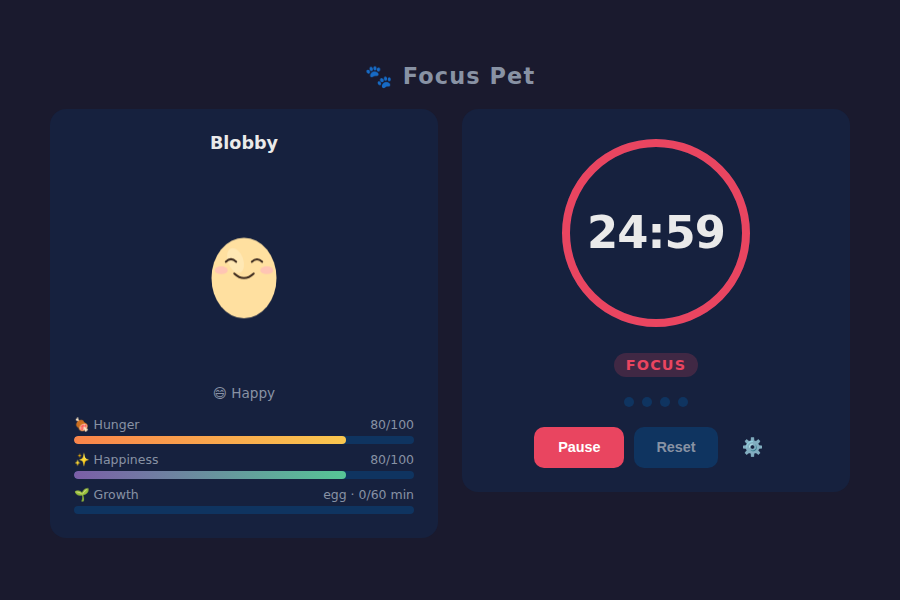

# Focus Pet



*Left: Blobby in egg stage with full hunger and happiness bars. Right: 25-minute focus timer ticking down with the button toggled to Pause.*



A Pomodoro-style focus timer fused with a virtual pet. Complete focus sessions to feed and cheer up your pet. Neglect it and it'll get a little droopy — but one session is always enough to perk it back up.

## How to run

```bash
cd focus-pet
python -m http.server 8080
# open http://localhost:8080
```

ES modules require an HTTP server — `file://` URLs won't work.

## Features

- **Pomodoro timer** — 25 min focus / 5 min short break / 15 min long break (all configurable). Start, pause, reset. Session dots show progress toward the long break.
- **Virtual pet (Blobby)** — SVG blob-creature with 4 mood states (happy, content, hungry, sad) reflected in eye and mouth expressions.
- **4 evolution stages** — egg → baby → child → adult, driven by total focus minutes (0 / 60 / 240 / 600).
- **Stat bars** — Hunger and Happiness (0–100), decay by real elapsed time using timestamps. Completing a session restores both.
- **Time-based decay** — stats drop even when the tab is closed, registered on next load via `lastSeen` timestamp.
- **localStorage persistence** — pet and timer settings survive reloads.
- **Animations** — idle bob (CSS + rAF), bounce reward on session complete, purple radial flash on evolution.
- **Settings panel** — rename your pet, change all three timer durations.

## Pet state machine

| Stat       | Decay rate          | Session reward |
|------------|---------------------|----------------|
| Hunger     | −8 / hour           | +30            |
| Happiness  | −5 / hour           | +20            |

| Stage  | Total focus minutes |
|--------|---------------------|
| Egg    | 0                   |
| Baby   | 60                  |
| Child  | 240                 |
| Adult  | 600                 |

## Stack

Vanilla JS (ES modules) · SVG · CSS · `localStorage` · no build step
