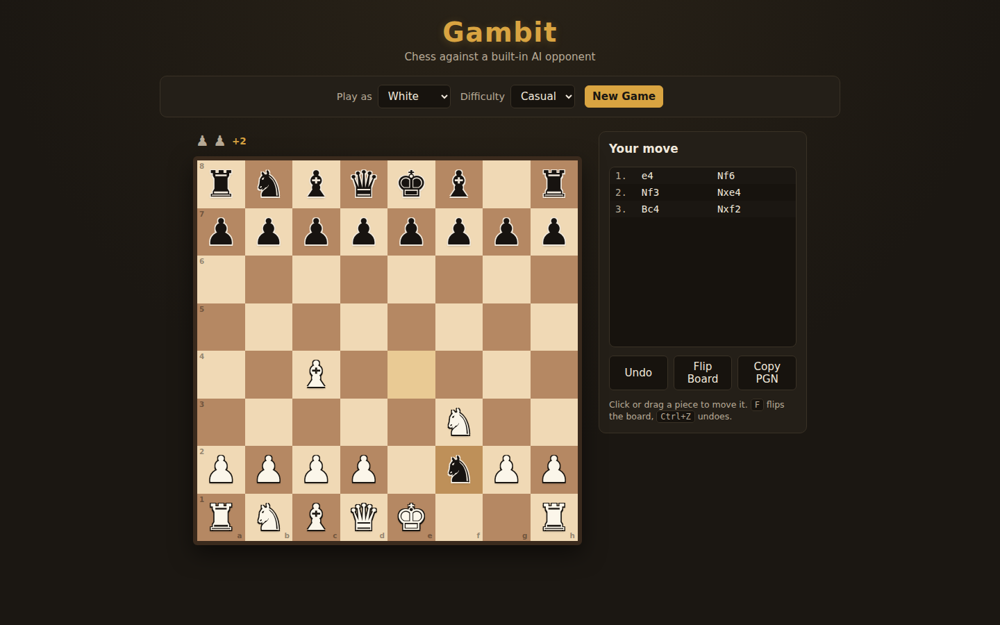

# Gambit — Chess vs AI

A full chess game for the browser: play White or Black against a built-in AI
opponent. Every standard rule is implemented — castling, en passant,
promotion, check/checkmate/stalemate, the fifty-move rule, threefold
repetition, and insufficient-material draws — with a move-history panel in
real algebraic notation and four selectable difficulty levels.

| Early state | Settled state |
|:---:|:---:|
|  |  |

See [`PRD.md`](./PRD.md) for the full product spec.

## What it does

- **Play either side** against a built-in AI, no account or network needed.
- **Full rules engine**, hand-written from scratch: legal move generation
  (including all special-move edge cases), check/checkmate/stalemate
  detection, and draw detection (fifty-move rule, threefold repetition,
  insufficient material).
- **Four difficulty levels** — Casual, Club, Strong, Hard — trading off
  minimax search depth (and, at Hard, a ~1.5s iterative-deepening time
  budget) so the bot is genuinely harder to beat as you go up.
- **Click or drag** to move; legal destinations highlight as dots (quiet
  square) or rings (capture); the king lights up red when in check.
- **Move history** in real algebraic notation (`Nf3`, `O-O`, `exd5`,
  `Qh4#`, …), a captured-pieces tray with material advantage, undo (takes
  back a full turn), flip board, and copy-as-PGN.
- **Auto-resumes** — the in-progress game persists to `localStorage`, so a
  refresh picks up exactly where you left off.
- The AI search runs in a Web Worker, so the board never freezes while the
  bot is thinking, even at Hard.

## How to run

Static site, no build step:

```bash
cd gambit
python -m http.server 8080
# open http://localhost:8080
```

## Key parameters

- **Difficulty** (`Play as` bar): Casual (depth 1, occasionally picks a
  near-best move instead of the best one so it isn't unbeatable), Club
  (depth 2), Strong (depth 3), Hard (iterative deepening to a ~1.5s budget,
  typically reaching depth 4–5).
- **Side**: White, Black, or Random — the AI moves first automatically if
  you're Black.

## How the AI works

- Minimax search with alpha-beta pruning over the legal move tree.
- Move ordering via MVV-LVA (captures tried first, ranked by most-valuable
  victim / least-valuable attacker) to maximize pruning.
- Evaluation = material balance + piece-square tables (pieces favor
  active/central squares, king favors safety early and the center in the
  endgame) + a small mobility bonus.
- The full rules engine was verified against the standard chess "perft"
  move-count test through depth 5 (4,865,609 positions), which exercises
  castling, en passant, and promotion correctness along with ordinary move
  generation.

## Dependencies

None — vanilla JS (ES modules), CSS Grid, and a Web Worker. No frameworks,
no bundler, no chess library.
