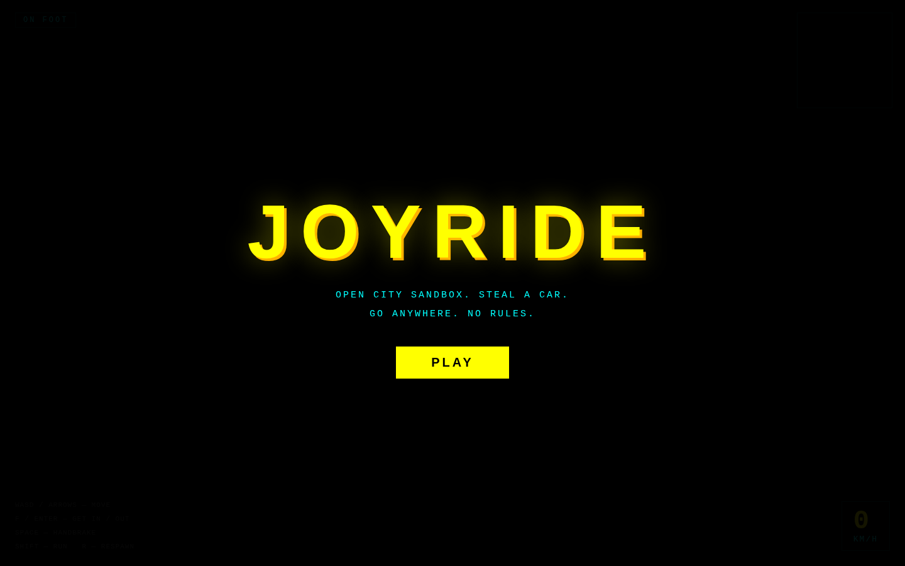
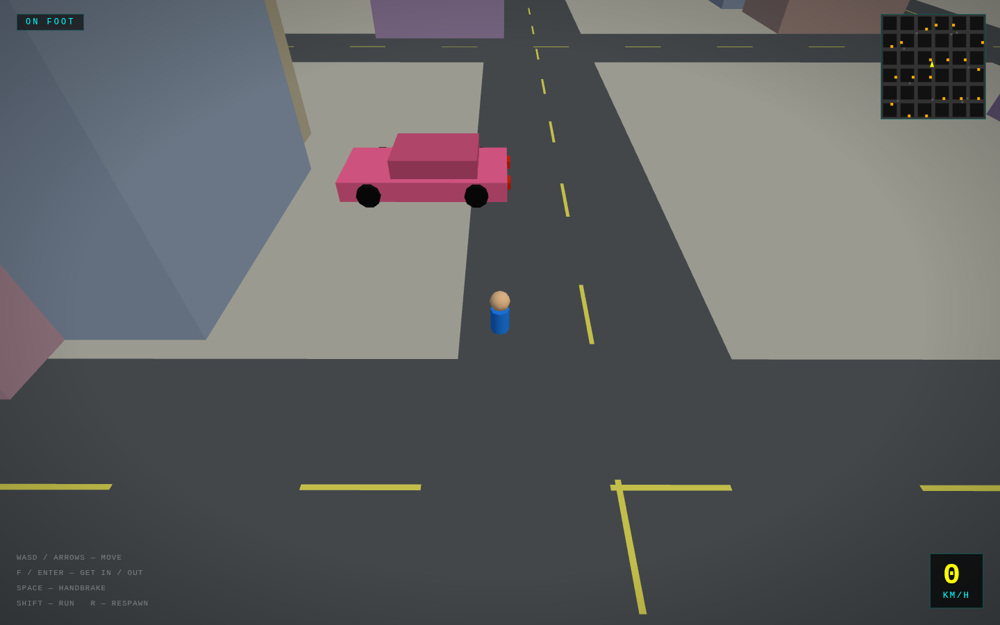
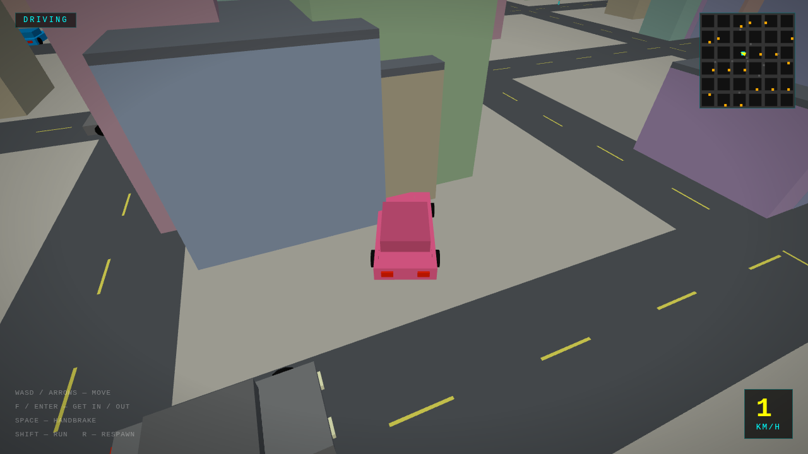

# Joyride

A low-budget, GTA-style open-world sandbox for the browser. Roam a procedurally generated city on foot, walk up to a parked car, get in, and drive anywhere you like. No missions. No fail state. Just freedom.

https://github.com/jason32456/claude_code-workspace/raw/main/joyride/demo.webm

| Start screen | On foot | Driving |
|:---:|:---:|:---:|
|  |  |  |

## How to run

```bash
cd joyride
python3 -m http.server 8080
# open http://localhost:8080
```

Requires an HTTP server — `file://` won't work with ES modules.

## Controls

| Input | On foot | Driving |
|-------|---------|---------|
| WASD / Arrow keys | Walk (camera-relative) | Throttle / brake-reverse / steer |
| Shift | Run | — |
| Space | — | Handbrake |
| F or Enter | Enter nearest car | Exit car |
| R | Respawn at center | — |
| Mouse drag | Orbit camera | — |

On mobile: on-screen joystick + F button (enter/exit) + HB button (handbrake).

## Key parameters (tuning)

Open `index.html` and adjust these constants near the top of the `<script>` block:

| Constant | Default | Effect |
|----------|---------|--------|
| `GRID` | 6 | City size in blocks (6×6) |
| `ROAD_W` | 10 | Road width in world units |
| `BLOCK_W` | 36 | Block interior width |
| `MAX_SPEED_FWD` | 60 | Top speed forward (u/s) |
| `MAX_SPEED_REV` | 18 | Top speed reverse |
| `ACCEL` | 40 | Acceleration rate |
| `STEER_RATE` | 2.0 | Steering sensitivity |

## Stack

- **Three.js** (local bundle, `vendor/three.module.js`) — 3D rendering
- **Vanilla JS** — game logic, input, collision
- **HTML5 Canvas** — minimap overlay
- **No build step** — single `index.html`, fully offline

## Features

- Procedural 6×6 block city with randomized buildings
- On-foot movement with camera-relative WASD and walk bob
- Arcade driving model — speed-dependent steering, handbrake slide, wall collisions
- Circle-vs-AABB deterministic push-out collision (no physics engine)
- Ambient traffic (cars cruising street lanes) and pedestrians
- Third-person chase camera with mouse orbit
- Minimap: roads, parked cars, player heading
- Mobile joystick controls
