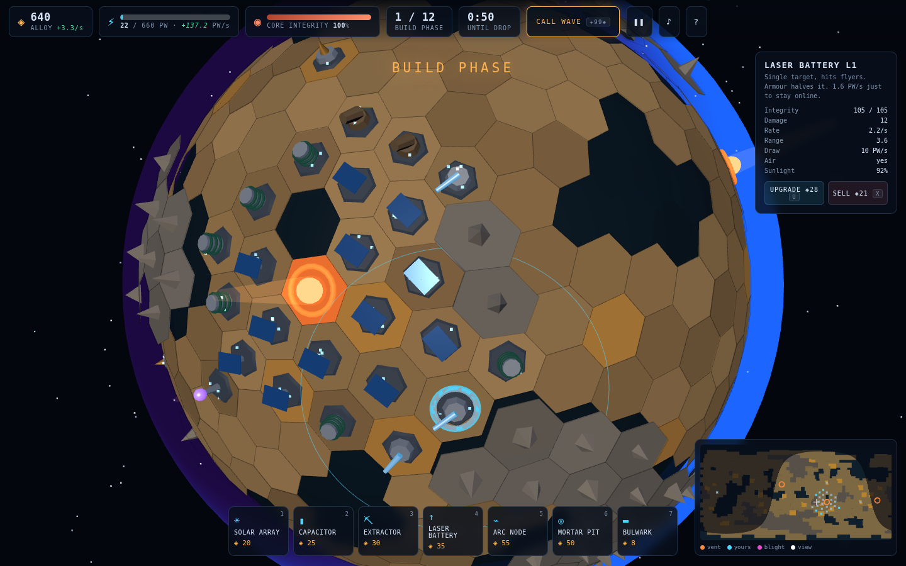
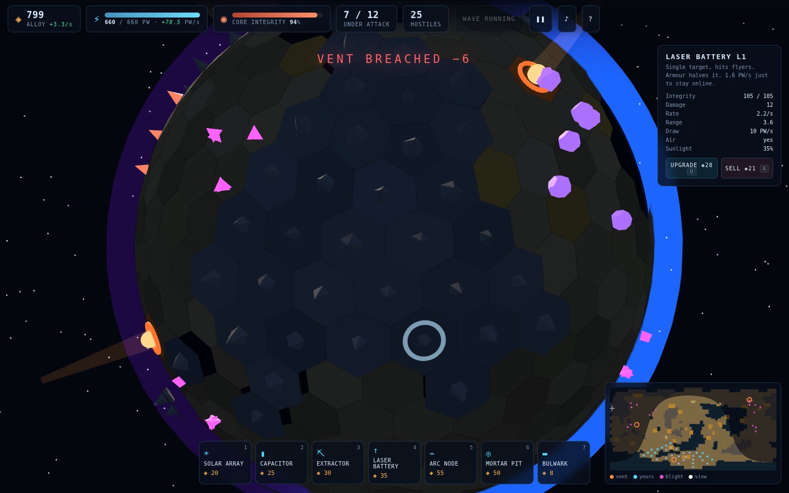
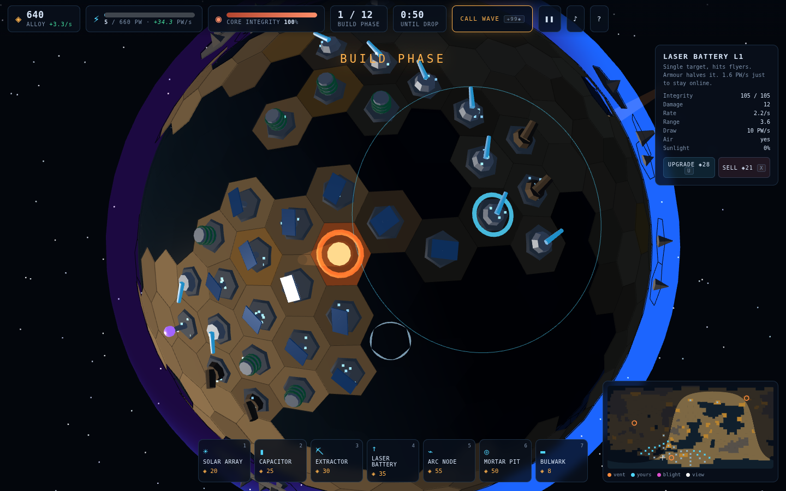

# NIGHTSIDE

A tower defense fought on a **rotating planet**. Your weapons run on sunlight,
and the enemy only ever lands in the dark.

Pods drop onto the unlit half of a 642-tile world, crack open, and walk to the
nearest Core Vent. You never control a unit — you place structures, run two
economies, and read a battlefield that curves away over the horizon. Meanwhile
the sun sweeps across the surface every two minutes, and half of your power grid
is offline at any moment. *Which* half keeps changing.

| Build phase — a base straddling the terminator | 25 hostiles on the night side |
|:---:|:---:|
|  |  |

The mechanic in one frame — solar arrays still lit on the left, laser batteries
already in darkness on the right, and the selected turret's range circle
crossing between them:



## Run it

```bash
cd nightside
python3 -m http.server 8080
# open http://localhost:8080
```

No build step, no `npm install`, no network at runtime — Three.js r163 is
vendored into `vendor/`. Needs WebGL2 and a keyboard/mouse (desktop only).

## How it plays

**Goal** — survive 12 waves. Three Core Vents share one integrity pool; anything
that reaches a vent takes a bite out of it and 0% ends the run.

**Controls**

| | |
|---|---|
| drag | orbit the globe |
| wheel | zoom |
| click | place the selected structure, or inspect an existing one |
| <kbd>1</kbd>–<kbd>7</kbd> | pick a structure |
| <kbd>U</kbd> / <kbd>X</kbd> | upgrade / sell the selected structure |
| <kbd>space</kbd> | call the next wave early — banks the unused build time as alloy |
| <kbd>P</kbd> / <kbd>M</kbd> | pause / mute |
| <kbd>Esc</kbd> | clear selection |
| <kbd>Shift</kbd>+<kbd>R</kbd> | new planet |

## The three decisions

**Where does the farm go.** Solar arrays produce `yield × sunlight`, and each
array touching another gains **+22%**. That bonus is the whole design: without
it the optimal play is to sprinkle arrays evenly over the globe, half of them
are always lit, production is dead flat, and the day/night cycle stops mattering
(an instrumented 12-wave run confirmed the grid never once browned out). Paying
for clustering makes a farm a *place* — which the terminator then leaves.

| Layout | Peak | Behaviour |
|---|---|---|
| one tight farm | highest | swings to near zero every night; needs deep storage |
| scattered singles | lowest | nearly flat, survives with almost no capacitors |
| two opposed farms | middle | one is always earning, at twice the tiles |

**Which gun.** Lasers and Arc Nodes hit flyers but cost real power — 1.6 PW/s
each just to stay online, far more while firing. Mortar Pits need no power at
all and ignore armour, but **cannot touch a Drifter**. A mortar-only night side
loses to flyers; a laser-only night side loses to a blackout.

**Where the gap is.** Pods bias toward tiles far from your turrets, so the drop
always searches for whatever you left uncovered. Three vents spread by
farthest-point sampling mean no single cluster covers everything.

## Structures

| | Name | Cost | Power | Role |
|---|---|---|---|---|
| 1 | Solar Array | 20 | +7 PW/s × sun × links | does nothing at night |
| 2 | Capacitor | 25 | +110 PW store | moves daylight into the dark |
| 3 | Extractor | 30 | −0.5 PW/s | +1.1 alloy/s, ferrite seams only |
| 4 | Laser Battery | 35 | −10 PW/s firing | single target, hits air, halved by armour |
| 5 | Arc Node | 55 | −22 PW/s firing | chains to 3 targets, very hungry |
| 6 | Mortar Pit | 50 | none | splash, ignores armour, **no air** |
| 7 | Bulwark | 8 | none | blocks walkers; flyers ignore it |

Upgrades run to level 3 at `0.8 × base` per level for `1.5×` the numbers.
Selling refunds 60%. A Bulwark is rejected if it would seal any part of the
surface off from the vents — the flow field is recomputed against the
hypothetical wall before the alloy is spent.

## The Blight

| Unit | HP | Behaviour |
|---|---|---|
| Crawler | 30 | walks the flow field to the nearest vent |
| Husk | 110 | armoured — halves beam damage, takes full mortar damage |
| Drifter | 45 | **flies** a great circle; ignores walls and mortars |
| Spitter | 60 | stops at range and destroys your buildings instead of advancing |
| Leviathan | 2600 | wave 12 boss, armoured, sheds Crawlers as it walks |

## How it works

**The grid** is a Goldberg polyhedron — the dual of a 3× subdivided
icosahedron, giving 642 tiles (12 pentagons, 630 hexagons) with exact
neighbour lists. Each source vertex becomes a tile whose corners are the
centroids of the faces touching it, sorted by angle around the tile normal so
the triangle fans wind outward.

**Terrain** comes from 3-octave value noise over the tile centres, cut at
*percentiles* rather than fixed thresholds — value noise clusters around its
mean, so absolute cuts produce wildly different worlds seed to seed. The largest
connected walkable component is kept and orphan pockets are flooded, which
guarantees every drop can reach a vent.

**Pathing** is a flow field, not per-unit A*: one multi-source Dijkstra from all
three vents yields a next-hop for the entire surface, recomputed only when a
wall changes. Unit count is therefore decoupled from pathfinding cost.

**Day/night** — the planet doesn't spin; the sun sweeps, which keeps the camera
stable relative to the terrain while still producing a moving terminator. Tile
insolation is `max(0, n̂ · ŝ)`, feeding both solar yield and the shading.

**Brownouts** — when draw exceeds supply and storage is empty, every powered
turret's rate of fire scales by `production / draw` rather than cutting out, so
the failure mode is a visible, recoverable sag instead of a cliff.

**Rendering** — one merged vertex-coloured mesh for all 642 tiles with a face→
tile lookup for raycast picking, instanced meshes per enemy type, pooled beams
and blasts, and a fresnel atmosphere shell. Audio is synthesised from
oscillators; the folder ships no audio files.

## Files

```
nightside/
├── PRD.md            ← product requirements + design rationale
├── index.html
├── style.css
├── vendor/three.module.js
└── js/
    ├── main.js       ← bootstrap + frame loop
    ├── game.js       ← state machine, economy, waves, placement rules
    ├── config.js     ← every tunable number
    ├── planet.js     ← geodesic tile generation, terrain, mesh building
    ├── pathing.js    ← multi-source Dijkstra flow field + seal check
    ├── structures.js ← building meshes, targeting, firing
    ├── enemies.js    ← unit behaviour, instanced rendering
    ├── effects.js    ← beams, shells, blasts, sparks, drop pods
    ├── render.js     ← scene, lights, starfield, atmosphere, sun sweep
    ├── input.js      ← orbit camera + tile picking + hotkeys
    ├── hud.js        ← DOM readouts + equirectangular surface map
    └── audio.js      ← procedural WebAudio SFX
```

Every run generates a new planet, so the screenshots above are three different
worlds.
