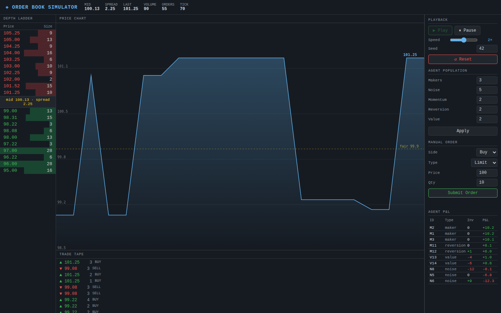
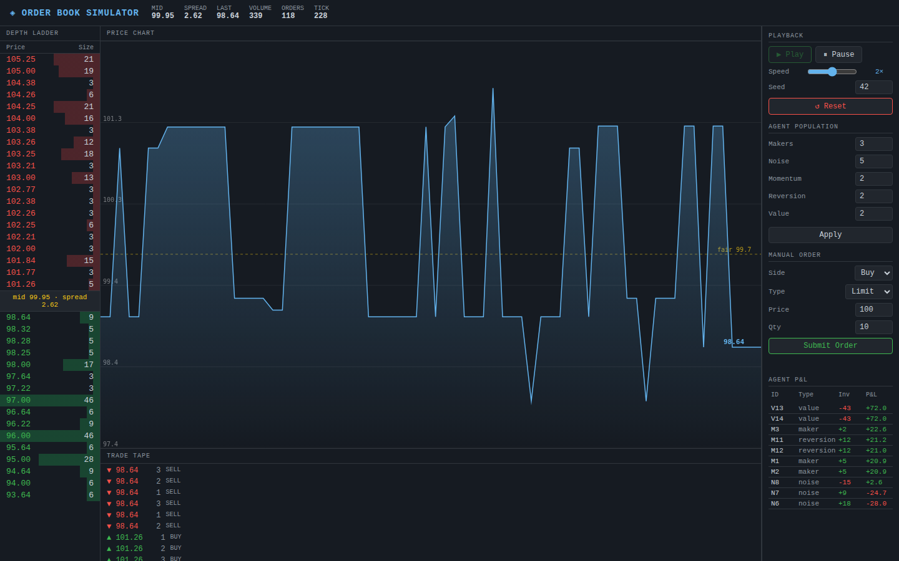

# Order Book Matching Simulator

A fully working limit-order-book exchange with a live agent-based market running on top of it. The matching engine is correctness-critical (price-time priority, partial fills, cancel/amend) and is covered by unit tests. On top sits a population of rule-based trader agents whose interaction produces emergent price action.

## Features

### Matching Engine
- Limit and market orders with price-time (FIFO) priority
- Partial fills — remainder rests or is cancelled
- Trade executes at the **maker's price** (taker gets price improvement)
- Cancel and amend (cancel-replace) with O(1) order lookup
- 41 unit tests covering all edge cases

### Simulation
- Tick-based loop driven by `setTimeout`
- Seeded PRNG (Mulberry32) — same seed + config → identical run
- Drifting "true value" process anchors the value traders

### Agent Zoo
| Agent | Behaviour |
|-------|-----------|
| **Market Maker** | Posts bid/ask around mid; skews quotes by inventory to mean-revert position |
| **Noise Trader** | Random side/size/timing; keeps the market moving |
| **Momentum Trader** | Detects recent moves and trades with the trend |
| **Mean-Reversion Trader** | Fades moves relative to rolling average |
| **Value Trader** | Tracks a slowly drifting fair value; buys cheap, sells dear |

### UI
- **Live depth ladder** — bid/ask levels with size bars
- **Live price chart** — last-trade price line with fair-value reference (dashed)
- **Trade tape** — scrolling prints with direction arrows
- **Stats bar** — mid, spread, last, volume, order count, tick
- **Agent P&L leaderboard** — inventory and mark-to-market P&L per agent
- **Manual order entry** — submit your own limit/market orders into the live book

## How to run

```bash
cd order-book-simulator
python -m http.server 8080
# open http://localhost:8080
```

ES modules require an HTTP server — `file://` URLs will not work.

## Run unit tests

```bash
cd order-book-simulator
node tests/engine.test.js
```

## Controls

| Control | Description |
|---------|-------------|
| Play / Pause | Start or freeze the simulation |
| Speed slider | 0.5× to 10× real-time |
| Seed + Reset | Reset with a specific seed for a reproducible run |
| Agent counts | Change how many of each agent type; click **Apply** |
| Manual Order | Submit your own orders into the live market |

## Key parameters

- **Seed** — integer; changing it gives a completely different run
- **Market makers** — more makers → tighter spread, deeper book
- **Momentum** — more momentum traders → larger swings, bubble/crash behaviour
- **Value traders** — anchor the price to a slowly drifting fair value
- **Noise traders** — background flow; more noise → higher volume, noisier price

## Stack

Vanilla JS with ES modules, zero dependencies, Canvas 2D for the chart. Runs entirely in the browser.

## Screenshots

| Early state — ~70 ticks in | Settled state — volatility clusters, momentum spikes |
|:---:|:---:|
|  |  |
