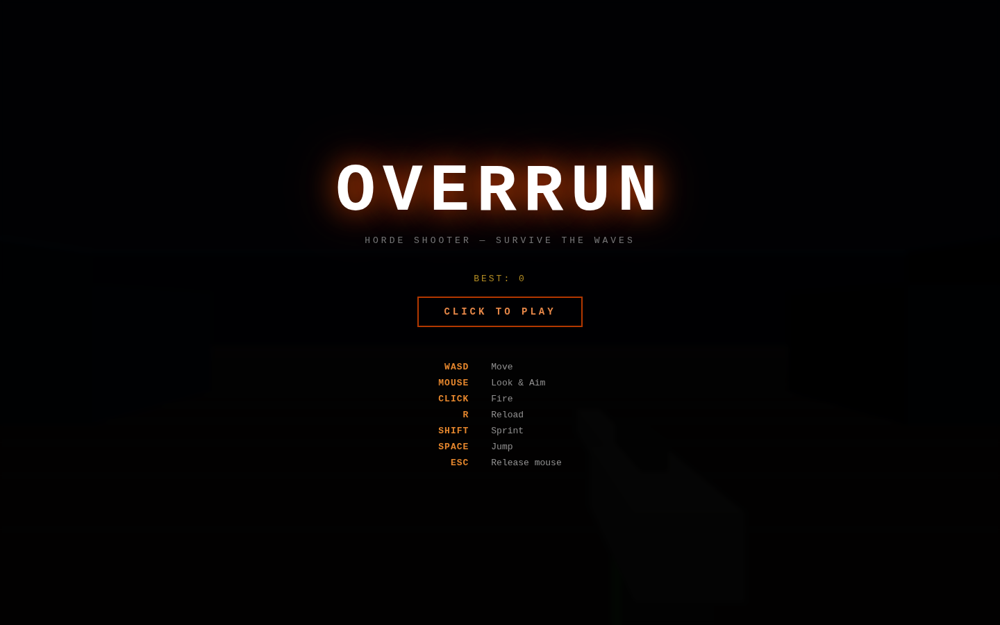
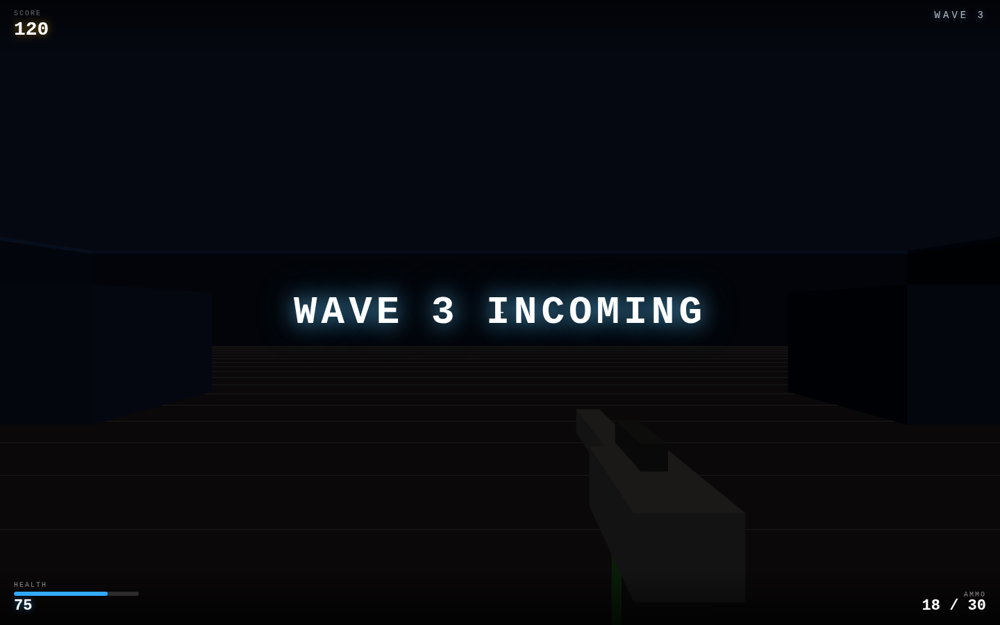

# OVERRUN

A fast-paced browser FPS. You're dropped into a closed arena; enemies spawn at the edges and rush you. Shoot them, clear the wave, survive the next one — which is bigger and meaner.

Built with Three.js (bundled locally) and vanilla JS. Fully offline, no CDN, desktop-first.

| Menu | Arena |
|:---:|:---:|
|  |  |

## How to run

```bash
cd overrun
python3 -m http.server 8080
# open http://localhost:8080
```

ES modules require an HTTP server — `file://` URLs will not work.

## Controls

| Input | Action |
|-------|--------|
| Click | Lock mouse / fire |
| WASD | Move |
| Shift | Sprint |
| Space | Jump |
| R | Reload |
| ESC | Release mouse |

## Gameplay

- Survive escalating waves of melee enemies.
- Each wave is larger and enemies are faster, tougher, and hit harder.
- **Health regenerates** after a few seconds without damage — use cover and keep moving.
- Score is **kills × 10** + **wave-clear bonus** (increases with wave number).
- High score is saved in `localStorage`.

## Stack

- **Three.js r157** — bundled locally at `vendor/three.module.min.js`
- **Vanilla JS ES modules** — no build step required
- **Python HTTP server** — for local development

## Architecture

| File | Responsibility |
|------|----------------|
| `js/constants.js` | All tunable values (speeds, damage, wave scaling, etc.) |
| `js/arena.js` | Floor, walls, cover blocks, AABB collision resolution |
| `js/player.js` | FPS controller: accel/friction movement, gravity, view bob |
| `js/weapon.js` | Hitscan raycast, magazine, reload, muzzle flash, view model |
| `js/enemy.js` | Enemy pool, per-enemy state machine (chase/attack/hurt/dying) |
| `js/waves.js` | Wave director: spawn scheduling, difficulty scaling, score |
| `js/game.js` | Render loop, state machine, camera, HUD, effects |

## Tuning

All gameplay values live in `js/constants.js`. Key parameters:

```js
WALK_SPEED     = 8        // units/s
SPRINT_MULT    = 1.7      // ×walk speed
GUN_FIRE_INTERVAL = 1/9   // fire rate gate
GUN_DMG        = 25       // per shot
ENEMY_BASE_HP  = 60       // wave 1 HP
ENEMY_BASE_SPD = 3.0      // wave 1 speed
WAVE_BASE      = 5        // enemies in wave 1
WAVE_STEP      = 3        // extra enemies per wave
REGEN_DELAY    = 5        // seconds before regen kicks in
REGEN_RATE     = 8        // HP/s during regen
```
