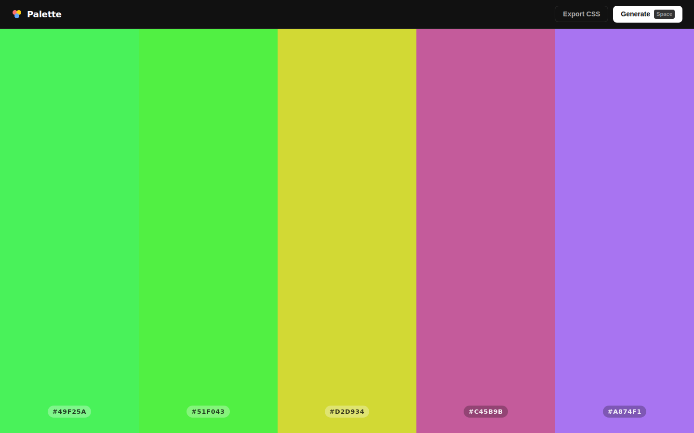
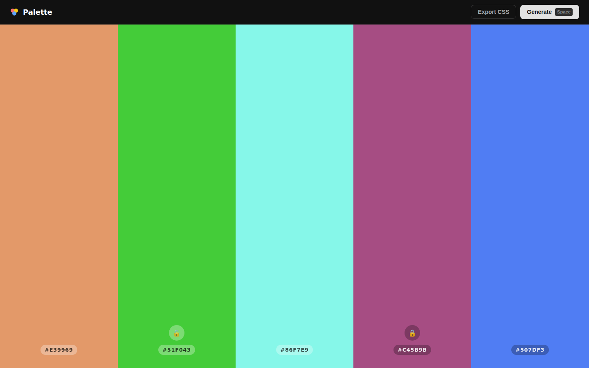

# Palette — Color Generator

A dead-simple color palette generator. Press **Space** (or click Generate) to get a new 5-color palette. Lock any color you love, regenerate the rest. Click a hex code to copy it instantly.

| Early state | With locked swatches |
|:---:|:---:|
|  |  |

## Features

- **5-swatch palette** fills the full viewport
- **Spacebar** or **Generate** button regenerates unlocked colors
- **Lock icon** on each swatch — locked colors survive regeneration
- **Click hex code** to copy it to clipboard
- **Export CSS** copies all colors as CSS custom properties (`--color-1` … `--color-5`)
- Toast confirmation on every copy action
- Mobile-friendly (vertical stack on small screens)

## How to run locally

```bash
cd palette
python3 -m http.server 8080
# open http://localhost:8080
```

ES modules require an HTTP server — `file://` URLs won't work.

## Stack

- Vanilla HTML5 / CSS3 / ES6 JS — zero dependencies, no build step
- Colors generated in HSL space for guaranteed saturation and lightness
- WCAG luminance check picks white or dark text per swatch automatically

## Key parameters

| Parameter | Value | Where |
|-----------|-------|--------|
| Swatch count | 5 | `COUNT` in `app.js` |
| Saturation range | 45–90 % | `randomColor()` in `app.js` |
| Lightness range | 30–75 % | `randomColor()` in `app.js` |
| Toast duration | 1.5 s | `showToast()` in `app.js` |
