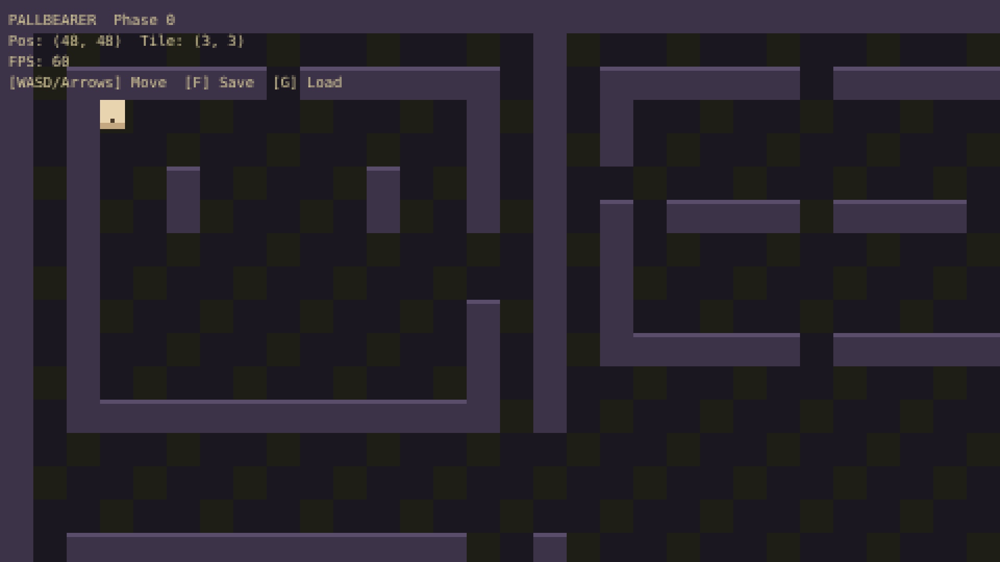
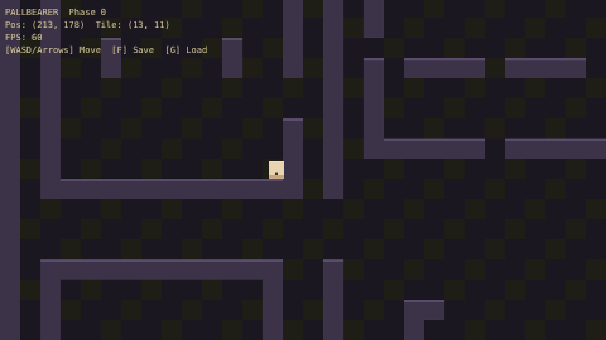

# PALLBEARER — Phase 0 Skeleton

A 2D action RPG prototype built with TypeScript, PixiJS 7, and Vite. Phase 0 establishes the core engine skeleton: movement, tilemap rendering, tile-based collision, smooth camera, a multi-room test level, and IndexedDB save/load.

Internal resolution is 480×270, integer-scaled with `image-rendering: pixelated` for a crisp retro look.

| Early state | Settled state |
|:---:|:---:|
|  |  |

## Controls

| Key | Action |
|-----|--------|
| WASD / Arrow Keys | Move player |
| F | Save position to slot 0 |
| G | Load position from slot 0 |
| — | Auto-saves every 30 seconds |

## Stack

- **TypeScript 5** — strict mode, ESNext modules
- **PixiJS 7.x** — Canvas 2D renderer, Graphics API for all drawing
- **Vite 5.x** — dev server + production build
- **IndexedDB** — save/load via `idb` (raw API, no extra library)
- **ECS architecture** — `World`, components (`CTransform`, `CVelocity`, `CPlayer`, `CTileMap`, `CCamera`, `CSprite`), and per-frame systems

## How to run

```bash
cd pallbearer
npm install
npm run dev
# open http://localhost:8080
```

To build for production:

```bash
npm run build
# serve dist/ with any static file server
```

## Phase 0 acceptance criteria

- [x] Stable 60 fps
- [x] Walk around the test room with WASD / arrow keys
- [x] Tile-based collision (walls block movement)
- [x] Smooth camera follows player, clamped to map bounds
- [x] F to save position, G to load — persists across page reload (IndexedDB)
- [x] Auto-save every 30 seconds
