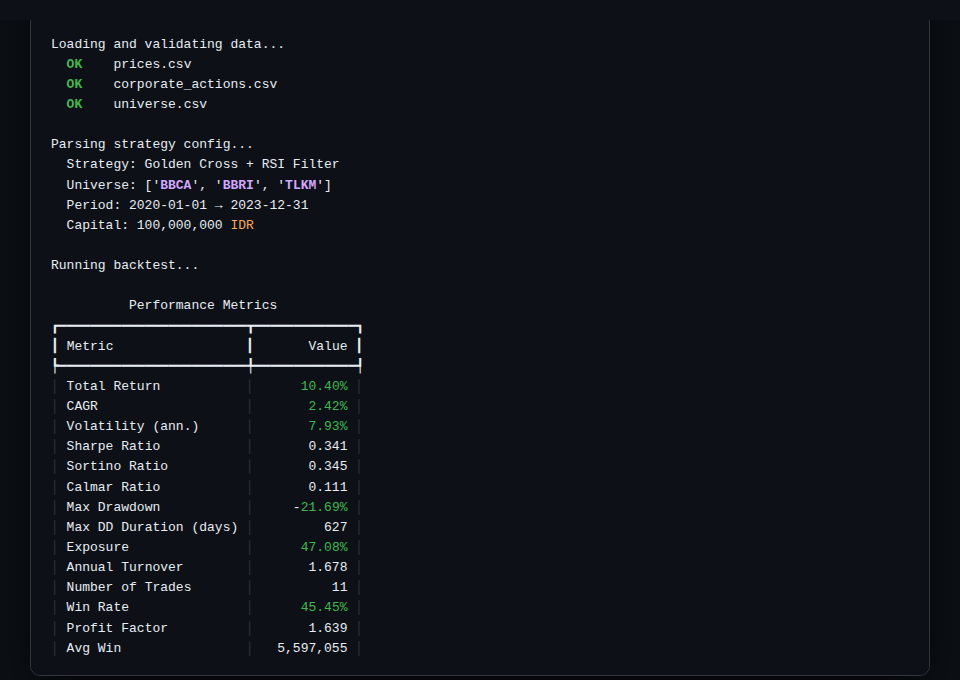
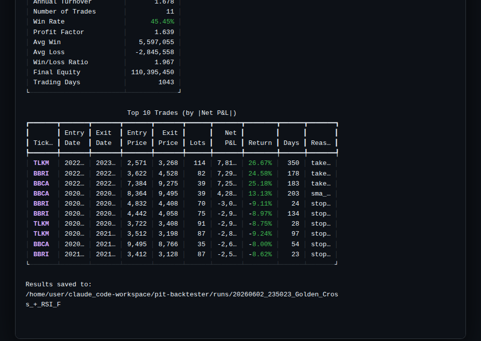

# IDX PIT Backtester

A point-in-time (PIT) strategy backtesting engine for rule-based equity trading on the Indonesia Stock Exchange (IDX). The engine makes look-ahead bias **structurally impossible** — not just discouraged — by enforcing a strict PIT data-access discipline at the architecture level.

| Early state | Settled state |
|:---:|:---:|
|  |  |

> **Demo video:** [screenshots/demo.mp4](screenshots/demo.mp4)

---

## Why this exists

Most homegrown backtesters silently leak future information. The equity curve looks great precisely because the engine cheated. The common sources:

1. **Same-bar decision and execution** — deciding to buy *at* the close of bar T using that same close, then filling at that close. The close is not known until the bar is complete.
2. **Survivorship bias** — backtesting only on tickers that still exist today.
3. **Reporting lag** — treating Q1 earnings as known on the last day of Q1.
4. **Adjustment leakage** — back-adjusting prices using corporate actions that hadn't happened yet.

This engine refuses to lie. A correct equity curve that is honestly mediocre is worth infinitely more than an impressive one built on leaked data.

---

## How it works

The engine maintains a simulated **as-of clock**. Every data read passes through a `PITDataView` bound to that clock:

```python
class PITDataView:
    def history(self, ticker, field, lookback):
        # Returns at most `lookback` bars with date <= clock.now
        # Future bars are ABSENT from the returned object — not filtered, absent.
        past = df.loc[df.index <= self._clock.now, field]
        return past.iloc[-lookback:]
```

Future rows are structurally absent, not merely discouraged. This converts leakage from a discipline problem into an impossibility.

The one-bar **signal/fill separation** (`signal_on: close` → `fill_on: next_open`) is the single most important execution design choice: you compute your signal after the close, you trade at the next open.

---

## Features (Phase 0 — Engine)

- **PIT-safe data access** — clock-bound history(), leakage impossible by construction
- **JSON strategy definition** — declarative, validatable, no user code
- **Technical indicators** — SMA, EMA, RSI, MACD, ATR, Bollinger Bands
- **Signal operators** — `<`, `>`, `==`, `cross_above`, `cross_below`
- **Entry/exit combinators** — `all` (AND), `any` (OR), nestable
- **Exit primitives** — `stop_loss`, `take_profit`, `trailing_stop`, `time_stop`
- **Position sizing** — `equal_weight`, `fixed_fraction`, `fixed_lots` with `max_positions`
- **IDX market mechanics** — 100-share lots, broker commissions (separate buy/sell), sell-side final tax, slippage in basis points
- **Corporate actions** — PIT-correct split/dividend adjustment
- **Survivorship bias protection** — universe.csv enforcement; warning if absent
- **Full metrics suite** — Total Return, CAGR, Sharpe, Sortino, Calmar, Max Drawdown, Win Rate, Profit Factor, and more
- **Trade log** — every closed trade with entry/exit dates, prices, costs, and which exit rule fired
- **Audit log** — machine-readable record of every signal and fill for post-hoc verification
- **Deterministic** — identical inputs produce byte-identical results
- **15 acceptance tests** — 8 adversarial leakage tests (the project's definition of done)

---

## Quick start

### 1. Install dependencies

```bash
cd pit-backtester
pip install -r requirements.txt
```

### 2. Generate sample data

```bash
python scripts/generate_sample_data.py
```

This creates BBCA, BBRI, TLKM price data (2019–2023, ~1,300 trading days) using geometric Brownian motion.

### 3. Run a backtest

```bash
python cli.py run \
  --strategy sample_data/strategies/golden_cross.json \
  --prices sample_data/prices.csv \
  --corporate-actions sample_data/corporate_actions.csv \
  --universe sample_data/universe.csv
```

### 4. View saved results

```bash
python cli.py show <run_id>
```

---

## Data inputs

All data is supplied as CSV. The engine validates on load and refuses to proceed on hard errors.

| File | Required | Description |
|------|----------|-------------|
| `prices.csv` | **Yes** | Daily OHLCV — raw unadjusted prices, tickers without `.JK` suffix |
| `corporate_actions.csv` | No* | Splits, dividends — needed for correct total-return figures |
| `universe.csv` | No* | Listed/delisted dates per ticker — defeats survivorship bias |
| `benchmark.csv` | No | Index series for alpha/beta/IR metrics |

*Strongly recommended. Running without `universe.csv` emits a survivorship-bias warning.

---

## Strategy format

Strategies are defined in JSON. See `sample_data/strategies/golden_cross.json` for a complete example.

```json
{
  "name": "Golden Cross + RSI Filter",
  "universe": ["BBCA", "BBRI", "TLKM"],
  "start_date": "2020-01-01",
  "end_date": "2023-12-31",
  "initial_capital": 100000000,
  "entry": {
    "all": [
      {"indicator": "sma", "period": 50, "op": "cross_above",
       "target": {"indicator": "sma", "period": 200}},
      {"indicator": "rsi", "period": 14, "op": "<", "value": 70}
    ]
  },
  "exit": {
    "any": [
      {"indicator": "sma", "period": 50, "op": "cross_below",
       "target": {"indicator": "sma", "period": 200}},
      {"type": "stop_loss", "pct": 0.08},
      {"type": "take_profit", "pct": 0.25}
    ]
  },
  "sizing": {"method": "equal_weight", "max_positions": 3},
  "execution": {"signal_on": "close", "fill_on": "next_open"},
  "costs": {
    "commission_buy_pct": 0.0015,
    "commission_sell_pct": 0.0025,
    "sell_tax_pct": 0.001,
    "slippage_bps": 5
  },
  "lot_size": 100
}
```

### Supported indicators

`sma`, `ema`, `rsi`, `macd`, `atr`, `bollinger`, `close`, `open`, `high`, `low`, `volume`

### Supported operators

`<`, `<=`, `>`, `>=`, `==`, `cross_above`, `cross_below`

### Sizing methods

| Method | Description |
|--------|-------------|
| `equal_weight` | Allocates `cash / available_slots` per position |
| `fixed_fraction` | Allocates `cash * fraction` per position |
| `fixed_lots` | Fixed number of lots per position |

---

## Sample backtest result

Golden Cross + RSI Filter on BBCA, BBRI, TLKM (2020–2023):

| Metric | Value |
|--------|-------|
| Total Return | 10.40% |
| CAGR | 2.42% |
| Sharpe Ratio | 0.341 |
| Sortino Ratio | 0.345 |
| Max Drawdown | -21.69% |
| Win Rate | 45.45% |
| Profit Factor | 1.639 |
| Trades | 11 |
| Best trade | TLKM +26.7% (take_profit) |

---

## Tests

```bash
python -m pytest tests/ -v
```

**15/15 passing**, including the full leakage test suite:

| Test | What it proves |
|------|---------------|
| `test_history_never_returns_future_bars` | history() structurally cannot return bars after clock.now |
| `test_history_field_count` | lookback=N returns exactly N bars, all in the past |
| `test_current_bar_is_pit` | current_bar() returns None for future dates |
| `test_indicator_uses_only_past_data` | RSI at day N+1 ≠ RSI at day N — each clock sees its own slice |
| `test_cross_signal_no_leakage` | cross_above fires at bar 6, not bar 5 — no peeking at the breakout bar early |
| `test_exit_stop_loss_uses_current_bar_only` | Stop uses current close, not any future price |
| `test_clock_monotonicity` | Clock can only advance forward — raises on backward travel |
| `test_available_tickers_respects_clock` | Tickers with all bars in the future are not available |

---

## Project structure

```
pit-backtester/
  backtester/
    data/         # CSV loaders, validation, PIT store, corporate-action adjuster
    strategy/     # JSON schema validation, indicators, condition evaluator
    engine/       # as-of clock, event loop, portfolio, broker (fills/costs/lots)
    metrics/      # performance analytics, benchmark stats
    report/       # JSON/CSV result serialization
  tests/          # leakage test suite + engine integration tests
  sample_data/    # generated sample data + example strategies
  scripts/        # data generator, demo video tool
  cli.py          # CLI entry point
```

---

## Phased roadmap

- **Phase 0** ✅ — Engine: PIT data layer, event loop, JSON strategies, metrics, CLI
- **Phase 1** — FastAPI + React dashboard with equity curve charts
- **Phase 2** — Rule DSL expression parser
- **Phase 3** — PIT fundamentals, full corporate-action handling, benchmark analytics
- **Phase 4** (gated) — Sandboxed Python strategies + walk-forward optimization

---

## Stack

Python 3.11 · pandas · numpy · pydantic v2 · duckdb · rich · click · pytest
