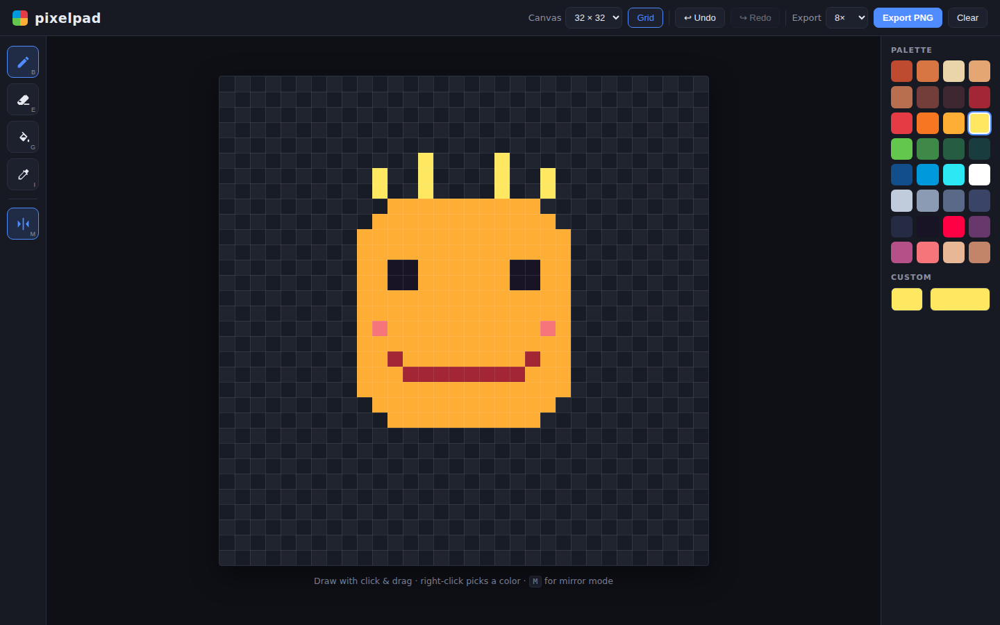
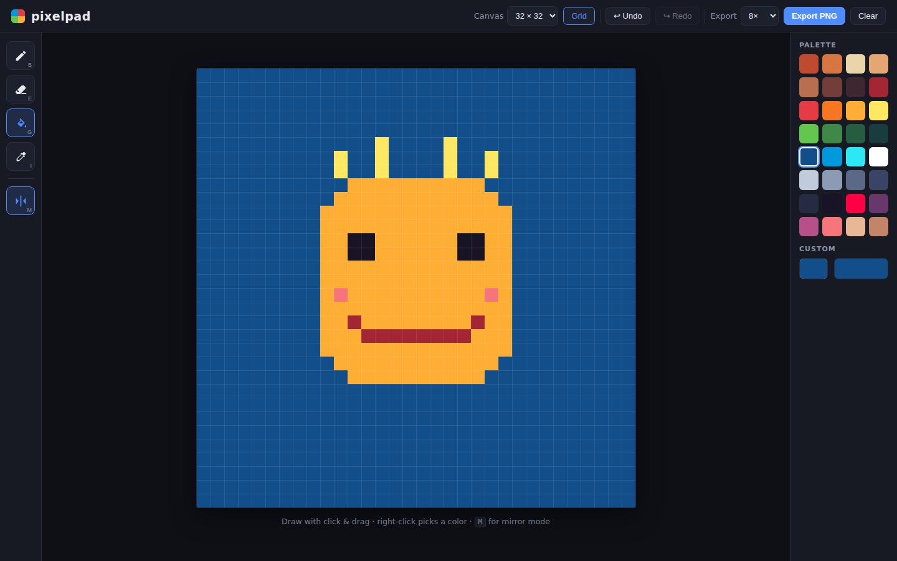

# pixelpad

A tiny, fast pixel art editor in the browser. Pick a color, draw sprites, avatars, icons, or favicons on a 16/32/64 pixel grid, and export the result as a crisp PNG at up to 32× scale — transparency included. Everything runs client-side and your drawing autosaves to `localStorage`, so a refresh never loses work.

| Mirror-mode drawing | Fill tool settled |
|:---:|:---:|
|  |  |

See [PRD.md](PRD.md) for the full product spec.

## How to run

```bash
cd pixelpad
python -m http.server 8080
# open http://localhost:8080
```

No dependencies, no build step — vanilla JS with ES modules (which is why it needs an HTTP server rather than `file://`).

## Features

- **Canvas sizes** — 16×16, 32×32, or 64×64 with a checkerboard behind transparent pixels and toggleable grid lines.
- **Tools** — pencil, eraser, flood fill, eyedropper (right-click anywhere also picks a color).
- **Mirror mode** — X-axis symmetry mirrors every stroke live; instant faces, ships, and monsters.
- **Color** — the Endesga 32 pixel-art palette, a native custom color picker, and your 8 most recent custom colors.
- **Undo / redo** — 50 steps, via buttons or `Ctrl/Cmd+Z` / `Ctrl+Y`.
- **Export PNG** — 1×, 4×, 8×, 16×, or 32× nearest-neighbor scale, transparency preserved.
- **Autosave** — drawing, palette, and settings persist to `localStorage` (debounced after every stroke).

## Keyboard shortcuts

| Key | Action |
|-----|--------|
| `B` | Pencil |
| `E` | Eraser |
| `G` | Fill |
| `I` | Eyedropper |
| `M` | Toggle mirror mode |
| `Ctrl/Cmd+Z` | Undo |
| `Ctrl+Y` / `Ctrl/Cmd+Shift+Z` | Redo |

## Files

| File | Role |
|------|------|
| `main.js` | UI wiring, keyboard shortcuts, boot/restore |
| `editor.js` | Canvas state, rendering, undo/redo history |
| `tools.js` | Pencil/eraser/fill/eyedropper behaviors, mirror stamping |
| `palette.js` | Default palette, active color, recent colors |
| `storage.js` | Debounced `localStorage` persistence |
| `export.js` | Nearest-neighbor PNG scaling and download |
