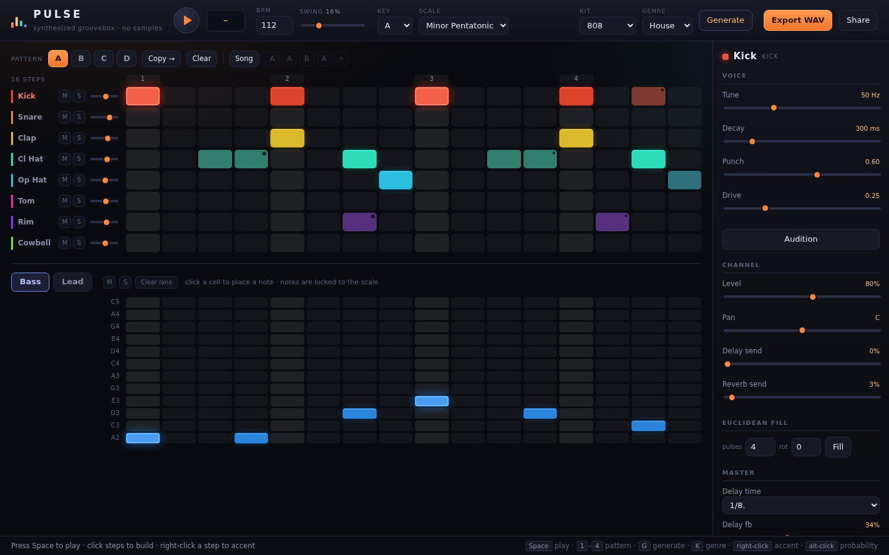
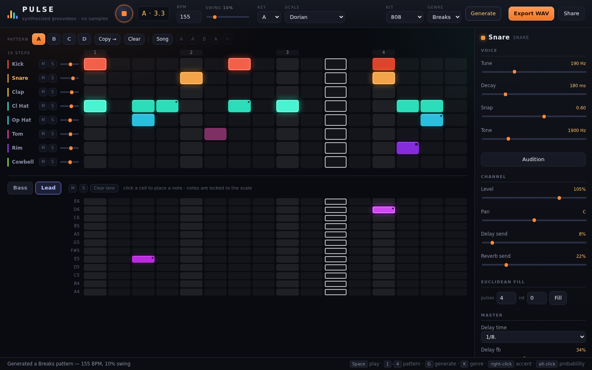

# PULSE — a synthesized browser groovebox

A 16-step groovebox that ships **zero audio files**. Every kick, hat, clap and bassline
is built from oscillators and noise in the Web Audio graph, so the whole instrument is a
handful of text files: it loads instantly, runs offline, lets you tune every voice, and
renders your loop to a real 16-bit WAV.

| Pattern editor | Playing a generated breaks pattern |
|:---:|:---:|
|  |  |

## Why no samples

Practically every browser drum machine is a sample player — it downloads megabytes of kit
WAVs, so its sounds are fixed and it is dead without a network. Synthesizing instead buys
three things a sample player structurally cannot have:

- **Every voice is editable.** Tune the kick, stretch its decay, open the hat — the sound
  is math, not a recording.
- **Instant and offline.** No asset fetch, no loading bar.
- **Exact export.** The same graph rebuilt in an `OfflineAudioContext` renders faster than
  real time, so the WAV is a true render rather than a screen recording.

## Run it

```bash
cd pulse
python -m http.server 8080
# open http://localhost:8080
```

ES modules need an HTTP server — opening `index.html` over `file://` will not work.
No build step, no dependencies.

## Using it

**Drums.** Click a cell to place a hit, drag to paint a run of them.
Right-click (or shift-click) cycles the velocity **ghost → normal → accent**.
Alt-click cycles the step's probability **100 → 75 → 50 → 25 %** — shown as a corner
notch, and re-rolled on every pass so the pattern breathes instead of looping dead flat.

**Notes.** The lower grid is a note roll for the selected melodic track (Bass or Lead).
Its rows are *scale degrees*, not semitones, so every note you can place is in key and
changing the key or scale transposes the line musically instead of breaking it.

**Patterns and songs.** Four slots, `A`–`D`. **Copy →** duplicates the current pattern into
the next slot; **Song** plays the chain of chips beside it instead of a single pattern
(click a chip to cycle it, right-click to remove, `+` to append).

**Sound.** Pick a track to load it into the inspector on the right: its voice parameters,
channel level/pan/delay/reverb sends, a one-click Euclidean fill, and the master FX.

**Output.** **Export WAV** renders offline and downloads. **Share** packs the whole session
— patterns, sounds, mix, tempo — into the URL and copies it to your clipboard.

### Keyboard

| Key | Action |
|---|---|
| `Space` | Play / stop |
| `1`–`4` | Jump to pattern A–D |
| `G` | Generate a new pattern in the current genre |
| `K` | Cycle the genre |

## How it works

**Timing.** A `setInterval` tick every 25 ms looks 100 ms ahead and schedules any step
falling in that window against `AudioContext.currentTime` — the lookahead scheduler from
Chris Wilson's [*A Tale of Two Clocks*](https://web.dev/articles/audio-scheduling). Timer
jitter never reaches the audio; the UI playhead reads a queue of `(step, time)` pairs on
`requestAnimationFrame`. Swing is applied as a delay on odd 16ths at schedule time, so the
underlying grid stays rigid and swing never accumulates drift.

**Voices.** Kick is a pitch-enveloped sine plus a click transient; snare is band-passed
noise over a tuned triangle body; the hats run the 808's six inharmonic square oscillators
into a band-pass with a parallel noise layer for sizzle; clap is three staggered noise
bursts plus a tail. Bass and lead are subtractive synths with their own filter envelopes.

**Signal path.**

```
voice → track gain → track pan ─┬─→ dry ────────────────┐
                                ├─→ delay send → delay ─┤→ drive → rumble cut
                                └─→ reverb send → conv ─┘   → master filter
                                                            → compressor → out
```

Delay is tempo-synced with a damped feedback loop. Reverb is a `ConvolverNode` fed a
**procedurally generated** impulse response (decaying, progressively darkened noise) —
still no asset files.

**Export.** `createEngine(ctx, project)` takes its context as an argument, so WAV export
rebuilds the identical graph in an `OfflineAudioContext` and runs the same scheduling code.
Noise is seeded and probability dice use a seeded PRNG, so a given project always renders
the same file.

## Files

| File | Role |
|---|---|
| `src/main.js` | Wiring: state, audio lifecycle, rAF playhead, keyboard |
| `src/state.js` | Project model, demo patterns, compact serialization |
| `src/engine.js` | The audio graph — channels, sends, master chain |
| `src/voices.js` | Every drum and synth voice |
| `src/transport.js` | Lookahead scheduler and swing |
| `src/export.js` | Offline render + 16-bit PCM WAV encoder |
| `src/generate.js` | Genre-weighted pattern generator |
| `src/theory.js` | Scales, note ladders, Euclidean rhythms |
| `src/kits.js` | Track definitions, parameter schemas, kit presets |
| `src/share.js` | URL-hash session sharing (deflate + base64url) |
| `src/storage.js` | Debounced `localStorage` autosave |
| `src/ui.js` | Grid, note roll, inspector, all DOM |

## Parameters worth knowing

- **BPM** 60–200 · **Swing** 0–65 % (applied to odd 16ths)
- **Kits** — `808`, `909`, `Lo-Fi`, `Acoustic` swap every voice's parameters at once
- **Genres** — House, Techno, Trap, Breaks, Lo-Fi drive the generator, and set a matching
  tempo, swing and scale
- **Export** renders two passes of the current pattern, or the whole chain in Song mode,
  plus a 2.5 s tail so the reverb and delay ring out

## Dependencies

None. Vanilla JS, ES modules, Web Audio API.

## Not in this version

Sample import, microphone recording, MIDI in/out, per-track pattern lengths (polyrhythm),
automation lanes, patterns longer than 16 steps, and a touch-first mobile layout.
