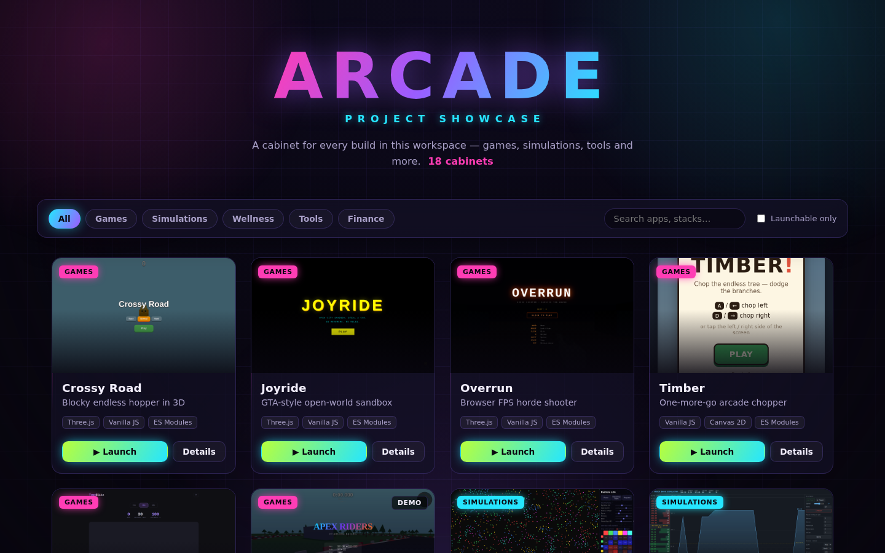
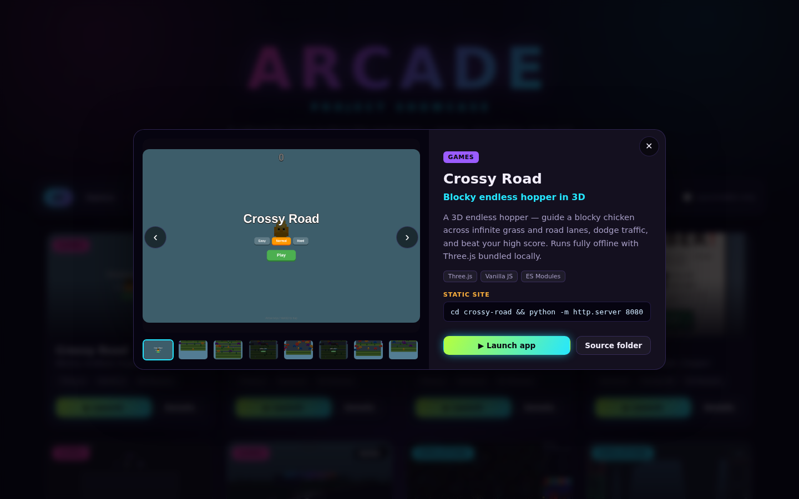
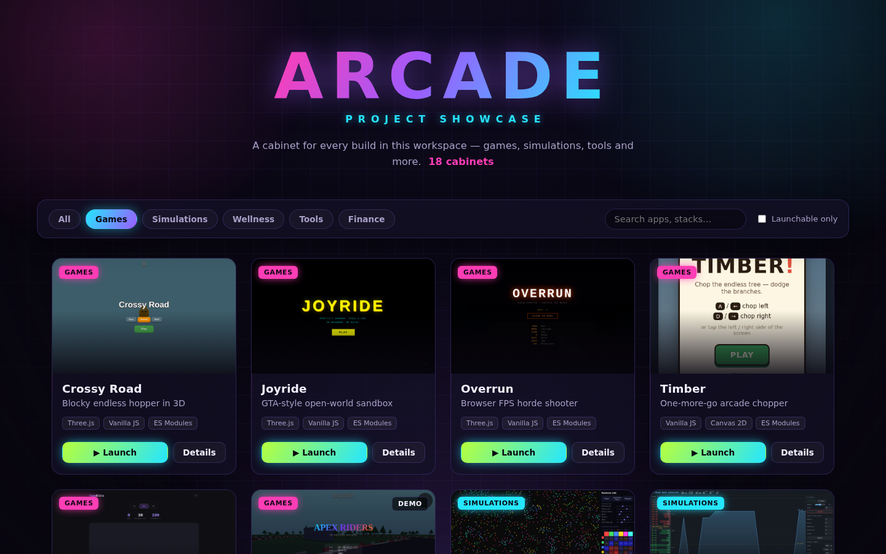

# Arcade — Project Showcase

An arcade-style launcher that presents every app in this workspace as a neon
"cabinet" card. Browse by category, search by name or stack, open a screenshot
gallery for any project, and **launch the runnable apps live** in a new tab.

| Grid | Detail / gallery modal |
|:---:|:---:|
|  |  |

| Filtered by category |
|:---:|
|  |

## What it does

- **One cabinet per project** — cover screenshot, title, tagline, stack chips, and a
  category badge.
- **Launch where possible.** The static apps get a live **Launch** button that opens
  the running app. The three that need a build/server step
  (`finance-dashboard` · Next.js, `pit-backtester` · Python CLI, `apex-riders` ·
  unbuilt Vite) instead show a **View** button with a gallery and the exact run command.
- **Filter + search** — category pills (Games / Simulations / Wellness / Tools /
  Finance), a live text search over names and stacks, and a "Launchable only" toggle.
- **Gallery modal** — full screenshot gallery (with prev/next + keyboard arrows),
  description, run command, and source link. `pit-backtester` also shows its demo clip.

## How to run

> **Important:** serve from the **repository root**, not from inside `showcase/`.
> The Launch buttons and cover images use relative `../<project>/` paths, so they
> only resolve when the document root is the repo root.

```bash
# from the repo root (one level above this folder)
python -m http.server 8080
# then open http://localhost:8080/showcase/
```

Launching `cd showcase && python -m http.server` will show the grid but the launch
links and screenshots will 404 — by design.

## How it's built

Vanilla JS + ES modules, no build tooling — consistent with the rest of the repo.

```
showcase/
├── index.html        # page shell + module entry
├── style.css         # arcade theme
├── main.js           # wires data → grid, filters, search, modal
├── data/projects.js  # single source of truth: one entry per project
├── js/card.js        # builds a cabinet card
├── js/grid.js        # renders + filters/searches the grid
└── js/modal.js       # reusable gallery/detail modal
```

Screenshots are referenced **in place** from each project's own `screenshots/`
folder — nothing is copied or duplicated. To add a project, append an entry to
`data/projects.js` (set `launchable: false` if it needs a build/server step).

## Deploying later

The relative-path layout already matches how Vercel serves the repo root, so launch
links and screenshots resolve identically in production. To make `/` land on the
showcase, update the catch-all route in the repo's `vercel.json` to point at
`/showcase/$1` and add a matching `showcase` route pair (mirroring the existing
per-app routes). No build step or bundler is required.
