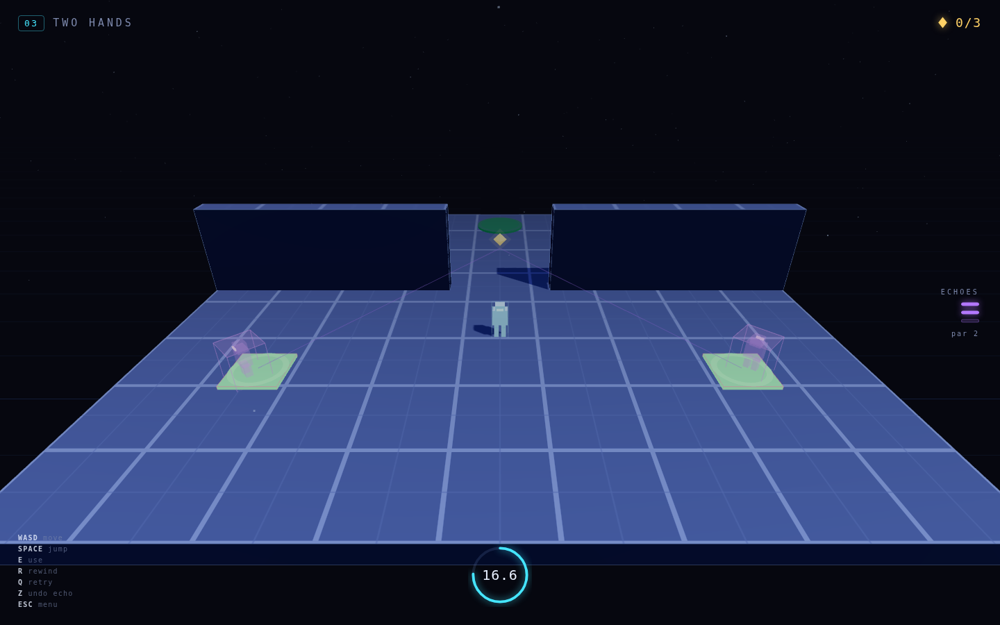
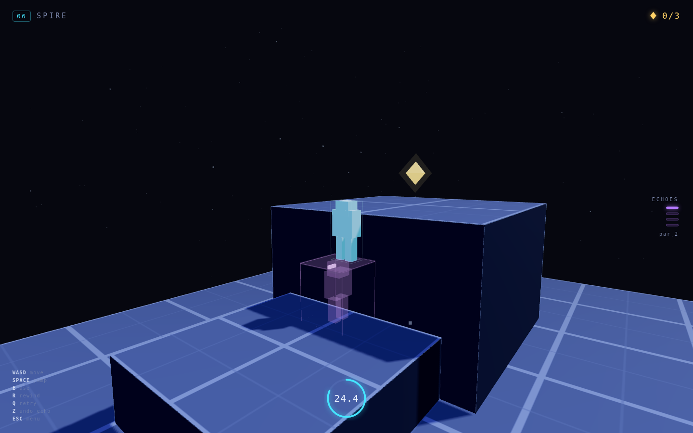
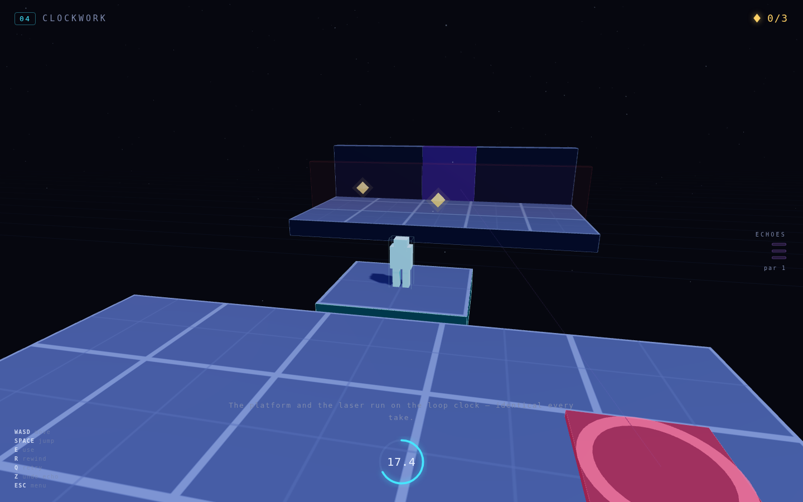
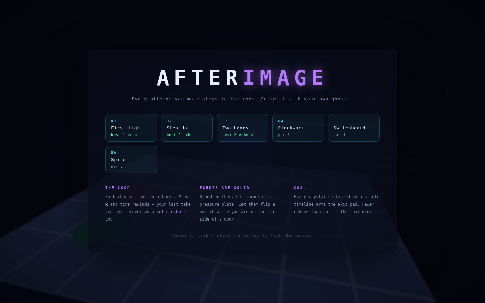

# AFTERIMAGE

A 3D time-loop puzzle-platformer. Every chamber runs on a countdown; when the clock
runs out — or when you press **R** — time rewinds and your last attempt stays behind
as an **echo**: a translucent replay of you that is *physically solid*. Stand on it.
Let it hold a pressure plate. Let it flip a switch while you are locked on the far
side of a door. Six chambers, one body, and as many copies of yourself as the level
budget allows.

Built with Three.js (vendored locally — the game makes zero network requests after
load) and vanilla ES modules. No build step.

| Two echoes holding a two-plate door open | Standing on an echo to reach the spire |
|:---:|:---:|
|  |  |

| Riding a loop-synced platform over the void | Title screen |
|:---:|:---:|
|  |  |

## Run it

```bash
cd showcase/apps/afterimage
python3 -m http.server 8080
# open http://localhost:8080
```

ES modules need a real HTTP server — opening `index.html` over `file://` will not work.
Desktop only (keyboard + mouse). No dependencies to install.

## Controls

| Input | Action |
|---|---|
| `W A S D` | Move (camera-relative) |
| `Space` | Jump |
| `E` | Use a switch |
| `R` | **Rewind** — bank this take as an echo and restart the loop |
| `Q` | Retry the take (throw the current recording away) |
| `Z` | Undo — delete your newest echo |
| Mouse | Orbit the camera (click the canvas to lock the cursor) |
| `Esc` | Pause / level select |

## How it works

**Collect every crystal in a single timeline, then stand on the exit pad.** Crystals
count whether *you* or an *echo* picks them up, so a route too long for one loop
becomes two loops with your past self doing half of it.

Elements you will meet, one per chamber:

| Element | Behaviour |
|---|---|
| **Echo** | Your recorded take, replayed from t = 0 and solid. Freezes on its last frame — rewind while stood on a plate and it holds that plate forever. |
| **Pressure plate** | Powered while any body overlaps it; its ring turns green and the wire to its door lights up. |
| **Door** | Opens when *all* its plates are held, and/or when its switch matches its polarity. |
| **Switch** | `E` to toggle for the rest of the take. A door can be wired **inverted**, so one switch gates two doors in opposite phase. |
| **Platform** | Ping-pongs on the loop clock with a dwell at each dock — identical every take, so you can plan around it. |
| **Laser** | Blinks on the loop clock. Contact discards the current take; your banked echoes survive. |
| **Exit** | Arms once every crystal is collected. |

### The chambers

| # | Name | The idea | Loop | Echo budget | Par |
|---|---|---|---|---|---|
| 1 | First Light | An echo holds the plate so you can walk through | 16 s | 2 | 1 |
| 2 | Step Up | An echo is a 1.8 m staircase | 16 s | 2 | 1 |
| 3 | Two Hands | Two plates held at the same instant | 22 s | 3 | 2 |
| 4 | Clockwork | Ride the platform, time the laser, someone holds the plate | 26 s | 3 | 1 |
| 5 | Switchboard | One switch, two inverted doors, one echo pressing it twice | 26 s | 3 | 1 |
| 6 | Spire | Echo on a pillar becomes the step to a 5 m ledge, plus a vault | 30 s | 4 | 2 |

Beating a chamber under par is the actual game. Best echo count per level is saved to
`localStorage`, along with how far you have unlocked.

## Technical notes

- **Fixed 60 Hz simulation** with an accumulator, bounded catch-up, and rendering
  decoupled from it. Frame-rate independence is a correctness requirement here, not a
  nicety: a recording has to replay tick-for-tick identically on any machine.
- **Playback, not re-simulation.** An echo replays stored transforms rather than
  re-running physics, so it can never drift or diverge from what you actually did.
- **Custom AABB character controller** — no physics library. Axis-by-axis resolution
  with a contact skin (without it, standing on a box registers a hairline vertical
  overlap and the horizontal pass ejects you sideways through the floor you are on),
  plus platform-riding via the supporting body's per-frame delta.
- **Echoes arm on separation.** Every take starts with you and all your echoes stacked
  on the same spawn point, so an echo stays intangible until you have stepped clear of
  it once. Its wireframe is drawn at collider size, so the surface you can stand on is
  the surface you can see.
- **All audio is synthesized** from oscillators and filtered noise at runtime — no
  audio files, so it loads instantly and works offline.
- **Jump maths**: gravity 40 m/s², jump 14.2 m/s → a 2.25 m apex and 0.7 s of airtime.
  Every ledge height in every level is authored against those numbers: above 2.5 m
  needs an echo, above 4.3 m needs an echo standing on something.

## Files

```
afterimage/
├── PRD.md              product requirements this was built from
├── index.html          shell, HUD markup, overlays
├── style.css
├── vendor/three.module.js
└── js/
    ├── main.js         bootstrap, menu and overlay wiring
    ├── game.js         scene, fixed-step loop, take/echo lifecycle, save data
    ├── levels.js       all six chambers as data
    ├── world.js        level builder + plate/door/switch/platform/laser logic
    ├── player.js       character controller and the shared figure model
    ├── echo.js         recording playback and arming
    ├── physics.js      AABB collision resolution
    ├── camera.js       orbit chase cam with wall pull-in and rewind shake
    ├── input.js        keyboard + pointer lock
    ├── audio.js        Web Audio synthesis
    └── hud.js          loop ring, echo pips, crystal count, toasts
```
