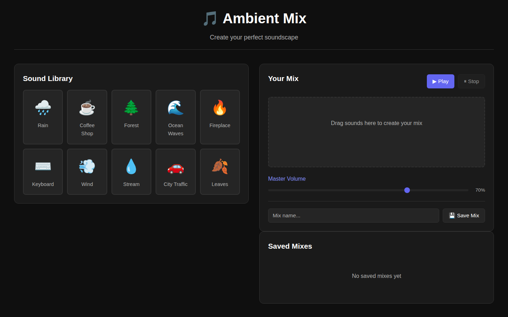
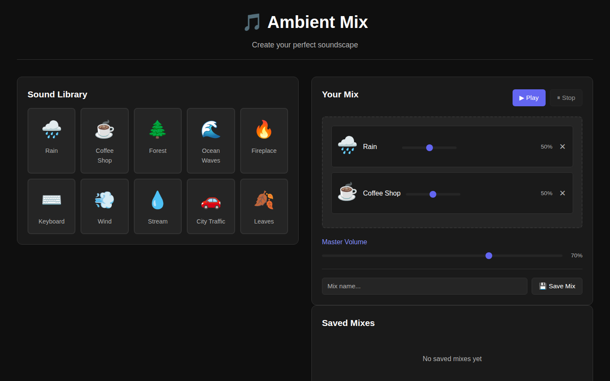

# Ambient Mix

A lightweight, interactive ambient sound mixer for creating custom soundscapes. Drag sounds into your mix, adjust volumes, and save your favorite combinations for instant access.

| Initial State | With Mix |
|:---:|:---:|
|  |  |

## Features

- **10 Pre-loaded Sounds**: Rain, Coffee Shop, Forest, Ocean Waves, Fireplace, Keyboard, Wind, Stream, City Traffic, Leaves
- **Drag-and-Drop Mixer**: Add up to 5 sounds to your mix instantly
- **Individual Volume Control**: Adjust each sound independently with sliders
- **Master Volume**: Global volume control for the entire mix
- **Save/Load Mixes**: Store your favorite combinations in browser storage for quick access
- **Quick Presets**: Built-in mixes for Focus, Relax, Sleep, and Work modes
- **Minimal Design**: Dark mode UI optimized for extended focus sessions

## How to Run

```bash
cd showcase/apps/ambient-mix
python3 -m http.server 8080
# Open http://localhost:8080 in your browser
```

## How to Use

1. **Drag sounds** from the library on the left into your mix panel
2. **Adjust volumes** with individual sliders for each sound
3. **Control master volume** for the entire mix
4. **Click Play** to start your soundscape
5. **Save your mix** by entering a name and clicking "Save Mix"
6. **Load saved mixes** by clicking the "Load" button in the Saved Mixes section

## Tech Stack

- **HTML5** for structure
- **CSS3** for dark-mode responsive design
- **Vanilla JavaScript** with Web Audio API for mixing
- **Browser Storage** (LocalStorage) for saving mixes

## Browser Support

Works on all modern browsers that support the Web Audio API:
- Chrome/Edge 14+
- Firefox 25+
- Safari 6+
- Mobile browsers (responsive design)

## Limitations (MVP)

- Audio files are fetched from Mixkit (third-party CDN)
- Mix data stored locally in browser only
- No user accounts or cloud sync
- Limited to 5 simultaneous sounds

## Future Enhancements

- Upload custom sounds
- Timer with auto-stop
- Expand sound library
- Cloud sync with user accounts
- Export/import mix files
- Social sharing of mixes
- Keyboard shortcuts

## Notes

Sound files are loaded from [Mixkit](https://mixkit.co) under the Mixkit Sound Effects Free License.
