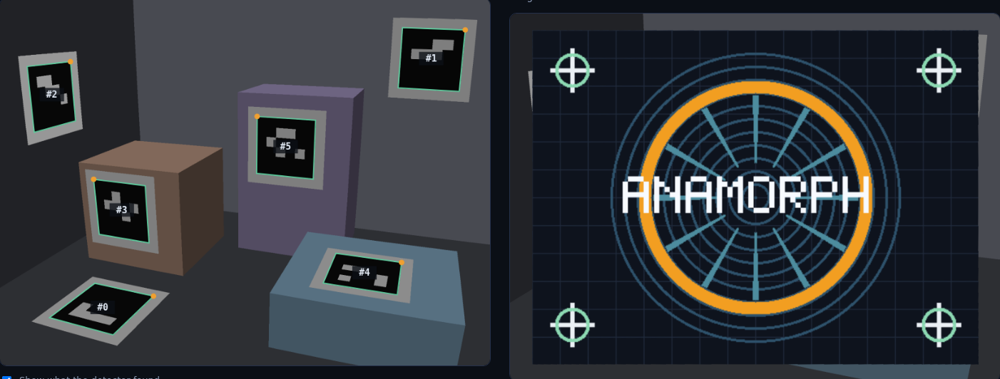
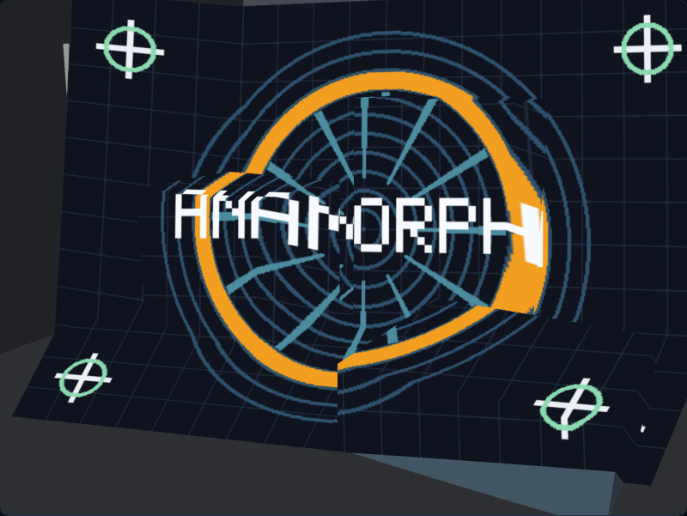
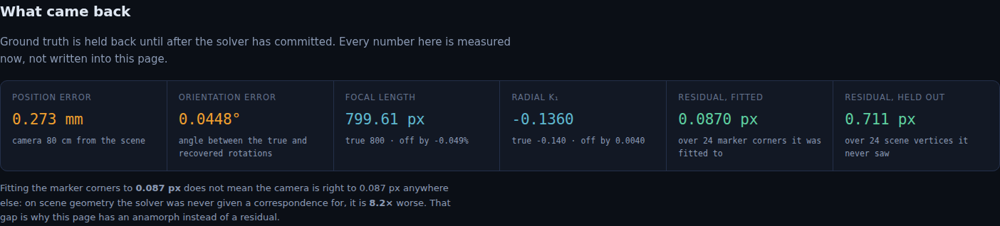
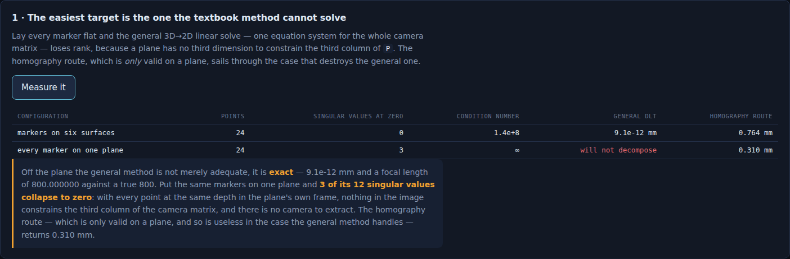
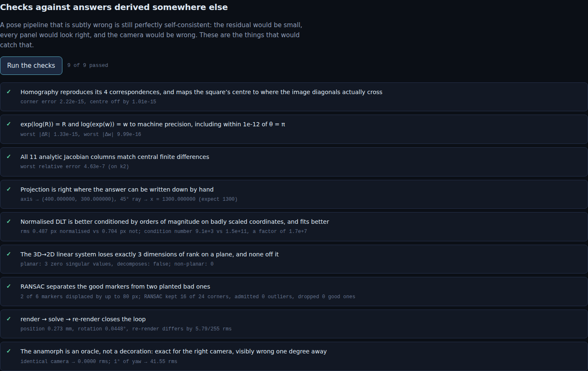

# Anamorph

Render a scene under a camera the app then deletes, recover that camera from the
rendered pixels alone, and prove the recovery with an anamorphic painting that
resolves into a picture from the recovered viewpoint and from nowhere else.

| The photograph, and the picture it gives back | The same paint, from somewhere else |
|:---:|:---:|
|  |  |

| What came back | The plane the textbook method cannot solve |
|:---:|:---:|
|  |  |

See [`PRD.md`](./PRD.md) for the full spec, including the claim this project was
built to demonstrate and then had to withdraw.

## Why an anamorph

Pose estimation is normally graded by a number nobody can feel. "0.087 px
reprojection error" means nothing to a reader, and a page that prints it is
asking to be trusted.

An anamorph cannot be trusted or distrusted. Paint every surface point `X` with
the colour the source picture has at `project(RECOVERED, X)`, then photograph the
result with the *true* camera. The two maps compose to the identity exactly when
the recovered camera equals the true one, so the picture comes back whole if the
recovery is right and smears if it is not. A viewer grades a six-degree-of-freedom
solve with their eyes before a single number appears — and the residual turns out
to deserve the suspicion, for reasons finding 4 makes concrete.

## The pipeline

Everything is written out by hand. No WebGL, no library, no build step.

```
scene + hidden camera
  → software rasteriser (z-buffer, perspective-correct, supersampled,
    rendered through the lens rather than at the corners)
  → Otsu threshold → connected components → Moore border following
  → Douglas–Peucker → 4-gon filter → sub-pixel corner refinement
  → unwarp, read the 6×6 grid, decode against the codebook with rotation
  → per-marker homography (normalised DLT) → plane pose → focal-length sweep
  → LO-RANSAC → Levenberg–Marquardt over pose + focal length + distortion
  → anamorph keyed to the recovered camera
```

The world is **Y-down**, the OpenCV convention, so that a camera looking along
`+Z` with image `v` increasing downward is an ordinary right-handed frame.
Authoring with Y up instead quietly makes every camera a reflection, which is the
sort of thing that still renders.

## What it measures

Every number below is recomputed live in the page from the current scene. None of
them is written into the copy.

**1. The camera comes back.** Position error **0.273 mm** and orientation error
**0.045°**, with the camera 80 cm from the scene; focal length `799.61` against a
true `800`; radial `k₁` to within `0.004`.

**The residual is not the same thing as being right.** The solver fits its 24
marker corners to `0.087 px`. On scene geometry it was never given a
correspondence for, it is **8.2× worse** at `0.711 px`. That gap is the argument
for the anamorph.

**2. The easiest-looking target is the one the general method cannot solve.**
Off the plane, the textbook 3D→2D linear solve is not merely adequate but
**exact** — `9.1e-12` mm, focal length `800.000000`. Put the same markers on a
single plane and **3 of the 12 singular values collapse to zero**: with every
point at one depth in the plane's own frame, nothing constrains the third column
of the camera matrix, the condition number is infinite, and there is no camera to
extract. The homography route — valid *only* on a plane, and so useless in the
case the general method handles perfectly — returns `0.310 mm`.

**3. Focal length and distance are the same thing, and the thing that separates
them is not what this project expected.** Hold a flat target square-on and sweep
the focal length from `508` to `1558 px`, a factor of 3.1: the residual moves by
**0.000 px in total**, while the recovered camera slides from `566 mm` to
`1718 mm` away to keep the picture the same size. Every one of those cameras
explains the photograph equally well. That is not a solver failing; it is a
question the image does not contain the answer to. Tilt the same flat target and
the valley closes — by 35° the focal length is pinned to `0.21%`.

**4. The claim that did not survive.** This project set out to show that *scene
relief* is what breaks that tie, and the measurement says otherwise. With the
markers coplanar to `6e-17 mm` — provably flat — the focal length still comes
back to `0.07%`, and no relief setting in the sweep is measurably better than any
other. Those markers lie on the floor and are seen at a steep angle, and a
slanted plane determines the focal length on its own: one homography puts two
constraints on the intrinsics, and they go degenerate only when the plane faces
the camera square-on. The experiment was measuring the wrong variable. It ships
anyway, because deleting it would leave finding 3 looking like something this
project knew in advance.

**5. Two free parameters that always help and buy nothing.** Render a *true*
pinhole, with no distortion for them to find, then fit it with both radial
coefficients free. The residual falls in **5 of 5** noise levels — it has to,
since two spare degrees of freedom can absorb noise that is not radial at all.
The position error improves in 2 of 5, with ratios scattered either side of 1. So
the honest result is not the one this was set up to show: fitting parameters that
do not exist does not visibly damage the camera, **it just stops the residual
from telling you anything**.

**6. Spread beats count.** One photograph of twelve markers, used twice: six
spread across the frame give `4.75 mm`, six packed into a corner give
`11.23 mm` — **2.4× worse** at identical count, marker size, noise and pixels.
Their residuals are *identical* to three decimals (`0.766` against `0.766 px`),
so nothing in the fit reports the problem. Doubling the evidence does not fix it
either: all twelve give `4.50 mm`, no better than the well-chosen six.

## What it refuses to do

- There is no accuracy figure for an image it did not render, because there is no
  ground truth for one.
- Translation magnitude is not recoverable independently of focal length from a
  single view of a fronto-parallel plane, and the page says "not determined"
  rather than printing the number the solver happens to return.
- Markers clipped by the frame edge, or too small, are rejected with the reason
  rather than fitted badly.

## Checks



Nine checks against answers derived outside the code being checked, because a
pose pipeline that is subtly wrong is still perfectly self-consistent — the
residual would be small, every panel would look right, and the camera would be
wrong. Among them: every one of the 11 analytic Jacobian columns against central
finite differences; `exp(log(R)) = R` to machine precision within `1e-12` of the
`θ = π` singularity; the planar rank collapse asserted as a rank; RANSAC
separating two planted bad markers from four good ones with no false positives;
and the full render → solve → re-render round trip.

Two of them failed when first written and the code changed rather than the
threshold. The RANSAC check originally planted outliers per *corner*, which at 40%
corruption leaves almost no marker with four clean corners — a fair test of a
different algorithm, not of this one. Fixing the test exposed a real weakness: a
single 172 mm marker is too weak a global hypothesis to score at a 4 px gate, and
the solver now locally optimises each hypothesis before judging it.

## Running it

```bash
cd showcase/apps/anamorph
python -m http.server 8080
# open http://localhost:8080
```

ES modules need an HTTP server; `file://` will not work.

## Layout

```
anamorph/
├── index.html         page
├── main.js            UI, charts, experiment wiring
├── style.css
└── js/
    ├── la.js          linear algebra: Gaussian elimination, Jacobi eigen,
    │                  null spaces, Rodrigues via quaternion
    ├── camera.js      projection, radial lens, analytic Jacobian
    ├── raster.js      software rasteriser + the inverse-distortion resample
    ├── scene.js       the room, the layouts, marker placement
    ├── markers.js     the searched codebook and the decoder
    ├── source.js      the picture the anamorph resolves into (procedural)
    ├── homography.js  normalised and unnormalised DLT
    ├── detect.js      threshold, components, contours, quads, sub-pixel corners
    ├── pose.js        DLT, RQ decomposition, plane pose, LO-RANSAC, LM
    ├── anamorph.js    the paint, and the residual it is graded by
    ├── pipeline.js    scene → photograph → correspondences → camera
    ├── experiments.js the five measurements
    ├── selftest.js    the nine checks
    └── rng.js         seeded generator, so every number is reproducible
```
