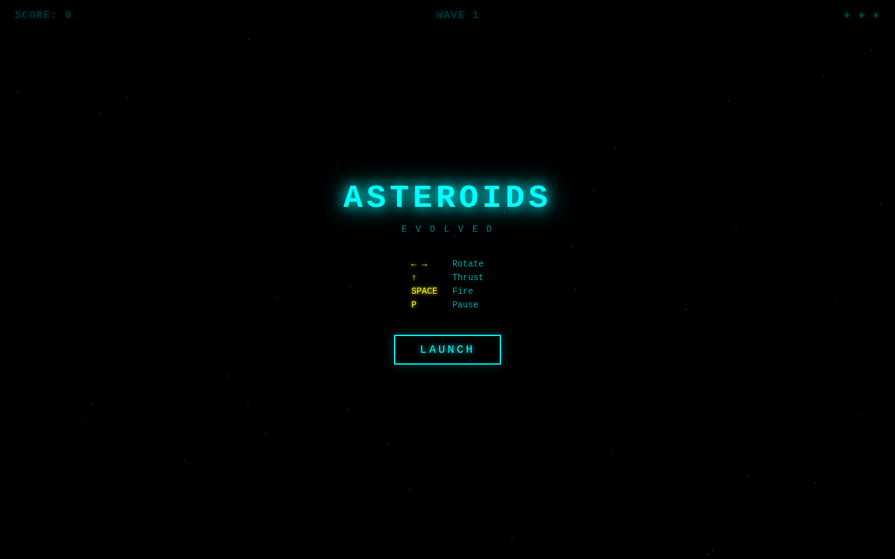
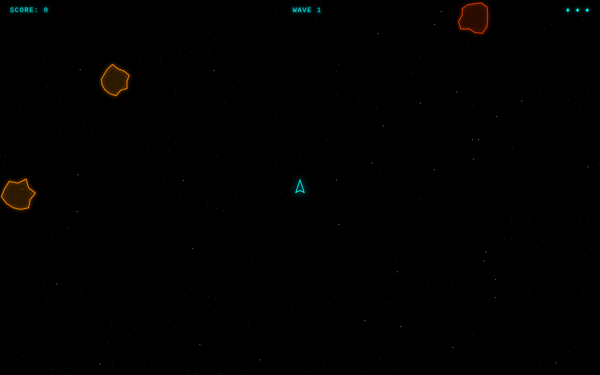

# Asteroids Evolved

A modern neon-aesthetic take on the classic Asteroids arcade game. Thrust through space, split and destroy asteroids across escalating waves, and chase a high score — all rendered with glowing synthwave visuals on a pure black starfield.

| Title Screen | Gameplay |
|:---:|:---:|
|  |  |

## How to run

```bash
cd showcase/apps/asteroids-evolved
python3 -m http.server 8080
# open http://localhost:8080
```

ES modules require an HTTP server — `file://` URLs will not work.

## Controls

| Key | Action |
|-----|--------|
| ← → | Rotate ship |
| ↑ | Thrust |
| Space | Fire |
| P | Pause / Resume |

## Gameplay

- Asteroids split into two smaller pieces when shot (Large → Medium → Small → gone)
- Screen wraps on all edges — ship, bullets, and asteroids alike
- You start with 3 lives; losing all ends the game
- Brief invincibility flicker after respawn
- Each wave cleared spawns the next with 2 more asteroids, slightly faster
- High score is saved in `localStorage`

## Scoring

| Asteroid | Points |
|----------|--------|
| Large    | 20     |
| Medium   | 50     |
| Small    | 100    |

## Stack

- Vanilla JS (ES modules)
- Canvas 2D API
- No build step, no dependencies
