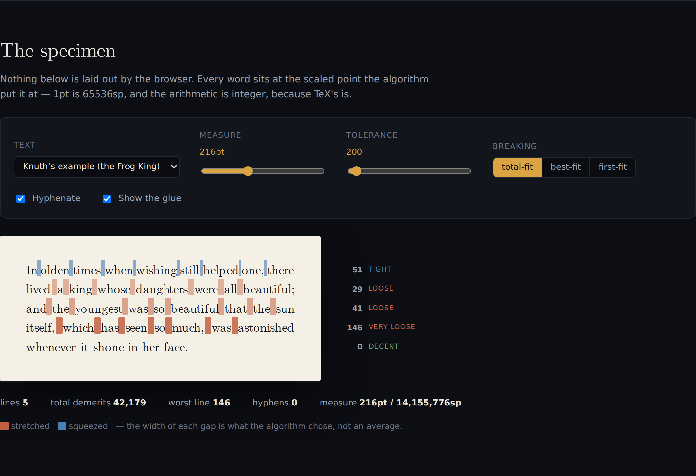
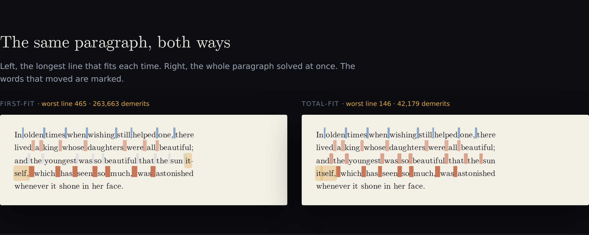
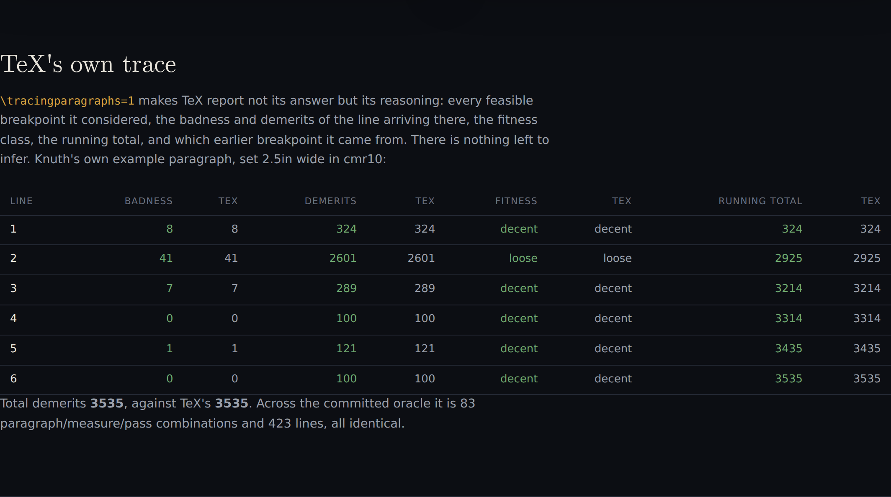
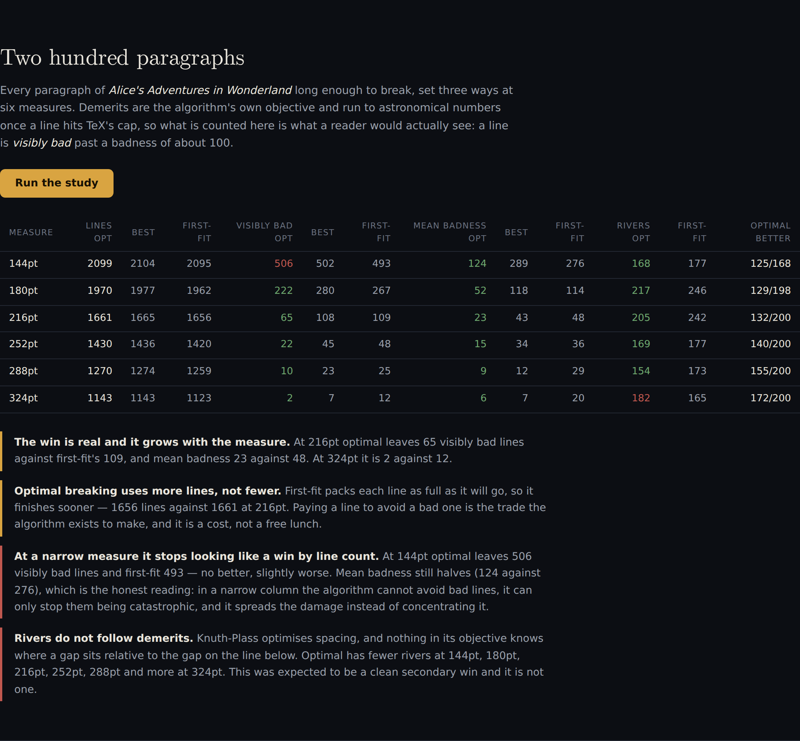

# Badness

Every browser and every word processor breaks a paragraph **greedily**: take the
longest line that fits, move on, never reconsider. TeX breaks the whole
paragraph at once, as a shortest path through every way it could be broken.
This is that algorithm — Knuth–Plass total-fit line breaking, with Liang's
hyphenation and the real `cmr10` metrics — written in plain JavaScript and run
in a tab. TeX itself grades the answer.

| The specimen, with the glue drawn at its true width | The same paragraph, both ways |
|:---:|:---:|
|  |  |

| TeX's own trace, beside this implementation's numbers | Two hundred paragraphs |
|:---:|:---:|
|  |  |

See [`PRD.md`](./PRD.md) for the spec.

## Run it

```bash
cd showcase/apps/badness
python -m http.server 8080
# open http://localhost:8080
```

No build, no dependencies, no network. The engine is plain ES modules and runs
unchanged in the page and under Node:

```bash
node tests.mjs             # the whole bench, about a second
node tests.mjs breaking    # one of: breaking optimality hyphenation metrics badness telescoping greedy
node tests.mjs --study     # 200 paragraphs broken three ways at six measures
```

## The claim

On Knuth's own example paragraph — the opening of the Frog King, set 2.5in wide
in `cmr10`, the setting used in *The TeXbook* — this implementation reproduces
TeX's line breaking exactly: the same breakpoints, the same badness at each, the
same demerits, the same fitness classes, the same running totals, and the same
final figure of **3535**.

Across the committed oracle it is **83 paragraph/measure/pass combinations and
423 lines, all identical**, over six paragraphs, ten measures from 144pt to
324pt, and both of TeX's passes.

Ground truth is not a number someone published. `\tracingparagraphs=1` makes TeX
report not its answer but its *reasoning*: every feasible breakpoint it
considered, the badness and demerits of the line arriving there, the fitness
class, the running total, and which earlier breakpoint it came from. There is
nothing left to infer, so any disagreement is a bug here rather than a
judgement call.

```
@ via @@0 b=8  p=0       d=324     @@1: line 1.2 t=324   -> @@0
@ via @@1 b=41 p=0       d=2601    @@2: line 2.1 t=2925  -> @@1
@ via @@2 b=7  p=0       d=289     @@3: line 3.2 t=3214  -> @@2
@ via @@3 b=0  p=0       d=100     @@4: line 4.2 t=3314  -> @@3
@ via @@4 b=1  p=0       d=121     @@6: line 5.2 t=3435  -> @@4
@\par via @@6 b=0 p=-10000 d=100   @@7: line 6.2- t=3535 -> @@6
```

## What it does

- **The box–glue–penalty model.** Text becomes boxes (glyph runs), glue
  (interword space that can stretch and shrink) and penalties (places a break is
  allowed, at a price). Breaking is then a shortest-path problem: breakpoints are
  nodes, lines are edges, demerits are the weight.
- **Badness and demerits to the letter**, including TeX's integer approximation
  of `100(t/s)³`, the four fitness classes, `\adjdemerits` for adjacent lines of
  incompatible looseness, `\doublehyphendemerits`, `\finalhyphendemerits`, and
  the artificial-demerits rule at a forced break.
- **Liang's hyphenation**, written from the algorithm, using Knuth's own
  `hyphen.tex` patterns and exception list. Only the pattern data is vendored.
- **Exact `cmr10` metrics**, parsed from the binary TFM: character widths, the
  ligature table, 181 kern pairs, and the font's own interword space.
- **Three algorithms on identical input** — total-fit, best-fit, first-fit — so
  the only variable is the choice of breakpoints.
- **The glue drawn at its true width**, warm where a line was pulled apart and
  cool where it was squeezed, so a badness of 146 is visible before it is read.
  Nothing on the page is laid out by the browser; every word sits at the scaled
  point the algorithm put it at.

## The bench

Seven checks, each decided by something outside the code it tests. Four are
decided by TeX, running on the machine that generated the committed oracles; one
by exhaustive search; one by arithmetic done on paper; one is a theorem.

| Check | Decided by | Result |
|---|---|---|
| Line breaking | `\tracingparagraphs` | 83 cases, 423 lines, identical |
| Optimality | exhaustive search | 238 cases, 21,630 breakings enumerated, identical |
| Hyphenation | `\showhyphens` | 5,986 words, **0 spurious breaks**, 0 missed |
| Word widths | `\number\wd` | 387 words exact to the scaled point |
| Badness | tex.web §108 | 6 known values |
| Split words | arithmetic | 10 words unchanged by hyphenation |
| Optimal ≤ greedy | theorem | 359 combinations, never worse |

The optimality check is the one that matters most for the algorithm itself. A
line breaker that agrees with itself proves nothing: a paragraph always looks
plausible, and a subtly wrong badness or a mis-pruned active list yields a
paragraph that is merely good rather than optimal, which no amount of looking
will catch. Exhaustive search shares no code path with the dynamic program — it
does not prune by fitness class, keeps no active list, and cannot discard a
route the DP would have kept.

## What the corpus says

Every paragraph of *Alice's Adventures in Wonderland* long enough to break, set
three ways at six measures. Demerits are the algorithm's own objective and run
to astronomical numbers once a line hits TeX's cap, so what is counted is what a
reader would actually see: a line is *visibly bad* past a badness of about 100.

**The win is real and it grows with the measure.** At 216pt optimal leaves 65
visibly bad lines against first-fit's 109, with mean badness 23 against 48. At
324pt it is 2 against 12.

**Optimal breaking uses more lines, not fewer.** First-fit packs each line as
full as it will go, so it finishes sooner — 1656 lines against 1661 at 216pt.
Paying a line to avoid a bad one is the trade the algorithm exists to make, and
it is a cost rather than a free lunch.

**At a narrow measure it stops looking like a win by line count.** At 144pt
optimal leaves 506 visibly bad lines and first-fit 493 — no better, slightly
worse. Mean badness still halves, 124 against 276, which is the honest reading:
in a narrow column the algorithm cannot avoid bad lines, only stop them being
catastrophic, and it spreads the damage rather than concentrating it.

**Rivers do not follow demerits.** This was expected to be a clean secondary win
and it is not one. Knuth–Plass optimises spacing, and nothing in its objective
knows where a gap sits relative to the gap on the line below. Optimal has fewer
rivers at five of the six measures and *more* at 324pt.

## Four things that went wrong, and what found them

Every one of these produced a paragraph that looked completely fine. TeX caught
all four.

**The interword space was one scaled point too wide.** TFM stores lengths as
32-bit fixed point with 20 fractional bits, and TeX converts them with a
specific integer routine (`store_scaled`, tex.web §572) whose result differs
from ordinary rounding. `cmr10`'s space is 218453sp in TeX and 218454sp if you
round the printed decimal. One scaled point is 1/65536 of a point and will never
be visible — but it can move a badness across a fitness-class boundary, and the
claim here is that none of the numbers differ at all. Fixed by parsing the
binary TFM instead of `tftopl`'s output.

**Every `va` pair in the font was 18204sp too wide.** A lig/kern program is
scanned in order and the *first* instruction matching the next character wins.
Labels accumulate, so one program can hold two steps for the same pair: `cmr10`
reaches `v` through a label shared with `k`, which kerns `v`+`a` by −0.055555,
and then through the block labelled `w`, which kerns it by −0.027779. Letting
the second overwrite the first is silent and wrong, and it took a single word —
`advantage,` — measured against `\number\wd` to find it.

**Hyphenating a word made it wider.** Offering a break inside a word must not
change the word's width when the break is not taken. Measured naively it does:
`of` + `fi` + `cer` never forms the *ffi* ligature and `daugh` + `ters` loses a
kern, so a paragraph would silently reflow just because hyphenation was switched
on. Fixed by measuring each fragment as the difference between two prefixes of
the whole word, so the widths telescope.

**The last line was charged for a break it could not refuse.** At a forced break,
on the last pass it will make, with one active node left and nothing feasible
recorded, TeX charges nothing — `artificial_demerits`, tex.web §851, printed in
the trace as `d=*`. Without it the closing line of a tightly-constrained
paragraph pays for a fitness-class jump it had no way to avoid: 10100 demerits on
Knuth's own paragraph at 216pt, enough to change which breaking wins for the
whole thing. This one is invisible to every check except a line-by-line
comparison with the trace, because the paragraph it produces is perfectly
reasonable — just not the one TeX produces.

## Regenerating the oracles

The JSON in `data/` is committed so the bench runs on a machine with no TeX
installed. To rebuild it you need `tex` and `tftopl` (TeX Live):

```bash
node tools/extract-tfm.mjs /usr/share/texlive/texmf-dist/fonts/tfm/public/cm/cmr10.tfm data/cmr10.json 10
node tools/extract-patterns.mjs vendor/hyphen.tex data/hyphen-en-us.json
node tools/tex-oracle.mjs                     # \tracingparagraphs, 83 cases
node tools/hyphen-oracle.mjs words.txt data/hyphen-oracle.json 6000
node tools/metrics-oracle.mjs                 # \number\wd, 387 words
node tools/build-corpus.mjs alice.txt data/corpus.json
```

## Layout

```
badness/
├── index.html           the page
├── main.js              wiring only — controls in, drawings out
├── js/
│   ├── linebreak.js     boxes, glue, penalties, badness, demerits, the DP,
│   │                    the two greedy adversaries, and exhaustive search
│   ├── typeset.js       text -> items, with ligatures, kerns and space factors
│   ├── hyphenate.js     Liang's algorithm over a pattern trie
│   ├── render.js        draws a broken paragraph at exact offsets
│   └── selftest.js      the bench, and the corpus study
├── data/                metrics, patterns, and the committed TeX oracles
├── tools/               the generators for everything in data/
├── vendor/              hyphen.tex (unmodified) and Computer Modern
└── tests.mjs            the bench under Node
```

## Credits and licences

- **Computer Modern**, Donald Knuth, under the SIL Open Font License
  (`vendor/fonts/OFL.txt`).
- **`hyphen.tex`**, Donald Knuth — vendored unmodified, as its terms require.
- **`cmr10.tfm`** from TeX Live; the parsed metrics are committed as JSON.
- **Corpus**: *Alice's Adventures in Wonderland*, Lewis Carroll, 1865, public
  domain. Project Gutenberg's header, footer and licence text are stripped by
  `tools/build-corpus.mjs`; only the work itself is committed.
- **Word list** for the hyphenation oracle: `word-list` (MIT), sampled evenly.
