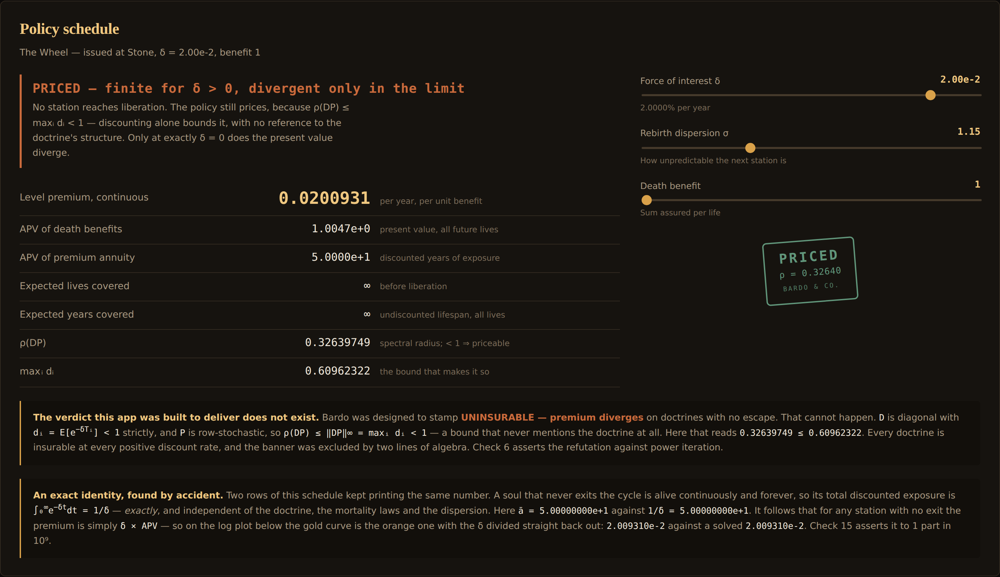
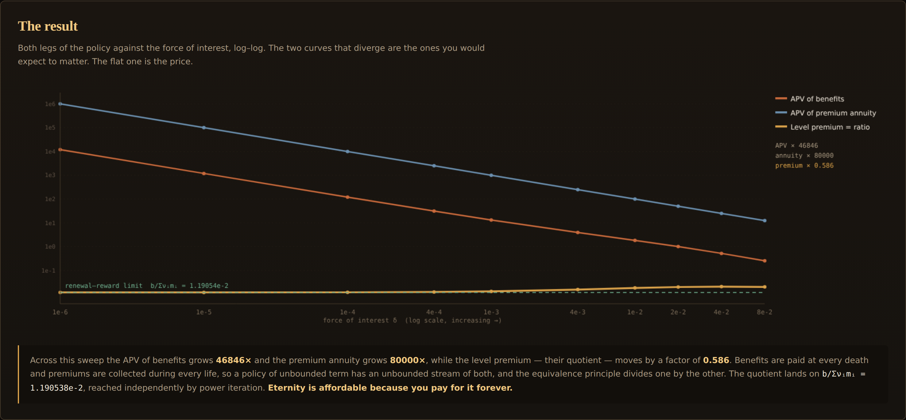
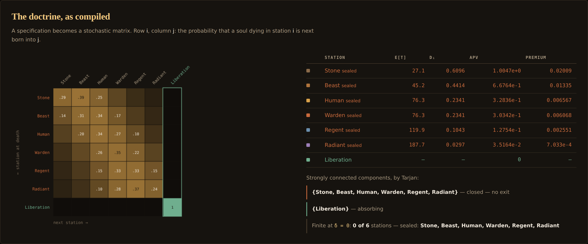
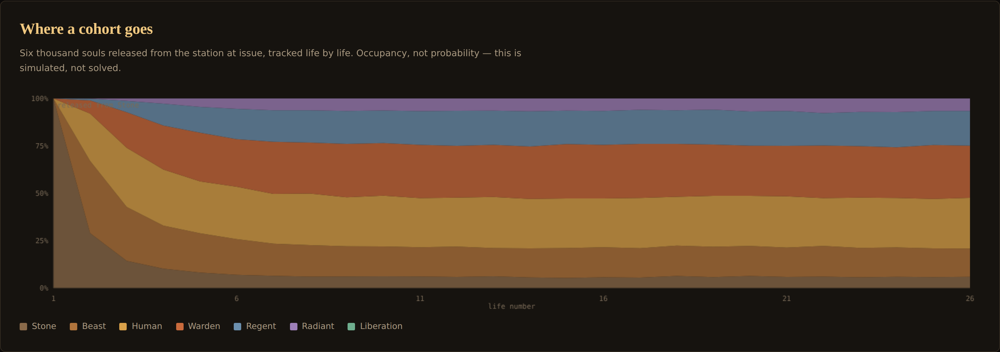
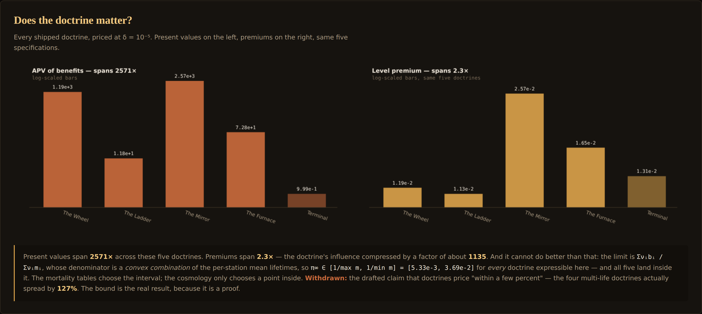
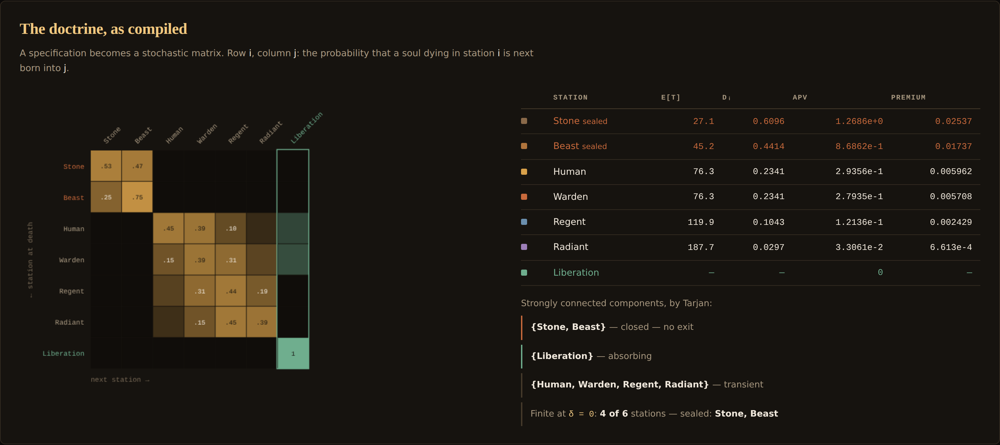
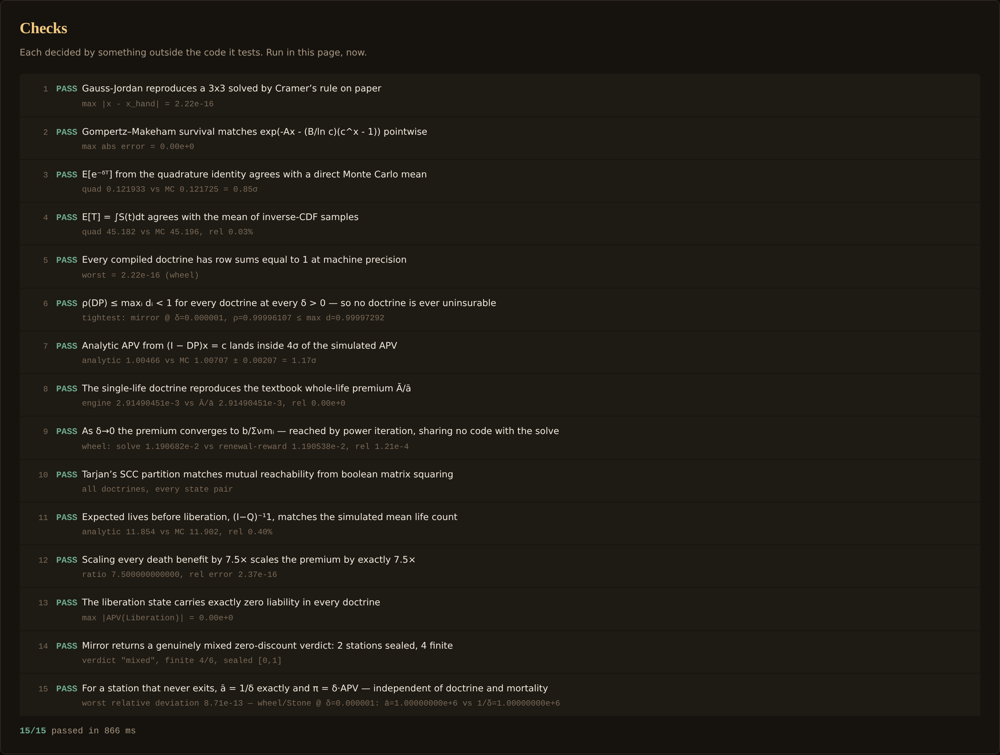

# Bardo

An underwriting desk that prices a whole-life insurance policy covering **every**
life rather than this one. Name a doctrine of rebirth, and the desk returns a
premium — then tells you which part of your doctrine the price actually depended
on. The answer is: almost none of it.

The premise is absurd on purpose and the execution is not. Writing a policy of
unbounded term forces a real piece of mathematics into the open — the actuarial
present value of an infinite sequence of lives, each with its own mortality,
linked by a stochastic matrix — and that object is a linear system you can
solve. Three independent routes solve it here, and they agree.

| Policy schedule | The result |
|:---:|:---:|
|  |  |

| The doctrine, compiled | Where a cohort goes |
|:---:|:---:|
|  |  |

## The result

Benefits are paid at every death. Premiums are collected during every life. A
policy of unbounded term therefore has an unbounded stream of claims **and** an
unbounded stream of premiums, and the equivalence principle divides one by the
other. Push the force of interest toward zero and both legs diverge — the APV of
benefits by `46,846×` across the shipped sweep, the premium annuity by `80,000×`
— while the level premium, their quotient, moves by a factor of `0.586` and
settles on a finite number.

**Eternity is affordable because you pay for it forever.**

That limit is `Σνᵢbᵢ / Σνᵢmᵢ`, and the app reaches it a second time by an
argument sharing no code with the solve: renewal–reward, with the stationary
distribution `ν` from power iteration. On the Wheel the two agree to four
significant figures (`1.190682e-2` against `1.190538e-2`); on the Mirror, to six.

## The claim that died

Bardo was designed around an insurability verdict. It was going to stamp
**UNINSURABLE — premium diverges** on any doctrine offering no escape, and the
whole interface was built around that banner.

There is no such banner, because the divergence cannot happen:

```
ρ(DP) ≤ ‖DP‖∞ = maxᵢ dᵢ · Σⱼ Pᵢⱼ = maxᵢ dᵢ < 1
```

`D` is diagonal with `dᵢ = E[e^−δTᵢ]`, which is strictly below 1 for any
positive discount rate and any lifetime that is not identically zero. `P` is
row-stochastic. The bound never mentions `P` at all — so **every doctrine is
insurable at every positive discount rate**, with no absorbing state required
and no reachable liberation required. A soul on an eternal wheel with no exit
has a finite present value. The verdict was excluded by two lines of algebra
that should have been checked before the UI was drawn.

Check 6 asserts the refutation against power iteration rather than restating the
bound.

## What the doctrine is worth

Almost nothing, and there is a theorem saying so. The limit's denominator
`Σνᵢmᵢ` is a **convex combination** of the per-station mean lifetimes, and a
convex combination cannot leave the interval it is drawn from. So for every
doctrine expressible in this specification language:

```
π∞ ∈ [ 1/max mᵢ , 1/min mᵢ ]   =   [5.33e-3, 3.69e-2]
```

The mortality tables choose the interval. The cosmology only chooses a point
inside it.

Measured: across the five shipped doctrines the APV spans `2,570×` while the
premium spans `2.3×`. The sharpest pair is `Terminal` — one life, then certain
liberation — against `The Wheel` — an eternal cycle with no exit: their APVs
differ by `1,193×` and their premiums by a factor of `1.1`. One life and endless
lives cost about the same per unit time.

The drafted version of this claim said doctrines price "within a few percent".
That is withdrawn — the four multi-life doctrines spread by `127%`. The bound is
the real result, because it is a proof rather than an observation.

| Does the doctrine matter? | Mixed verdict on the Mirror |
|:---:|:---:|
|  |  |

## An exact identity, found by accident

Two rows of the policy schedule kept printing the same number. A soul that never
exits the cycle is alive continuously and forever, so its total discounted
exposure is `∫₀^∞ e^−δt dt = 1/δ` — **exactly**, and independently of the
doctrine, the mortality laws and the dispersion. It follows that for any station
with no exit the premium is simply `δ × APV`. Check 15 asserts it to 1 part in
`10⁹`.

## Where insurability does split

At exactly `δ = 0` the discounting no longer protects anything, and the split the
project originally wanted finally appears: the APV is finite precisely when
liberation is reached almost surely. That is decided by Tarjan's SCC
decomposition on the transition digraph, with no arithmetic at all — a station is
uninsurable-at-zero iff it can reach a closed class that does not contain
liberation.

`The Mirror` ships specifically because it returns a genuinely mixed answer:
`{Stone, Beast}` form a closed class with no exit, `{Liberation}` is absorbing,
and `{Human, Warden, Regent, Radiant}` are transient — so 4 of 6 stations price
at zero discount and 2 do not. The block structure is visible in the matrix
before the classifier says a word.

## Dispersion

Claim C6 shipped with no predicted direction, because the Jensen argument cuts
both ways: dispersion raises `dᵢ` by convexity, inflating the benefit stream and
the annuity stream at once, and which one inflates faster was not something the
PRD was going to guess.

Measured, it **lowers** the premium — `2.05e-2 → 1.78e-2` as `σ` goes `0.7 → 3.0`
— and the mechanism is not Jensen at all: dispersion spreads the stationary
distribution toward the long-lived upper stations, lengthening the mean cycle,
and the premium is inversely proportional to it. There is also a genuinely
non-monotone point at `σ = 0.50`, which prices *above* its neighbour. It ships as
found, marked in red, rather than smoothed away.

## How it works

1. **A doctrine is specified** — ordered stations, a per-station merit drift, a
   dispersion, per-station exit probabilities, and an optional absorbing
   liberation state.
2. **It compiles to a stochastic matrix.** Band weights
   `wᵢⱼ = exp(−(j − (i + driftᵢ))² / 2σ²)`, normalised over the mass surviving
   after liberation. Row sums verified to machine precision.
3. **Each station carries a mortality law.** Gompertz–Makeham `μ(x) = A + Bc^x`,
   so every station has a real lifetime distribution — which is what makes the
   chain *semi-Markov* and the discounting non-trivial.
4. **One quadrature pass gives both legs.** Simpson over `e^−δt S(t)` yields the
   annuity value `ā`, then `d = 1 − δā` by integration by parts. The same pass at
   `δ = 0` gives `E[T]`.
5. **Two dense solves give the price.** `(I − DP)x = c` for benefits and
   `(I − DP)ā = (1−d)/δ` for the premium annuity — the *same matrix*, which is
   exactly why the two legs diverge together. Level premium `π = x/ā`.
6. **Three oracles check it.** A trajectory Monte Carlo (lifetimes by Newton
   inverse-CDF, no matrix anywhere); the renewal–reward limit via power
   iteration; and the degenerate single-life doctrine, which must reproduce the
   textbook whole-life premium `Ā/ā`.

## Checks

Fifteen, each decided by something outside the code it tests, run in the page on
load in about 900 ms. Among them: Gauss–Jordan against a 3×3 solved by Cramer's
rule on paper; the quadrature identity against a direct sample mean; Tarjan's
partition against boolean matrix squaring; the spectral bound against power
iteration; `(I−Q)⁻¹1` against a simulated life count; and premium homogeneity
under benefit scaling.



## Running it

```bash
cd showcase/apps/bardo
python -m http.server 8080
# open http://localhost:8080
```

ES modules need an HTTP server — `file://` will not work. No build step, no
dependencies, no network calls, no workers. Every solve is milliseconds on
matrices of order 10.

## Controls

| Control | What it does |
|---|---|
| **Doctrine** | Wheel (no exit), Ladder (absorbing), Mirror (mixed), Furnace (exit only from the bottom), Terminal (one life) |
| **Station at issue** | Which station the policy is written on |
| **Force of interest δ** | Logarithmic, `1e-6` to `1e-1`, plus exactly 0 at the bottom of the travel — the only place insurability splits |
| **Rebirth dispersion σ** | How unpredictable the next station is; re-compiles the matrix live |
| **Death benefit** | Sum assured per life; the premium must scale exactly linearly with it (check 12) |

## A note on what this is

Each doctrine is a **specification** — an ordered set of stations, a drift, a
dispersion, an exit probability. The names are structural (Wheel, Ladder, Mirror,
Furnace, Terminal) precisely so that the object under test is the shape of a
transition system and not anyone's faith. The app derives consequences from a
spec. It does not adjudicate cosmology, and it takes no view on whether any of it
obtains.

## Files

```
bardo/
├── index.html
├── main.js              UI and canvas rendering only
├── style.css
├── PRD.md               includes the claims that died, and why
└── js/
    ├── la.js            Gauss-Jordan, power iteration, stationary distribution
    ├── mortality.js     Gompertz-Makeham, Simpson quadrature, Newton inverse-CDF
    ├── doctrine.js      the specification language and its compiler
    ├── graph.js         Tarjan SCC, reachability, absorbing-chain expectations
    ├── valuation.js     the two solves, the premium, the renewal-reward limit
    ├── simulate.js      trajectory Monte Carlo — the independent oracle
    ├── experiments.js   the claim sweeps, run in-page
    ├── selftest.js      fifteen checks against outside answers
    └── rng.js           seeded RNG
```
