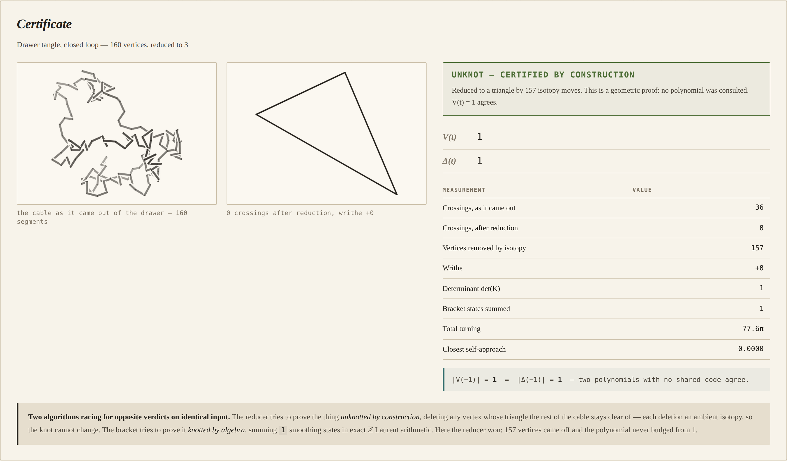
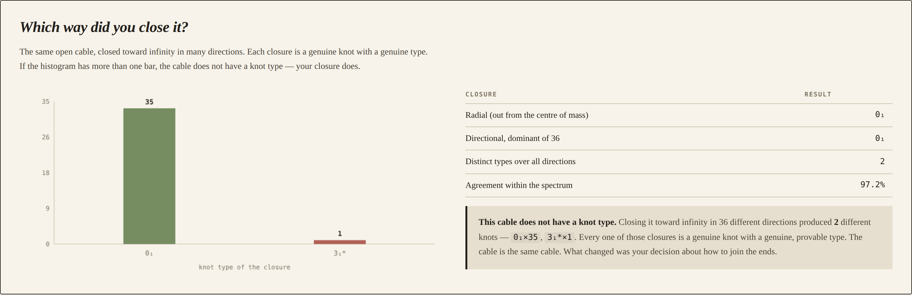
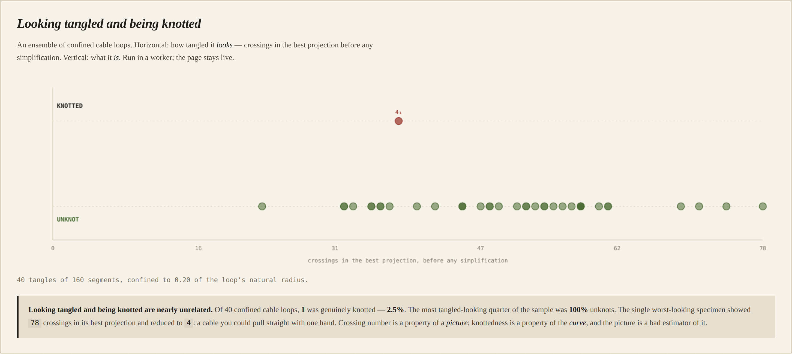
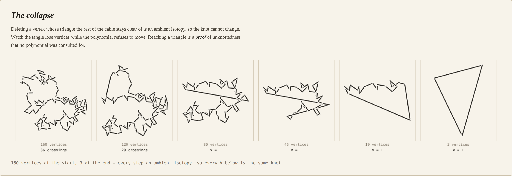

# Bight

A forensic bureau that will tell you whether the cable you pulled out of the
drawer is *actually* knotted — and that the question was not well-posed until
you decided how to close it.

The premise is absurd and the mathematics is not. **Knot type is an invariant of
embeddings of the circle, and a cable is an arc.** Every open curve in space can
be pulled straight without cutting it, so every open cable is unknotted and the
question has the same answer for all of them. To get a non-trivial answer you
must first *close* the arc — and the closure is a choice you are making rather
than a fact about the cable. This office therefore certifies closures, not
cables.

| Certificate | The closure question |
|:---:|:---:|
|  |  |

| Looking tangled vs being knotted | The collapse |
|:---:|:---:|
|  |  |

## What it found

**A cable showing 78 crossings that you could pull straight with one hand.**
Across 40 confined cable loops, one was genuinely knotted; over several runs the
rate lands between about 2% and 8%. But sorted by how tangled they *look* —
crossings in the best projection, before any simplification — the worst-looking
quartile has been **100% unknots in every run**, and the worst single specimen
showed **78 crossings** while being provably the unknot.

Crossing number is a property of a *picture*. Knottedness is a property of the
*curve*. The picture is an almost useless estimator of it.

The app measures this live rather than quoting a constant, because the sampler
is chaotic: a tangle is bit-identical from its seed within one JavaScript engine
(checked), but `Math.sin` is implementation-defined to an ULP and twelve thousand
moves amplify that, so Node and Chromium disagree about which seeds knot.

**The closure really does change the answer — rarely.** For 14% of open cables
there exist closure directions giving a different knot type, so the
ill-posedness is demonstrable rather than pedantic. But the drafted claim that
the two standard conventions would disagree on more than 5% of tangles is
**withdrawn**: they disagreed on 0%, with 99.4% mean agreement inside the
directional spectrum. The ambiguity is real and it is a 1-in-24 edge case.

**The expensive invariant is provably stronger and practically redundant.**
Jones resolved 5 classes against Alexander's 4 — but the extra class is entirely
the chiral trefoil pair, which is in the sample only because the reference
curves were inserted deliberately. On the drawer tangles alone, the knots that
turned up were a trefoil and a figure-eight, determinants 3 and 5, which the
determinant *by itself* separates. The `2ⁿ` state sum bought nothing on the
ensemble it was built for.

## Why you can believe it

Four independent checks on one computation, and they found three real bugs.

- **Two invariants from disjoint code.** The Jones polynomial via the Kauffman
  bracket state sum, and the Alexander polynomial via Fox calculus on the
  Wirtinger presentation. They share the diagram and nothing else.
- **A bridge theorem**: `|V(−1)| = |Δ(−1)| = det(K)`. Two polynomials from
  unrelated machinery must agree on one integer.
- **A third road to that integer**: a knot has a non-trivial Fox *p*-colouring
  exactly when `p | det(K)`. Counted by Gaussian elimination mod *p*, and for
  small diagrams also by brute force over all `pⁿ` assignments.
- **Published tables.** Every reference knot is a *parametric curve*, never a
  hand-typed planar diagram code, so published values grade the extractor rather
  than agreeing with my own choice of convention.

Plus two free structural invariants: `Δ` must be palindromic, and `V` must not
depend on the projection direction.

## The three bugs those checks caught

Each produced a perfectly self-consistent wrong answer — the failure mode a
single-implementation app cannot detect.

**The crossing sign was inverted.** The trefoil's bracket came back as
`A⁷ − A³ − A⁻⁵` alongside writhe `+3`. Individually plausible, together
impossible: that bracket belongs to writhe `−3`. The Jones normalisation
`(−A³)^(−w)` only lands on exponents divisible by 4 when the writhe and the
bracket share a handedness, so the divisibility check threw rather than rounding.

**Minimising crossing number over projections actively selected broken
projections.** Crossing number is a minimum over diagrams, so the app searches
directions. But a crossing whose parameter landed near a vertex was silently
*dropped* — and a direction with a dropped crossing looks like a *better*
diagram, so the search hunted for exactly those. `7₁` came back reading as `5₁`.
Ambiguity had to become a hard rejection of the whole projection.

**The KMT reducer passed strands through the cable, three different ways.** It
skipped the neighbouring edges, which touch the triangle at a vertex but can
still pierce it. It used a boolean intersection test, blind to an edge
*coplanar* with the triangle lying across the swept region — Möller–Trumbore
calls that a miss because the determinant vanishes. And the fix for shared
vertices, pulling edges back by 1e-3 of their length, hid piercings near an
edge's own endpoint. Each version turned `7₁` into `5₁`, and each was caught
because Jones *and* Alexander independently reported `det 7 → det 5` on a
triangle that two separately written intersection tests both called clean — and
because an 8-vertex polygon cannot carry `7₁` at all, its stick number being 9.

A fourth bug was caught by a number that looked like a finding: the sampler's
confinement was applied from the first move, but a loop of `n` unit edges starts
at radius `1/(2 sin(π/n))`, which already violates any interesting drawer. Every
move was rejected, the accept rate was exactly `0%`, and every "tangle" was the
pristine circle it started as — which measured `0%` knotted. Confinement is now
annealed, because a drawer squeezes a cable rather than teleporting around it.

## How it works

1. **A cable is generated** — crankshaft moves on a closed loop, or pivot moves
   on an open chain. Every move preserves every edge length exactly and is
   vetoed if it would bring the cable within its own thickness of itself: fixed
   length, cannot pass through itself.
2. **If it is open, it is closed** — radially, or toward a point at infinity in
   a chosen direction. Sweeping the direction gives a spectrum, not an answer.
3. **KMT reduction.** Delete any vertex whose triangle the rest of the curve
   stays clear of; each deletion is an ambient isotopy, so the knot type is
   provably unchanged. Reaching a triangle is a **geometric certificate of
   unknottedness** — proved by construction, with no polynomial consulted.
4. **The diagram is extracted from geometry**: over/under from depth, crossing
   sign from orientation, cyclic order from in-plane directions.
5. **Two algorithms race for opposite verdicts on identical input.** The reducer
   tries to prove it unknotted by construction; the bracket tries to prove it
   knotted by algebra.

## Running it

```bash
cd showcase/apps/bight
python -m http.server 8080
# open http://localhost:8080
```

ES modules need an HTTP server — `file://` will not work. No build step, no
dependencies, no network calls. The ensemble experiment runs in a Web Worker so
the page stays live while it samples.

## Controls

| Control | What it does |
|---|---|
| **Specimen** | A drawer tangle as a closed loop, a drawer tangle as an open cable (which is where the closure question bites), or one of the parametric reference knots |
| **New tangle** | Re-samples with the next seed. Reproducible from its seed within a given browser |

## Files

```
bight/
├── index.html
├── main.js              UI and canvas rendering only
├── style.css
├── PRD.md               includes the claims that died, and why
└── js/
    ├── laurent.js       exact ℤ Laurent polynomials (BigInt)
    ├── geom.js          vector maths, and the three predicates everything rests on
    ├── curves.js        reference knots as parametric curves
    ├── diagram.js       geometry → crossings → the 4-valent graph
    ├── jones.js         Kauffman bracket state sum → V(t)
    ├── alexander.js     Fox calculus → Δ(t), by disjoint machinery
    ├── colour.js        Fox p-colourings, two independent ways
    ├── simplify.js      KMT reduction — the unknotting certificate
    ├── sampler.js       cable generation with a strand-passage veto
    ├── closure.js       radial and directional closures
    ├── identify.js      the pipeline and the generated reference table
    ├── draw.js          the cable, and the diagram with breaks
    ├── experiments.js   the claim measurements
    ├── worker.js        runs the ensemble off the main thread
    ├── selftest.js      twelve checks against outside answers
    └── rng.js           seeded RNG
```

## A note on what this is not

It does not claim to identify every knot. Drawer tangles routinely produce
composite knots, and the app reports "unidentified, det *d*, *n* crossings"
rather than guessing. The reference table is generated from parametric curves,
so it names only what it can produce — and says so.
