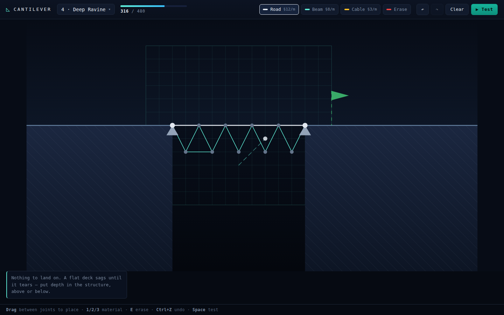
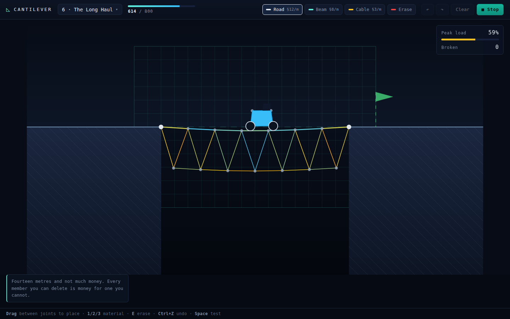
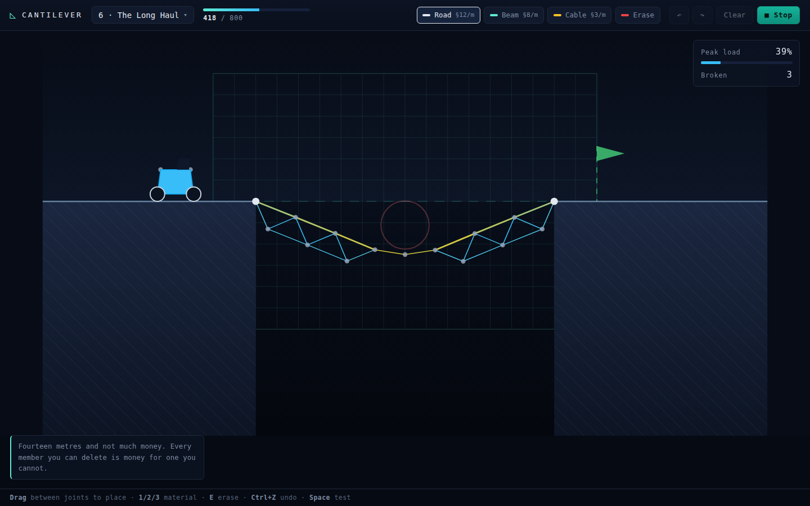
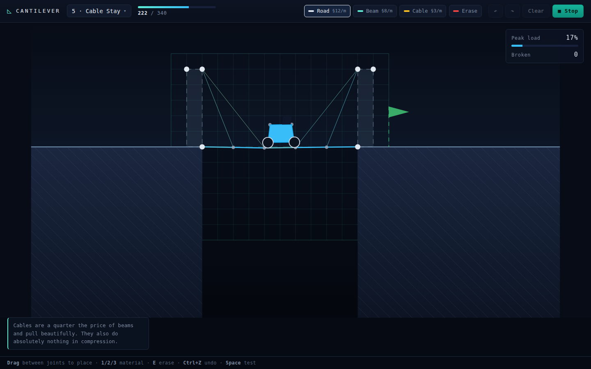
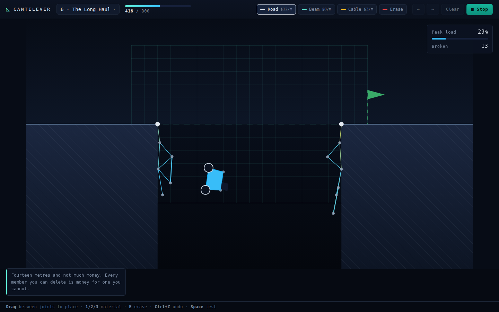

# Cantilever — build it, then drive across it

A structural engineering puzzle. Span the gap with road, beams and cables under a
fixed budget, hit **Test**, and watch a truck drive across your design. Every
member is a real compliant constraint carrying a real axial force, so the deck
sags, members color themselves by how close they are to failing, and anything you
overload snaps and takes its neighbours with it.

| Build mode | Live stress under load |
|:---:|:---:|
|  |  |

| A truss too shallow for the span | Cable stays |
|:---:|:---:|
|  |  |

## How to run

```bash
cd showcase/apps/cantilever
python3 -m http.server 8080
# open http://localhost:8080
```

No build step, no dependencies, no network. It is also launchable straight from
the [showcase](../../).

## Controls

| Input | Action |
|---|---|
| Drag between two points | Place a member |
| `1` / `2` / `3` | Road / Beam / Cable |
| `E` or right-click | Erase a member (refunds it) |
| `Ctrl+Z` / `Ctrl+Shift+Z` | Undo / redo |
| `Space` or `Enter` | Start or stop the test run |
| `R` | Back to build mode |

## Materials

| | Cost | Carries | Notes |
|---|---|---|---|
| **Road** | §12/m | Tension + compression | The only surface the truck can drive on. Heavy. |
| **Beam** | §8/m | Tension + compression | Loses compression capacity as it gets longer. |
| **Cable** | §3/m | Tension only | Goes slack instead of pushing. Spans up to 7 m. |

Beams and road max out at 4 m, so anything wider than that needs joints in
mid-air — which is to say, a truss. You can run a beam alongside a road panel to
stiffen a deck that is buckling; doubling up on the same material is the only
thing that is blocked.

## The eight levels

1. **First Crossing** — a 6 m gap and a generous budget
2. **Span** — wider than the longest legal member
3. **Two Towers** — a pier to land on, if you triangulate the tower
4. **Deep Ravine** — nothing to land on; the deck needs depth
5. **Cable Stay** — high pylons and cheap cables
6. **The Long Haul** — 14 m on a tight budget
7. **Clearance** — a shipping channel you may not build across
8. **Sandbox** — 17 m, a pier, and effectively unlimited money

Progress, your last design per level, and the cheapest winning cost are saved to
localStorage.

## How the simulation works

Position-based dynamics with small substeps — 16 per frame, one solver iteration
each, which is what keeps stiff members stable without making them perfectly
rigid.

- **Members are XPBD distance constraints.** Each one has a compliance of
  `length / EA`, so the Lagrange multiplier the solver accumulates *is* the axial
  force: `force = -λ / h²`. That number drives the stress colors, the readout,
  and the breaking test — nothing is faked for display.
- **Cables are one-sided.** Shorter than rest length means no constraint at all,
  so they hang slack and draw as a curve.
- **Compression capacity falls off with length**, standing in for Euler buckling,
  so long struts fail before short ones. Real buckling goes as 1/L², which makes
  every truss impossible at this scale, so the falloff here is linear past each
  material's buckle length.
- **Structural damping** removes a fraction of each member's axial relative
  velocity per substep. Without it nothing dissipates energy, the truck's
  bouncing rings the truss up, and members tear at random.
- **Gravity ramps in over the first 0.5 s** and nothing may break for 0.8 s. A
  structure built at rest has no internal forces, so the first substep would
  otherwise be a step load that destroys bridges which would carry the real thing.
- **Wheels are circle-vs-segment contacts** against road members only, with the
  correction mass-weighted between truck and structure — that is why a heavy
  truck visibly pushes a light deck down.

The truck is four particles and six rigid links, so it tips, noses down into a
sag, and tumbles convincingly when the deck goes out from under it.



## Files

```
cantilever/
├── index.html      # shell + HUD
├── style.css       # blueprint theme
├── main.js         # input, HUD, game loop, level lifecycle
├── physics.js      # XPBD solver, contacts, truck, win/lose
├── build.js        # the design graph and every placement rule
├── levels.js       # pure level data
├── materials.js    # costs, stiffness, strength, buckling
├── render.js       # canvas drawing
├── storage.js      # localStorage progress
└── audio.js        # synthesized snap / win / lose cues
```

`window.cantilever` exposes `loadLevel`, `addMember`, `test`, `status` and `sim`
so designs can be built and run without touching the UI. Every level was checked
that way during development: a scripted reference design is placed, run headless,
and required to reach the far platform inside its budget.
