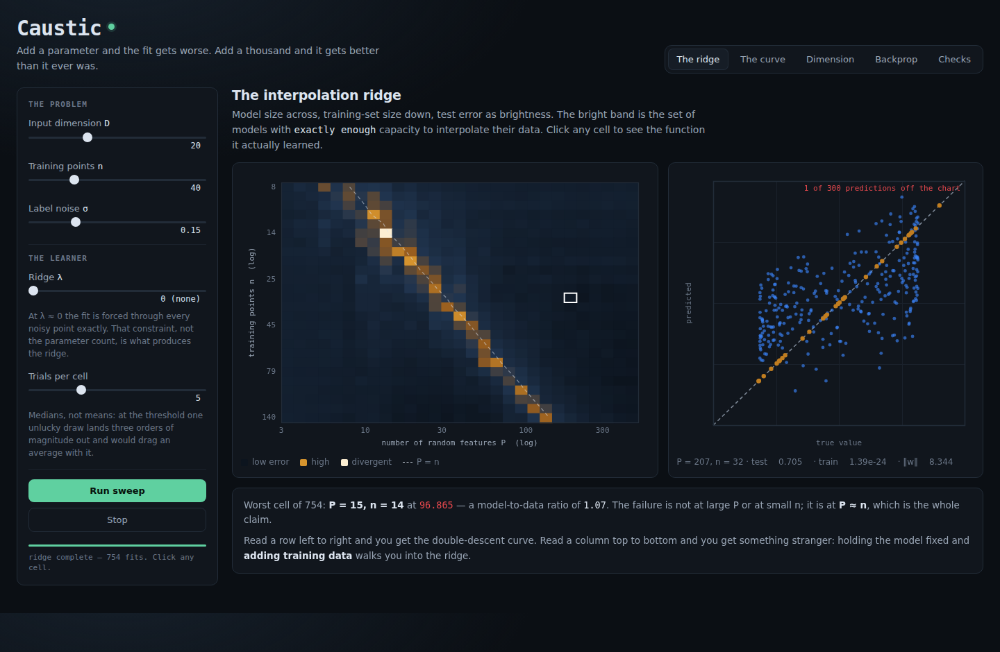
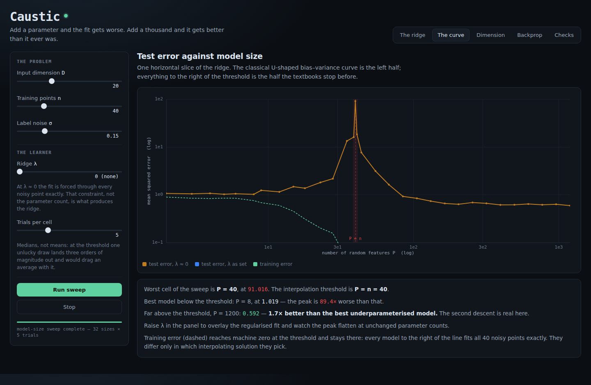
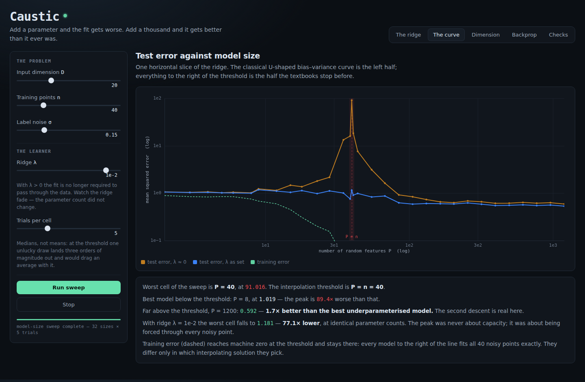
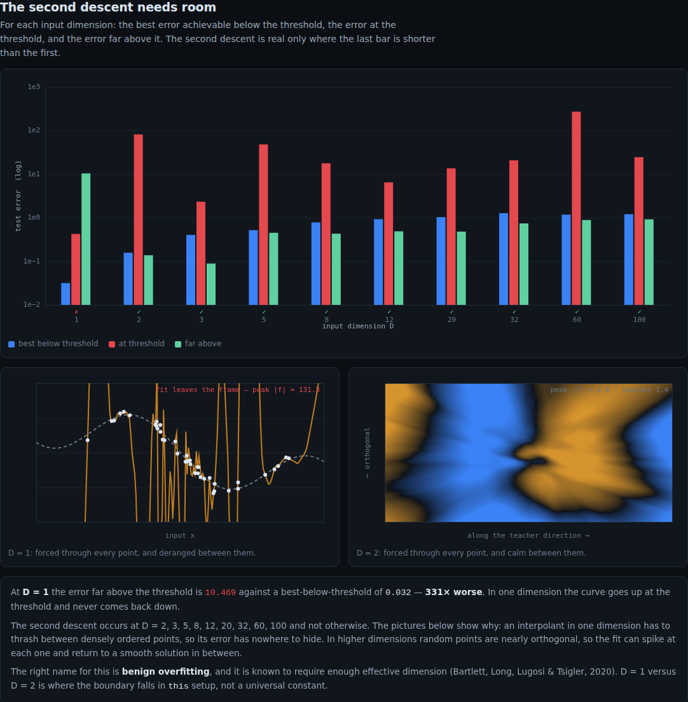
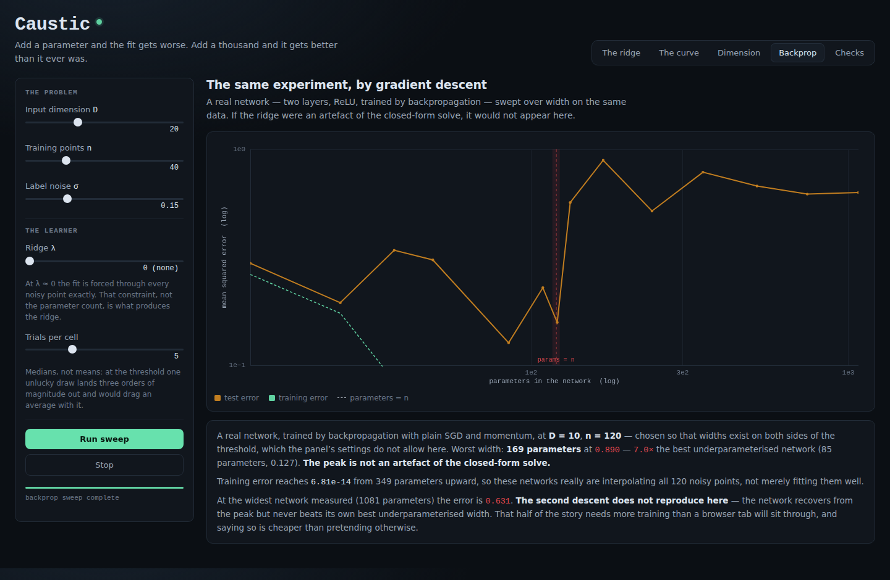
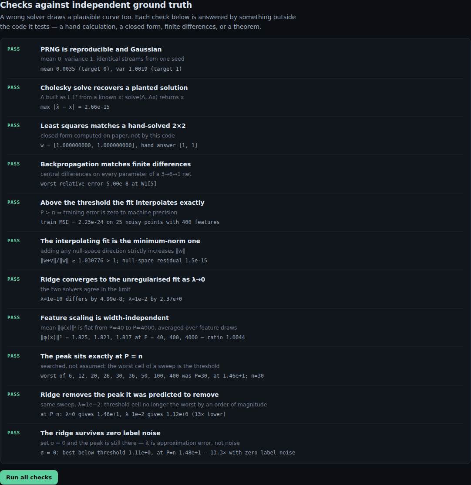

# Caustic

Double descent and benign overfitting, **measured** in the browser rather than
illustrated. A least-squares learner is swept across model size and dataset size
at once, and the result is a bright ridge of failure running along the line where
the model has exactly enough capacity to interpolate its data. You can click into
it.

| The interpolation ridge, and a model sitting on it | The same data, four times the model |
|:---:|:---:|
|  |  |

| The spike at P = n | The same sweep, with ridge regularisation |
|:---:|:---:|
|  |  |

See [`PRD.md`](./PRD.md) for the full spec, including the two claims this project
started with that its own measurements overturned.

## The findings

Defaults are `D = 20`, `n = 40`, noise `σ = 0.15`, medians over 9 trials. Every
number below is recomputed live from the current sweep, not written into the copy.

**1. Test error peaks at exactly `P = n`, and the peak is enormous.** `91.0`
against `1.019` for the best smaller model — **89.4× worse**. The pane searches
for the worst cell rather than assuming where it is, and a self-test asserts the
answer comes back `P = n`.

**2. Adding training data can make the model dramatically worse.** Hold the
model at `P = 40` features and grow the training set from 10 points to 40:
test error goes `1.159 → 91.0`, **78× worse**. More data walked it into the ridge.

**3. The spike is not about parameter count.** A ridge penalty of `λ = 1e-2`
drops the worst cell from `91.0` to `1.111` — **82× lower, at identical
parameter counts**. Nothing about model size changed; only the requirement to
pass exactly through every noisy point. The popular framing "more parameters can
hurt" is wrong. "Exact unregularised interpolation can hurt" is right.

**4. The second descent needs dimension — and the picture everyone draws is the
one case where it fails.** Past the threshold, error falls back *below* the best
underparameterised model — `0.573` against `1.019`, **1.78× better**. But at
`D = 1`, the one-dimensional curve fit used in nearly every explainer of this
phenomenon, it **never comes back down**: `331× worse` far above the threshold.
All nine `D ≥ 2` values swept show the second descent; `D = 1` shows none.

The mechanism is visible. In one dimension the training points are densely
ordered along a line, so an interpolant forced through every noisy one has to
thrash between them — the error has nowhere to hide, and the fit leaves the frame
at `|f| = 131`. In higher dimensions random points are nearly orthogonal, so the
fit can spike at each one and return to a smooth solution in between.



**5. The ridge is not caused by label noise.** This one was written into the
docs as an assumption and then contradicted by its own measurement. Double
descent is almost always explained as the model contorting itself to fit *noise*,
so setting `σ = 0` should flatten the ridge. It does not: at zero label noise the
peak is still **14.5×**. What it actually tracks is how hard the target is to
approximate with the features available. Holding noise at exactly zero and
varying only the target's complexity:

| target | best below threshold | at `P = n` | ratio |
|---|---|---|---|
| nearly linear | `0.151` | `1.45` | 9.6× |
| mildly curved | `0.559` | `4.38` | 7.8× |
| the default | `1.02` | `67.5` | **66×** |
| very wiggly | `0.800` | `146` | **182×** |

Adding label noise on top of the default barely moves it (`66× → 89×`). So in
this setup the dominant driver is **approximation error** — the part of the
target the model cannot represent — not noise in the labels. An interpolating
fit is forced through residuals it has no way to express, and that is enough to
blow it up on its own.

**6. The peak survives real backpropagation; the second descent does not.** A
two-layer ReLU network trained with plain SGD and momentum, on the same data,
peaks at the threshold by a factor of **7.0** (`0.127 → 0.890`) with training
error at `6.8e-14` — genuinely interpolating, not merely fitting well. So the
ridge is not an artefact of the closed-form solve. But out to 1081 parameters the
network never beats its own best underparameterised width. That half of the story
needs more compute than a browser tab will sit through, and it is reported as
missing rather than implied.



## The correction

An earlier version of this project had a different headline: that a trained
network shows *no* peak at all, and the whole phenomenon is an artefact of the
closed-form solve. That measurement was run at `D = 1` using Adam — which is to
say, in the exact regime finding 4 identifies as the one where the effect is
absent, with an optimiser whose per-coordinate normalisation suppresses the norm
blow-up that *is* the mechanism. The two experiments contradicted each other's
premises. Re-run properly, the result reversed, and the draft was deleted.

A follow-up hypothesis died too: the optimiser was supposed to be the confound.
Measured at `D = 10`, both optimisers show the peak and **Adam's is the larger**
(`1.48` vs SGD's `1.04`). Only the dimension mattered.

## Checks

Eleven checks against ground truth derived outside the code under test — a
hand-solved 2×2 normal equation, a planted Cholesky solution, central finite
differences on every parameter of the network, a Gram–Schmidt construction of the
null space to confirm the interpolating fit really is the minimum-norm one, and
two that would fail if the headline claim were an artefact of the sampling grid
or the feature scaling.



## Running it

```bash
cd showcase/apps/caustic
python -m http.server 8080
# open http://localhost:8080
```

ES modules and a Web Worker, so it needs an HTTP server — `file://` will not
work. No build step, no dependencies, no network access at runtime. Every dataset
is generated from a seeded PRNG, so every figure is reproducible.

## Controls

| Control | What it does |
|---|---|
| `D` | input dimension — the one that decides whether the second descent exists |
| `n` | training points; the interpolation threshold moves with it |
| `σ` | label noise — and turning it to zero does **not** remove the ridge, see below |
| `λ` | ridge penalty; raise it and watch the peak flatten at unchanged model size |
| Trials | fits averaged per cell, by median — at the threshold one unlucky draw lands three orders of magnitude out |

## Declared limits

- `D = 1` versus `D = 2` is where the boundary falls **in this setup**, not a
  universal constant. The governing theory — benign overfitting (Bartlett, Long,
  Lugosi & Tsigler, 2020) — is about effective rank being large enough, not about
  a specific integer.
- The backprop arm cannot be run at `D = 1` at all: gradient descent never
  reaches interpolation there. At 1201 parameters and 30,000 epochs the training
  error is still `2.3e-2` against a noise variance of `4e-2`, so it never crosses
  the threshold and there is nothing to measure.
- The backprop arm picks its own `D` and `n`, because at the panel's defaults a
  network's threshold falls below width 2 and there is nothing below it to
  compare against. The pane says which values it used.
- The network's peak sits slightly right of its parameter count (169 parameters
  at `n = 120`). A ReLU network's effective capacity is not its parameter count,
  and the threshold line is left where the parameter count puts it.
