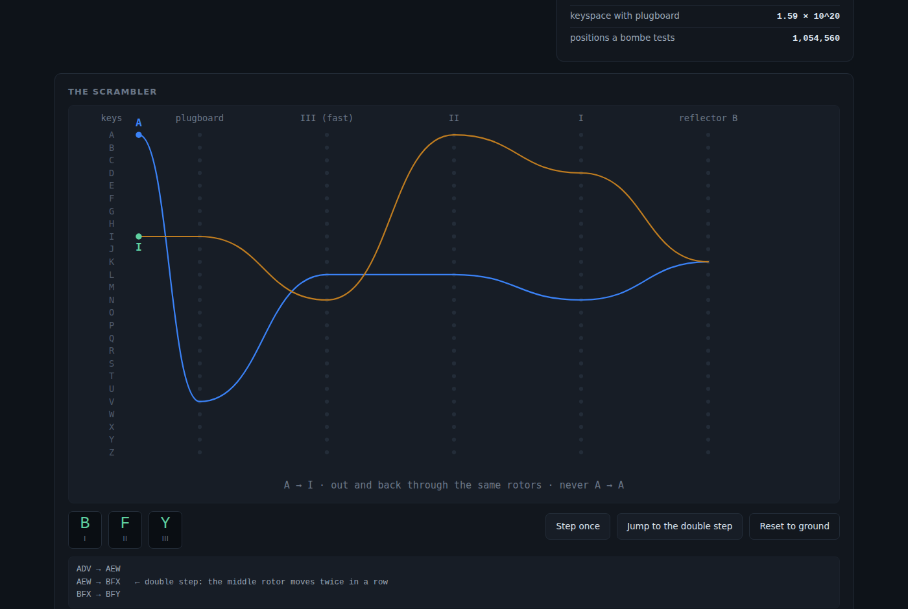
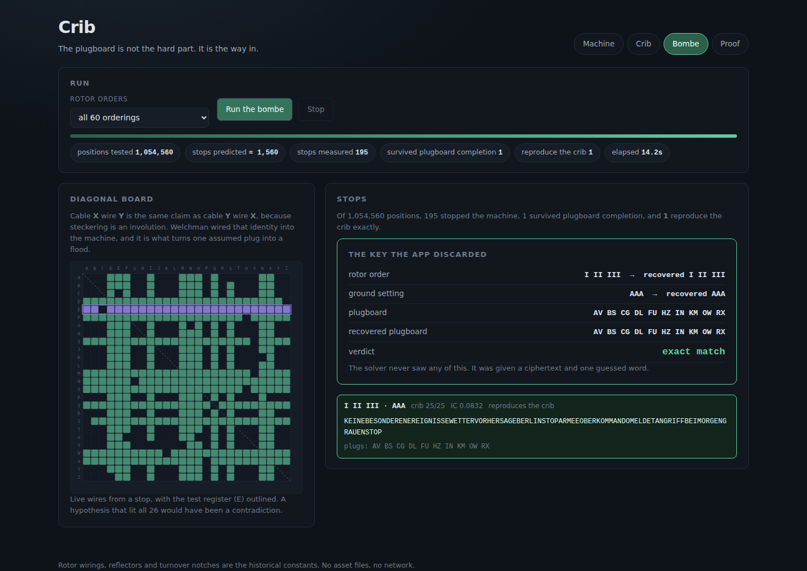
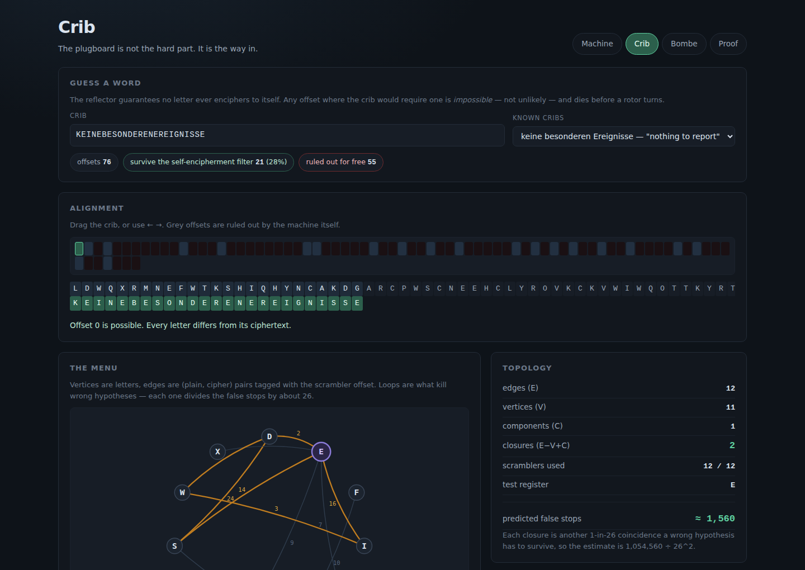
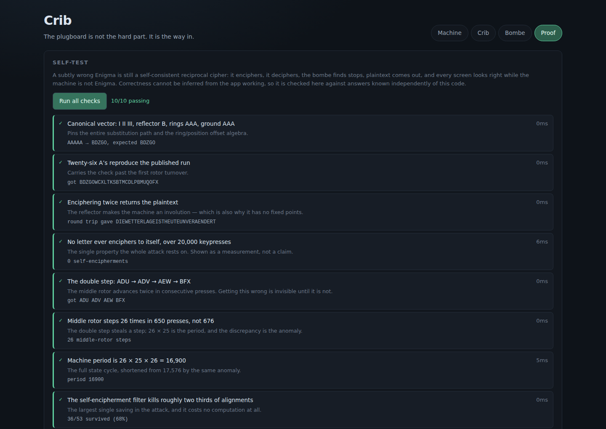

# Crib

Enigma simulators are everywhere and they teach nothing. Turning rotors and
watching lamps light is the least interesting fact about the machine. Crib is
the other half: encipher a message, **throw the key away**, guess one word of
the plaintext, and watch a Turing–Welchman bombe get the key back.

| The scrambler, and the invariant that dooms it | The key the app discarded |
|:---:|:---:|
|  |  |

| Where the search is won or lost | Checked against answers known independently |
|:---:|:---:|
|  |  |

See [`PRD.md`](./PRD.md) for the full product spec.

## The result, in one line

> 1,054,560 positions tested · 195 stops · **1** survives plugboard completion ·
> rotor order, ground setting and all ten plugs recovered exactly · 14 seconds.

The solver is given a ciphertext and one guessed word. It is never given the
key. At the end the app reveals the key it discarded and compares.

## The three things this is actually about

**1. The plugboard looks like the hard part and is actually the way in.**
The plugboard multiplies the keyspace to 158,962,555,217,826,360,000. The bombe
does not search it. Welchman's **diagonal board** encodes one structural fact —
steckering is an involution, so *A is plugged to G* and *G is plugged to A* are
the same statement — as physical wiring. That turns a single assumed plug into a
flood of implications which either survives or contradicts itself. A 10²⁰
keyspace collapses to 10⁶ tests because of a symmetry, not because of speed.

**2. The machine's one guarantee is what kills it.** The reflector means no
letter ever enciphers to itself. Any crib alignment requiring one is
*impossible* — not unlikely — so roughly two thirds of alignments die before a
single rotor turns. The design feature that made Enigma feel secure is the hole.

**3. The bombe's power is topology, not throughput.** Two cribs of the same
length can differ by three orders of magnitude in false stops, and the
difference is the **cycle rank** of the menu graph, `E − V + C`. Each
independent loop divides the false stops by about 26. Drag the crib one column
in the Crib tab and watch a loop break and the predicted stop count jump.

## The four modes

### Machine

The scrambler as five stacked banks with one keypress traced through it — the
forward leg in blue, the return leg in amber, so reciprocity is visible rather
than asserted. `self-encipherments: 0 in N keypresses` accumulates in the corner
and never moves; the whole attack rests on it, so it is shown as a measurement.

**Jump to the double step** parks the rotors one press before the anomaly and
walks through it: `ADV → AEW → BFX`, the middle rotor moving twice in
consecutive presses. This is why the middle rotor's period is 650 and not 676.

### Crib

Ciphertext in a band, a crib you can drag along it. Impossible offsets grey out
with the offending column marked. Surviving alignments build the **menu** — a
graph whose vertices are letters and whose edges are (plain, cipher) pairs
tagged with the scrambler offset — and edges lying on a cycle are drawn hot,
because a tree edge only propagates a hypothesis while a cycle edge can
contradict it.

The topology panel reports `E`, `V`, `C`, closures, the scramblers used out of
the bombe's twelve, the test register, and the predicted false stops.

### Bombe

The diagonal board as a live 26 × 26 lattice, an odometer over rotor orders and
core positions, and a ranked stop list. Every stop expands to the steckers the
closure forced, the completed plugboard, and the decrypt. One of them is not
gibberish.

### Proof

Ten checks, run in-page, against answers known independently of this code —
including the full round trip: encipher under a key, discard it, break it,
compare.

## Why the self-test exists

A subtly wrong Enigma is **still a self-consistent reciprocal cipher**. It
enciphers, it deciphers, the bombe finds stops, plaintext comes out, and every
screen looks perfect while the machine is not Enigma. There is no internal
signal of failure, so correctness cannot be inferred from the app working:

| Check | What it pins down |
|---|---|
| `AAAAA → BDZGO` at I II III / B / AAA / AAA | the substitution path and the ring/position offset algebra |
| 26 A's → `BDZGOWCXLTKSBTMCDLPBMUQOFX` | carries the check past the first turnover |
| Encipher twice returns the plaintext | reciprocity |
| 0 self-encipherments in 20,000 keypresses | the property the attack needs |
| `ADU → ADV → AEW → BFX` | the double step |
| 26 middle-rotor steps in 650 presses, not 676 | the anomaly, numerically |
| Machine period 26 × 25 × 26 = 16,900 | the full state cycle |
| Self-encipherment filter kills ~two thirds | the free saving |
| IC separates German (0.085) from ciphertext (0.036) | ranking is a measurement, not a corpus |
| **Round trip: random key → break → compare** | the entire pipeline |

## What the bombe cannot tell you

The bombe recovers the **rotor order** and the **core position**. It does *not*
recover the **Ringstellung**. Only the difference between ring setting and rotor
position affects the scrambler, so a whole family of (ring, position) pairs
produces identical ciphertext and is indistinguishable by any amount of
searching. The ring is pinned only by where the middle rotor's turnover must
have occurred — and if the message is too short to contain one, it is genuinely
underdetermined.

So the app searches at rings AAA and reports the position it finds, rather than
picking a member of that family and presenting it as the answer. The limit is
part of the lesson.

## One implementation note worth reading

The obvious optimisation is to hold the middle rotor fixed across the crib, and
it is wrong. A crib long enough to carry the right rotor past its turnover moves
the middle rotor mid-menu, and every scrambler after that point shifts. Holding
it fixed makes the **true key unrepresentable**, so the search runs to
completion, reports stops, and silently fails to find the answer it exists to
find. Crib simulates the stepping exactly, double step included.

This cost about 7 seconds of search time and is the difference between a demo
and a working bombe.

## Running it

```bash
cd showcase/apps/crib
python -m http.server 8080
# open http://localhost:8080
```

ES modules need an HTTP server — `file://` will not work. There is no build
step, no backend, no network access and no asset files: rotor wirings,
reflectors and turnover notches are the historical constants, and stop ranking
uses index of coincidence plus a 26-number letter-frequency table.

## Performance

A million closures in a browser tab needs three things:

- **Precomputed scrambler tables.** All 17,576 permutations for a rotor order
  are built once (457 KB) and reused across every position.
- **Per-vertex adjacency.** The closure's hot loop touches only the scramblers
  attached to the letter it is propagating from, not all twelve.
- **Early termination.** The moment the test register saturates, the answer is
  "no stop" — and most wrong positions saturate almost immediately.

Together: ~78,000 positions/sec, the full 60-order search in about 14 seconds,
all inside a Web Worker so the odometer stays honest and the page stays at 60fps.

## Files

```
crib/
├── index.html          four modes
├── style.css
├── main.js             controller
└── js/
    ├── enigma.js       rotors, stepping, the scrambler as a permutation
    ├── menu.js         alignments, the constraint graph, cycle rank, scrambler choice
    ├── bombe.js        permutation tables, exact crib stepping, the closure
    ├── scoring.js      plugboard completion, IC, German statistics, ranking
    ├── render.js       wiring, menu graph, diagonal board (SVG)
    ├── worker.js       the search, off the main thread
    └── fixtures.js     the ten checks
```
