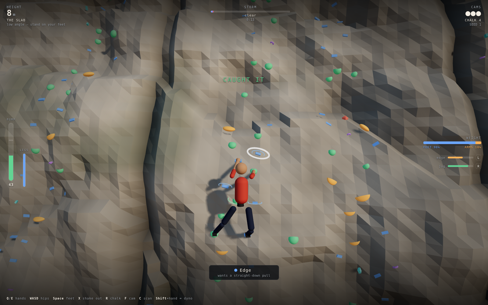
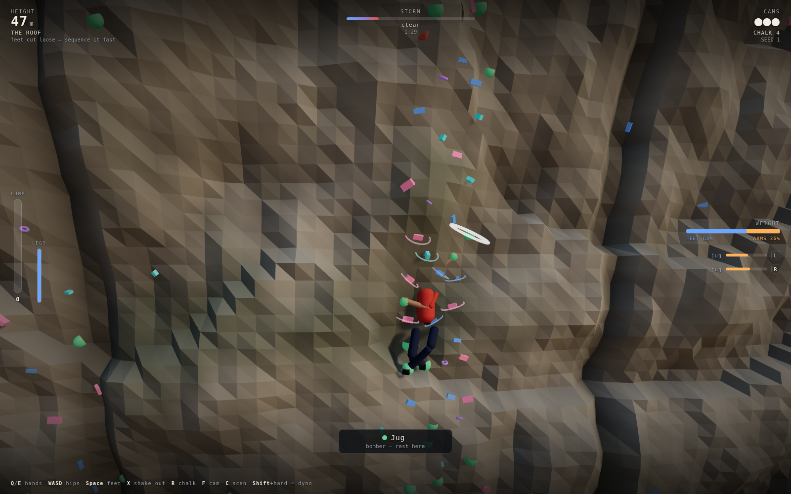
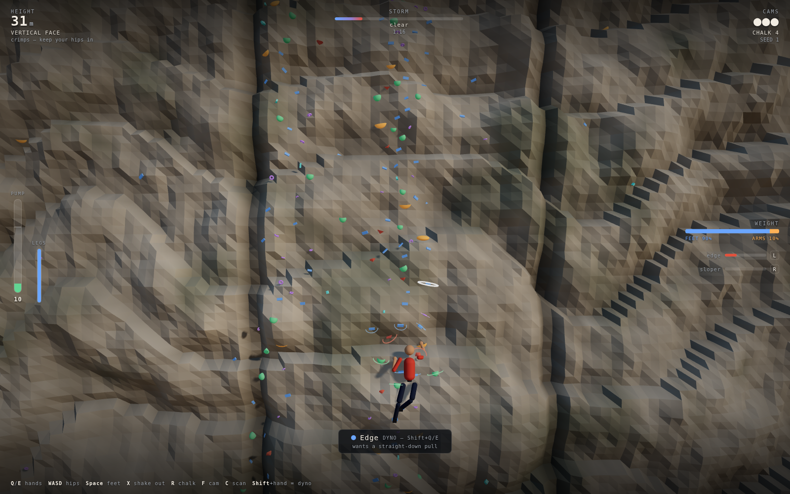
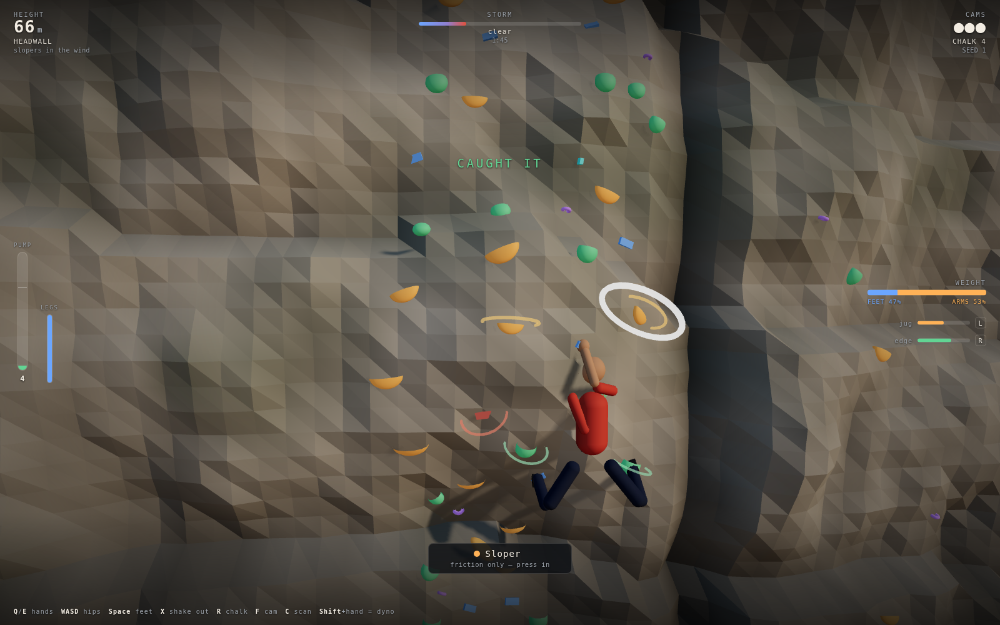

# Crux

A 3D free-solo climbing game where you move **one hand at a time**. The rock does
not decide whether you stay on it — *the direction you pull does*. A crimp that
spits you off when you hang straight down will hold all day once you get your hips
in and stand on your feet.

| The slab — feet do the work | The roof — feet cut loose |
|:---:|:---:|
|  |  |

| Reading the route ahead (`C`) | The headwall, in the wind |
|:---:|:---:|
|  |  |

## What it is

78 metres of procedurally generated limestone in four bands, three cams, a bag of
chalk and a storm coming in. There is no jump button, no attack, no throttle. For
long stretches nothing moves at all and the game is still asking you a hard
question: your hips are 30 cm too far off the rock, so most of your weight is
hanging off two fingers, and the meter that matters is filling up.

## The one idea

Every frame, the climber's weight is distributed across whatever is touching rock
— up to two hands and two feet — and each contact reports back the direction it is
being loaded. Each hold has an **ideal pull direction** derived from the local
surface: not world-down, but *down the face*, so the tilt of the rock rotates what
every hold wants.

```
grip quality = alignment(actual pull, ideal pull) × friction × (1 − fatigue)
```

Three consequences make the game:

- **Your hips are the controller.** `W A S D` move them. Moving in rotates the
  pull toward the face and shifts weight into your feet; moving out hangs you off
  your arms. The `WEIGHT` bar shows the split live.
- **The wall's angle sets the difficulty.** The same edge reads ~0.95 quality on
  the slab and ~0.5 under the roof, because `down the face` has swung 40° away
  from where you can pull.
- **Different holds want opposite things.** Crimps want your hips in; underclings
  want them out and your feet high; sidepulls want you shifted sideways so the
  pull goes lateral. Sequencing a roof is working out which of those you can
  satisfy at the same time.

## Controls

| Input | Action |
|---|---|
| Mouse | aim — the nearest hold to the cursor is targeted |
| `Q` / `E` | left / right hand to the targeted hold (or left / right click) |
| `W A S D` | shift your hips: in, left, out, right |
| `Space` | press your feet — more grip through the shoes |
| `X` | shake out — dumps pump, but only off a rest hold |
| `R` | chalk up — dries the holds you are on for ~26 s |
| `F` | place a cam (only at a crack seam) |
| `C` | scan — pull the camera back and read the route |
| `Shift` + `Q`/`E` | dyno to a hold out of reach |
| `Esc` / `P` | pause · `M` mute |

## Holds

| Type | Colour | Wants | Notes |
|---|---|---|---|
| Jug | green | anything | the only place you can shake out |
| Edge | blue | a straight pull down the face | hips in |
| Sloper | amber | pressure into the face | friction only; wind and rain kill it |
| Pocket | violet | down and slightly in | narrow window |
| Sidepull | cyan | a lateral pull | shift your hips away from it |
| Undercling | pink | outward and up | keep your hips *out*, feet high |
| Flake | dull red | a straight pull down | **breaks** after ~2.6 s of load |

## Pump, cams and the storm

- **Pump** is the only meter that ends runs. It rises with how much load your arms
  carry and how badly aligned the pull is; it falls when you get a hand off on a
  jug and shake out. Past 70 your hands judder and your arms straighten, which
  literally costs you reach. At 100 you come off.
- **Three cams.** Crack seams run up the wall; standing at one and pressing `F`
  leaves a cam that catches your next fall at the cost of 20 s and the cam itself.
  Fall below your last cam and the run is over.
- **The storm** arrives over about eight minutes: wind first, pushing your hips
  and rotating every pull vector, then rain wetting the rock from the top down.
  Chalk buys back some friction. Slopers go first.

## Bands

| Height | Band | Character |
|---|---|---|
| 0–20 m | The Slab | low angle, feet do the work, teaches the weight shift |
| 20–42 m | Vertical Face | crimps and pockets, hips-in economy |
| 42–58 m | The Roof | overhanging, underclings and sidepulls, where the cams matter |
| 58–78 m | Headwall | slopers, in the wind, and the summit mantel |

## Run it

```bash
cd showcase/apps/crux
python3 -m http.server 8080
# open http://localhost:8080
```

ES modules need an HTTP server — `file://` will not work.

## Notes

- Vanilla JS + ES modules, Three.js r163 vendored in `vendor/`. No build step, no
  network calls, no asset files: the spire, the route, the climber and every sound
  are generated at load.
- The seed on the title screen picks the wall. The same seed always builds the
  same spire and the same route, and best scores are kept per seed in
  `localStorage`.
- Limbs are two-bone analytic IK over a hips-driven body; the hips themselves are
  a damped point mass under rope constraints from each gripped hand, which is why
  the body swings when you are down to one hand.

See [PRD.md](PRD.md) for the full design.
