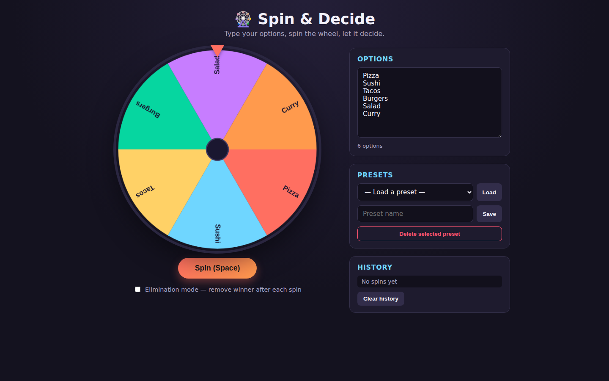
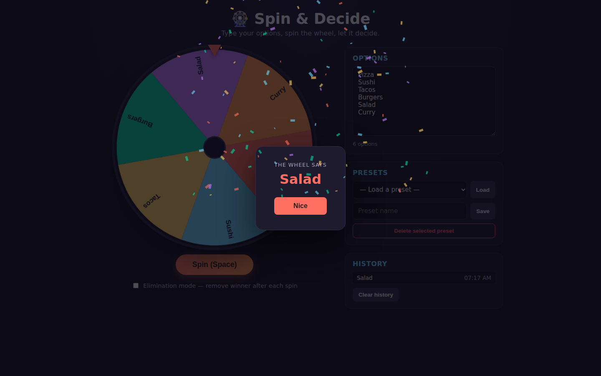

# Spin & Decide — Decision Wheel

A colorful spinning decision wheel: type a list of options, spin, and let it
pick one for you. Built for small everyday decisions — where to eat, whose
turn it is, who goes first — with satisfying spin physics, sound, and
confetti, plus saved presets and a spin history.

| Early state | Settled state |
|:---:|:---:|
|  |  |

See [`PRD.md`](./PRD.md) for the full product spec.

## What it does

- Type any list of options (one per line) and the wheel updates live.
- Click the wheel or press **Space** to spin — eased deceleration, a ticking
  sound as slices pass the pointer, and a confetti + "ding" celebration when
  it lands.
- **Elimination mode** — toggle it on to remove the winning option after each
  spin, useful for determining turn order.
- **Presets** — save your current option list under a name and reload it
  later. Ships with two starter presets ("What's for dinner?" and "Who goes
  first?").
- **History** — the last 20 results are logged with timestamps, all local to
  your browser.

Everything persists to `localStorage` — no account, no backend.

## How to run

Static site, no build step:

```bash
cd showcase/apps/decision-wheel
python -m http.server 8080
# open http://localhost:8080
```

## Key parameters

- Minimum 2 options required to spin.
- Spin duration is ~5s with an ease-out cubic deceleration curve
  (`wheel.js` → `spinTo`).
- History caps at the most recent 20 spins.

## Files

| File | Purpose |
|------|---------|
| `index.html` | Page structure |
| `style.css` | Layout and theme |
| `wheel.js` | Canvas rendering + spin animation/physics |
| `storage.js` | Presets, current options, and history persistence (localStorage) |
| `effects.js` | Confetti particles and Web Audio tick/ding sound effects |
| `main.js` | Wires up DOM events and state |

## Dependencies

None — vanilla JS, Canvas 2D, and the Web Audio API, all built in to the
browser.
