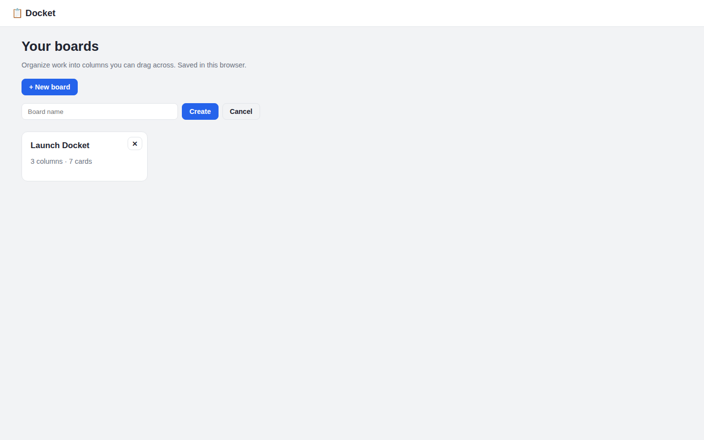
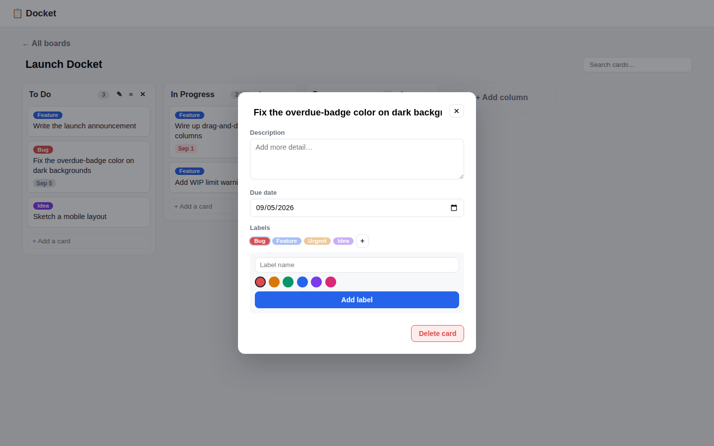

# Docket — Kanban Task Board

A browser-based Kanban board — multiple boards, drag-and-drop columns and cards,
colored labels, due dates, and a WIP limit per column to keep work from piling up.
No sign-up: every board lives in `localStorage`.

| Board list | Card detail |
|:---:|:---:|
|  |  |

## Features

- **Multiple boards** — create, rename, delete; a starter board ("Launch Docket")
  ships pre-loaded with sample cards so the app isn't empty on first load
- **Columns** — add, rename, delete, and reorder by dragging the header; an
  optional WIP limit turns the count badge amber once a column is over capacity
- **Cards** — quick-add at the bottom of any column; drag between columns or
  reorder within one, with a live drop indicator showing exactly where it'll land
- **Card detail panel** — title, multi-line description, a due date, and any
  number of colored labels; overdue cards get a red badge, due-today an amber one
- **Labels** — a small starter palette per board (Bug / Feature / Urgent / Idea),
  plus the ability to add custom labels from a 6-color swatch
- **Search** — filters cards on the current board in real time; non-matches fade
  instead of disappearing, so the board's shape doesn't jump while typing
- **Persistent** — everything saved in `localStorage`, survives a refresh

## How to run

```bash
cd showcase/apps/docket
python3 -m http.server 8080
# open http://localhost:8080
```

## Key parameters

| Setting | Value |
|---------|-------|
| Starter board columns | To Do / In Progress (WIP limit 3) / Done |
| Label swatch | 6 fixed colors, unlimited custom labels per board |
| Due badge | Red if overdue, amber if due today, gray otherwise |

## Stack

Vanilla JS (ES Modules) · CSS3 · HTML5 Drag and Drop API · `localStorage` — no
build step, no dependencies.
