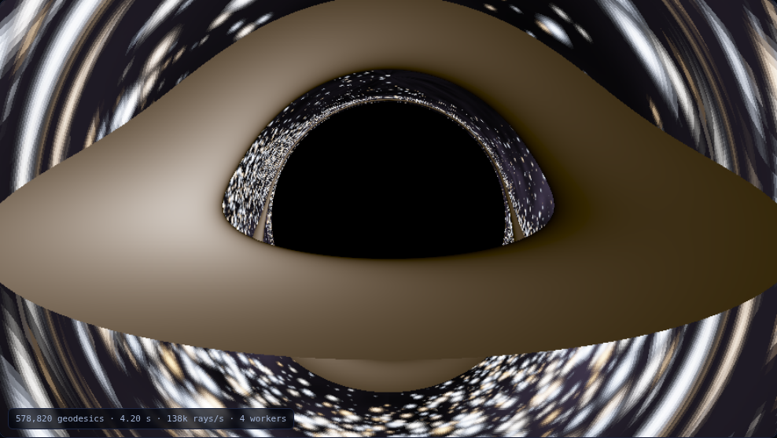
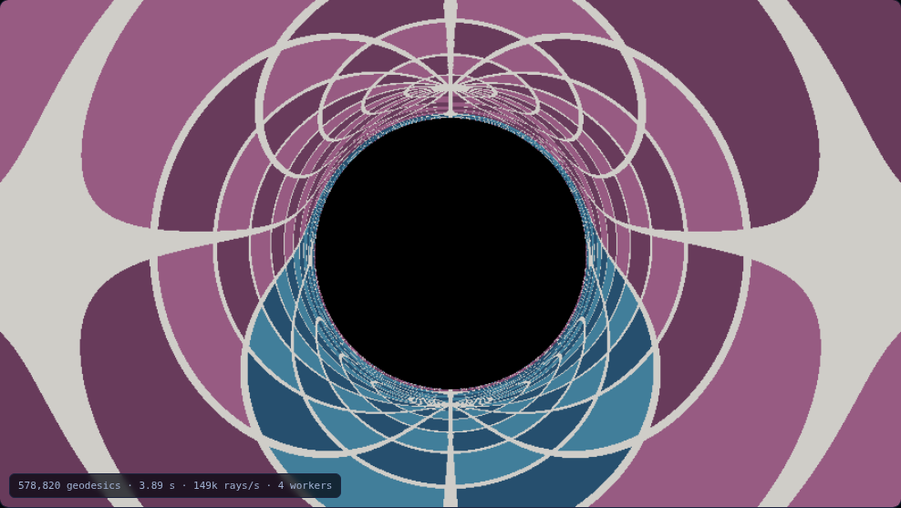
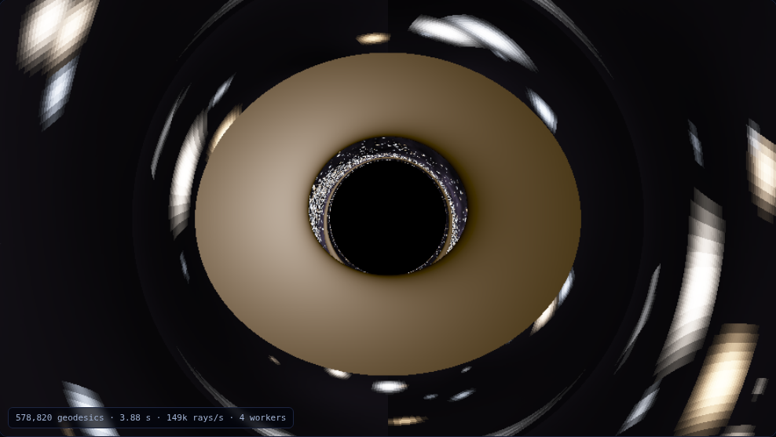

# eddington

Every pixel is a null geodesic of the Schwarzschild metric, integrated backwards from the camera. Nothing in this page is a shader trick or an artist's impression: the bending, the shadow, the photon ring, the lopsided disk and the endless copies of the sky all fall out of one second-order ODE in the orbit angle,

```
d²u/dφ² = 3u² − u ,        u = 1/r
```

and the `3u²` is the entire difference between Einstein and Newton. Delete it and every deflection on the bench moves to exactly half its measured value, the photon sphere disappears, and the shadow goes with it. Then a bench grades the whole thing against answers it did not produce — closed forms, conservation laws, an exact solution of the same equation, and a measurement taken in 1919.

| Edge-on, with the disk | The sky, wrapped |
|:---:|:---:|
|  |  |

| Tipped toward face-on | The bench |
|:---:|:---:|
|  |  |

The left image is the one everybody knows: the disk's far side is bent up over the top of the hole and its underside is wrapped around beneath, because light from behind the black hole arrives anyway. The right image is the same camera pointed at a plain 15° celestial grid with the disk switched off, and it is the more honest picture of what is happening — the entire sky, including everything behind the camera, is compressed into a band against the shadow's edge and repeated there without limit.

## Running it

```bash
cd showcase/apps/eddington
python -m http.server 8080
# open http://localhost:8080
```

ES modules and module Workers, so it needs an HTTP server; `file://` will not work. No build step, no dependencies, no assets, no network.

## What it does

Six panes.

**Render.** A progressive path tracer over null geodesics. Inclination, camera radius, field of view, disk edges and exposure are live; the sky can be stars, a celestial grid or nothing; the disk shading can be full, Doppler-free, or flat. 579,000 geodesics at full quality in about four seconds on four workers.

**Deflection.** `α(b)` integrated from infinity, against the weak-field `4M/b`, against Soldner's 1801 Newtonian corpuscle result `2·arctan(M/b)`, and against the 1919 eclipse.

**Photon ring.** Where each successive image of a source directly behind the hole sits, and why the spacing is exactly `e^(−π)`.

**Shadow.** The dark patch measured out of the renderer by bisection and compared with `3√3 M`, for cameras from `3.5 M` to `1000 M`.

**Doppler.** Why one limb is bright, measured on a `6 M` annulus rather than asserted.

**Bench.** Fourteen checks, run live in the page, each decided by something outside the code it tests.

## The physics, and where it is written down

The camera is a *static observer hovering at r₀*, and its three axes are that observer's own orthonormal tetrad. This matters more than it sounds: a pixel direction is then a real local viewing angle, and the impact parameter picked up from it is the conserved `b = L/E = r sin ψ / √(1−2M/r)`, not a flat-space cross product. Getting this wrong is invisible in the picture and wrong by `M/r` in every number.

Disk emission is a Shakura–Sunyaev thin-disk profile, `F ∝ r⁻³(1 − √(r_in/r))`, isotropic in the gas's own rest frame. What arrives is `g⁴F` at observed temperature `gT`, with

```
g = √(1 − 3M/r_e) / [ (1 − Ω b_z) √(1 − 2M/r_o) ]
```

where `Ω = (M/r_e³)^½` and `b_z` is the photon's axial angular momentum per unit energy, signed. The `g⁴` is not a choice: `I_ν/ν³` is a Lorentz invariant, so bolometric intensity scales as the fourth power of the frequency ratio, and a modest shift becomes a large brightness ratio.

## What the bench measures

All fourteen pass, in about 0.15 s.

| Claim | Graded against | Result |
|---|---|---|
| Critical impact parameter | `3√3 M`, from the metric | bisected out of the renderer at **5.196152423** from every camera radius between 3.5 M and 1000 M, worst error `1.4e-11` |
| Weak-field deflection | `4M/b + 15πM²/4b²` | `α·b = 4.00117852` against `4.00117810` at `b = 10⁴ M`, **0.11 ppm** |
| Einstein ÷ Newton | `2(1 + 15πM/16b)` | **2.000058907** against 2.000058905 |
| Integrator order | the exact critical geodesic | **4.037**, absolute error `9e-12` in `u` after four radians |
| Photon ring spacing | `e^(−π) = 0.0432139` | **0.0432139** at n = 6 |
| Photon sphere instability | exactly 1 e-folding per radian | **1.00000037** |
| Redshift decomposition | gravitational shift × SR Doppler | agree to `1.6e-15` over 4,000 random emitters |

Three of those deserve their own paragraph.

**The photon ring is exactly `e^(−π)`, and nothing fitted it.** Linearise the orbit equation about the photon sphere, `u = 1/3 + δ`, and the `3u²` term gives `δ″ = δ` — one e-folding per radian of orbit, for every black hole that has ever existed, independent of mass. Each extra half-turn is π radians, so successive rings close on the shadow edge by `e^(−π)`. Bisecting for the impact parameters that bend light through exactly π, 2π, … 6π gives gaps of `1.61e-1`, `6.53e-3`, `2.81e-4`, `1.21e-5`, `5.25e-7`, `2.27e-8` — ratios 0.0405953, 0.0430575, 0.0432052, 0.0432135, **0.0432139**, converging on `e^(−π)` from a computation that was never told about it.

**There is a closed-form solution to this equation, and it settles the instability without linearising anything.** The critical geodesic is `u(φ) = −1/6 + ½tanh²(φ/2)`, which satisfies `u″ = 3u² − u` identically. So `1/3 − u = ½sech²(φ/2) → 2e^(−φ)` exactly — the e-folding per radian is not a linear approximation, it is the asymptotics of an exact solution. It also grades the stepper with no reference integration at all, which is how the convergence-order row became trustworthy (see below).

**The dark patch is not the event horizon.** It is the set of directions whose rays end on the horizon, and in impact parameter it is `3√3 M` against a horizon at `2M` — **2.598076×** wider in radius, **6.75×** in solid angle. Its measured value does not depend on where the camera is, which is itself the check: nine cameras from 3.5 M to 1000 M all bisect to the same nine digits. And at the photon sphere the shadow's angular radius is `arcsin(3√3·√(1−2/3)/3) = arcsin(1)` — exactly 90°, so at `r = 3M` precisely half the sky is black.

## Three things that were wrong first

**The renderer painted concentric arcs across the entire sky, and they were an escape test.** A ray leaving the hole was called escaped when `u` dropped below a fixed threshold. But the step in `u` near infinity is about `h/b`, so for small `b` the integrator walked straight over the window in a single step, `u` went negative, and the ray was classified as *captured*. Whether a ray landed inside the window depended on `b`, so the misclassification was periodic in `b` and drew false rings centred on the hole across the whole frame. The fix is that `u` crossing zero on the outbound branch *is* escape, and the remaining sweep is `atan2(u, −w)` — exact in flat space and independent of the amplitude, so the ray can be released early without losing accuracy. It also made the renderer 3.5× faster, because the spurious captures were the expensive rays.

**The Doppler pane reported that the naive estimate breaks down at high inclination. It does not; the measurement did.** Take a photon leaving the limb to carry the axial angular momentum `r sin i` it would have in flat space, redshift-correct it, and you get a `g⁴` brightness ratio in two lines. On a fixed 96×60 grid the `6 M` annulus at 89° catches 28 rays, the extremes land nowhere near the limbs, and the ratio comes out at 32 — half the value at 85°, a clean turnover that reads as a real effect and is pure undersampling. Refining locally around each limb until the extremum stops moving, the turnover vanishes and the curve climbs monotonically to 81× at 89°. The estimate then turns out to be **exact edge-on** — and provably so, since at 90° the extremal photon leaves tangentially, its angular momentum lies along the disk axis, and `r sin i / √(1−2M/r)` is the exact supremum of `L_z/E` rather than an approximation. Its *worst* error is face-on, at +13%, and not because of lensing: it describes a single radius while the thing being measured is an annulus with width, and face-on there is no Doppler left for that width to hide behind.

**Two bench rows failed, and only one of them was a bug.** The convergence-order row read −1.8 because it was measuring the deflection pipeline rather than RK4: the last step before termination overshot `u = 0` by an amount independent of `h`, so the stopping rule set the error and the method measured as second order. Capping the step so `u` cannot be walked through zero, and grading against the exact critical geodesic instead, gives a clean 4.037. The other row, `α_Einstein ÷ α_Newton`, failed against an expected value of exactly 2 by 29 ppm at `b = 10⁵ M` — and that was not an error at all but the second-order term `15πM/16b`, which is 29.45 ppm there. The check was wrong, the code was right; it now grades against `2(1 + 15πM/16b)` and passes to nine digits.

## The 1919 eclipse, graded both ways

`4GM/c²R` at the solar limb is **1.75119″**; Soldner's Newtonian value is **0.87560″**. The Dyson–Eddington–Davidson expedition is usually told as a clean knockout, and the arithmetic is more interesting than that:

| Measurement | α at the limb | quoted error | from Einstein | from Newton |
|---|---|---|---|---|
| Sobral | 1.98″ | ± 0.12 | +1.91 σ | **+9.20 σ** |
| Príncipe | 1.61″ | ± 0.30 | −0.47 σ | **+2.45 σ** |
| VLBI (Shapiro et al. 2004) | 1.7512″ | ± 0.0016 | +0.01 σ | +547 σ |

Sobral rejects Newton decisively and sits 1.9 σ *above* Einstein. Príncipe — Eddington's own plate, the one the story is usually about — is a beautiful 0.47 σ from Einstein and only 2.45 σ from Newton, which on its own is not a rejection of anything. The uncertainties are the ones published in 1920, and what they mean has been argued over ever since; the modern radio measurement in the last row settles it at 547 σ.

## Layout

```
eddington/
├── index.html
├── style.css
├── main.js                 UI, camera controls, live readout
├── js/
│   ├── physics.js          the geodesic ODE, RK4, deflection, redshift, closed forms
│   ├── shade.js            camera tetrad and per-ray shading (shared with the bench)
│   ├── trace.worker.js     module worker: renders row bands
│   ├── render.js           worker pool, progressive passes, tone mapping
│   ├── sky.js              procedural starfield and celestial grid, blackbody colour
│   ├── plot.js             minimal log/linear plotting
│   └── panes/              deflection · rings · shadow · doppler · checks
└── screenshots/
```

## Stack

Vanilla JS, ES modules, Web Workers, Canvas 2D. Geometric units `G = c = M = 1` throughout, so every length is in units of the hole's mass and every number on the bench is the same for every Schwarzschild black hole in the universe.
