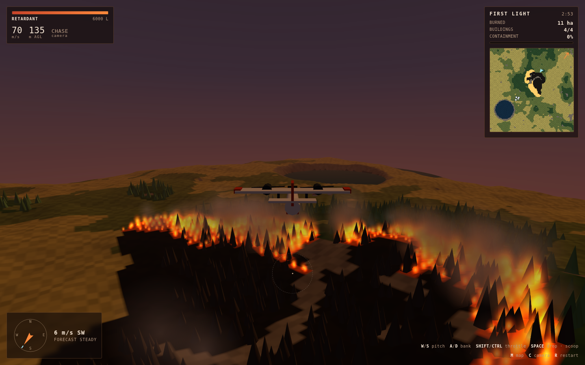
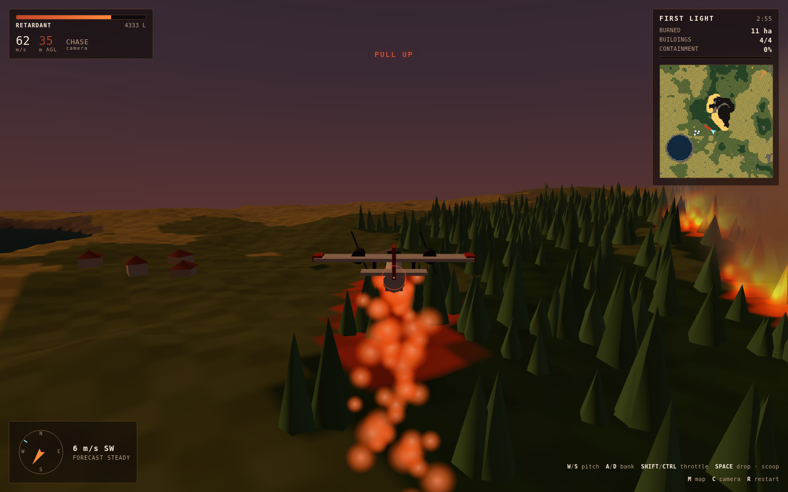
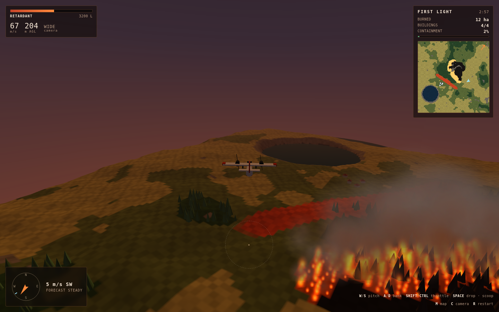
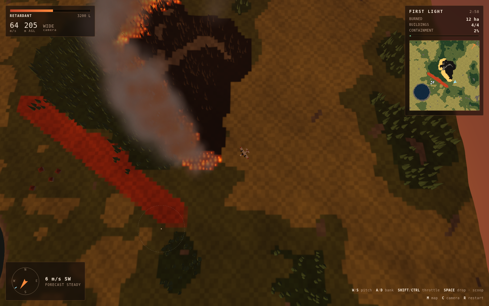

# Emberline

An aerial-firefighting game where **retardant never puts a fire out**. The red
slurry you drop only makes ground unburnable, so the game is not about hitting
flames — it is about reading a wind- and slope-driven fire, working out where it
is going to be in two minutes, and painting a line across that ground before it
gets there.

| Flame front | Drop run |
|:---:|:---:|
|  |  |

| Line held ahead of the head | Tactical overhead |
|:---:|:---:|
|  |  |

## How to run

```bash
cd showcase/apps/emberline
python -m http.server 8080
# open http://localhost:8080
```

No build step, no dependencies to install, no network calls. Three.js is
vendored in `vendor/`, and every texture and sound is generated at load — the
project ships no asset files at all.

## How it plays

You fly a scooper tanker over a burning valley at dusk.

| Key | Action |
|---|---|
| `W` / `S` | nose up / nose down |
| `A` / `D` | bank — the aircraft turns by rolling, and a hard turn sinks |
| `Shift` / `Ctrl` | throttle, 42–92 m/s |
| `Space` | drop retardant — or scoop, when low and slow over the lake |
| `M` (hold) | tactical overhead |
| `C` | camera: chase / cockpit / wide |
| `R` | restart the mission |

The dashed ring on the ground is where this load would actually land: the drop
leads the aircraft by however long the slurry takes to fall, so the higher you
are, the further ahead it lands and the wider and thinner the line gets. The
ring turns solid red under 70 m — that is the altitude band where a line is
worth flying. Under 40 m the ground-proximity warning starts; under 12 m the
mission is over.

**Load** is 6000 L, about five seconds of continuous drop or 350 m of ground at
cruise, and it can be split across several passes. Refill by skimming the lake
below 40 m at under 62 m/s.

### The one rule worth knowing

Retardant on unburnt fuel is a permanent line the fire cannot cross. Retardant
on flame is a knockdown that costs the same load and buys a few seconds. Use the
knockdown to save a specific building; use the line for everything else. A fire
goes out when every edge of the burn is against ground it cannot cross —
retardant, water, rock, or ground it has already burnt.

## The simulation

A 160 × 160 cell grid over 1600 m × 1600 m, stepped at 8 Hz. Each cell carries a
fuel model (grass, brush, timber, rock, water), a fuel load, moisture, and its
own state. Burning cells pre-heat their eight neighbours:

```
heat += dt · RATE · fuel · intensity · windFactor · slopeFactor · (1 − moisture)
windFactor  = exp(k · windSpeed · cos θ)   θ = angle between spread and wind
slopeFactor = exp(k · uphill gradient)
```

Both responses are exponential, which is why a fire creeping through a meadow
turns into a run the moment it lines up with a draw, and why the same fire
climbs a face far faster than it comes back down one. Ignition takes more
pre-heating in timber than in grass, and timber then burns four times as long,
so heavy fuel is slow to light and impossible to put back out.

A broad flame front pre-heats harder than a single cell does, but not eight
times harder — the strongest neighbour dominates and the rest contribute a
fraction. Without that the front accelerates as it widens and the whole map goes
up in ninety seconds.

Timber burning under wind lofts embers. They arc downwind for a couple of
hundred metres and light what they land on, which means a line you have just
finished can be jumped from the other side. Containment is a real measurement,
not a score: it is the fraction of the unburnt country the fire can no longer
reach, computed by flooding out from the flame front through every cell it could
still cross.

## Missions

| # | Name | What it teaches |
|---|---|---|
| 1 | **First Light** | grass and brush, steady wind — that a line ahead of the fire works and a line on it does not |
| 2 | **Ridge Run** | timber on a steep face, wind backs once — that slope does what wind does, and a flank becomes a head when the wind turns |
| 3 | **Emberline** | heavy timber, two starts, gusting wind — spotting: your line will be jumped, and you must choose which side of town to defend |

Grades (S–D) weigh buildings saved, hectares burned, loads used and time, and
are kept per mission in `localStorage`.

## Files

```
emberline/
├── index.html        HUD, overlays, briefing and results markup
├── style.css
├── js/
│   ├── config.js     grid, fuel models, simulation constants, mission table
│   ├── terrain.js    heightfield, lake, fuel percentile mapping, ground texture
│   ├── fire.js       the burn model: spread, spotting, retardant, containment
│   ├── fx.js         instanced flame, smoke, embers and slurry particles
│   ├── plane.js      bank-to-turn flight model and the aircraft mesh
│   ├── camera.js     chase / cockpit / wide rigs and the tactical overhead
│   ├── hud.js        instruments, compass, live fire map
│   ├── audio.js      synthesised engine, wind, fire roar, warnings
│   ├── input.js
│   ├── game.js       missions, drops, structures, wind shifts, scoring
│   └── main.js
└── vendor/three.module.js
```

`PRD.md` has the design reasoning behind all of it.
