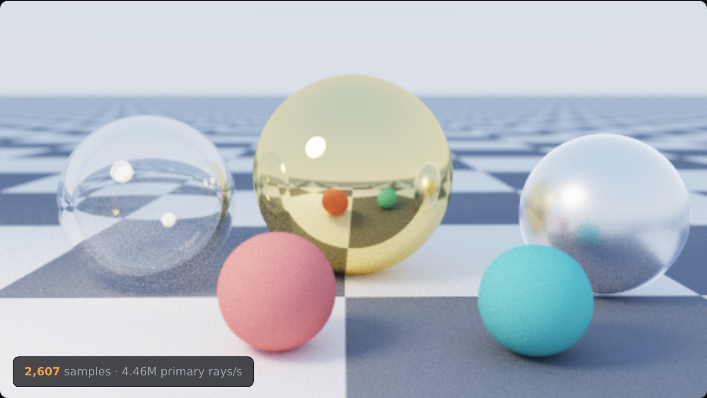
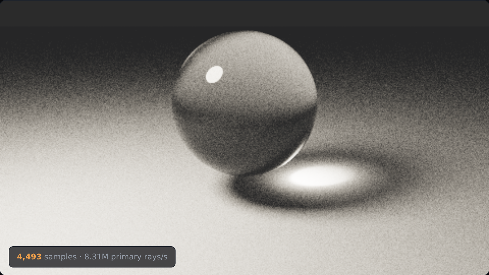
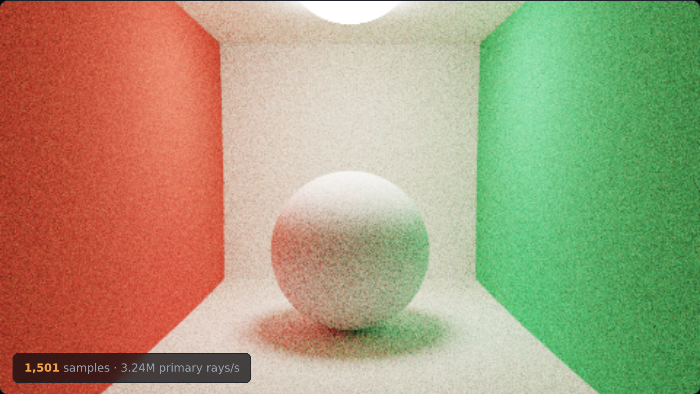
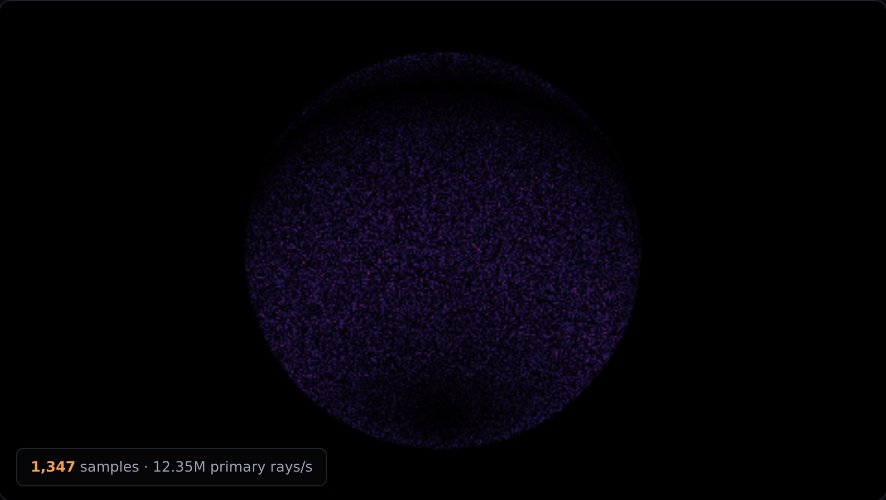

# Furnace

A Monte Carlo path tracer, and a test it cannot fake.

Put a sphere of albedo 1 inside a void of uniform radiance 1. Every photon that
lands on it leaves again, so the sphere can be neither brighter nor darker than
what is behind it — the correct render is flat, and **the sphere is not visible
at all**. There is nothing to tune and nothing to eyeball. Either it disappears
or the renderer is losing energy, and the amount it fails by is the amount it
loses.

This one disappears exactly. Deviation `0`.

| Gallery — glass, gold, rough metal, depth of field | Caustics — light refracted twice and focused |
|:---:|:---:|
|  |  |

| Colour bleeding — none of that colour is painted on | The furnace, as an error image |
|:---:|:---:|
|  |  |

The right-hand image is the furnace with the sampling basis deliberately broken,
shown as `|L − 1| × 20`. Correct, the same view is pure black.

See [`PRD.md`](./PRD.md) for the spec.

## Run it

```bash
cd showcase/apps/furnace
python -m http.server 8080
# open http://localhost:8080
```

No build, no dependencies, no network. The tracer runs unchanged in the page, in
the workers that draw it, and under Node:

```bash
node tests.mjs            # the whole bench, about 20 s
node tests.mjs furnace    # one of: furnace albedo basis convergence roulette importance ggx
node tests.mjs --ggx      # the energy-loss sweep
```

## The bench

Seven checks, none of them an opinion about an image.

| Check | Decided by | Result |
|---|---|---|
| White sphere in a white furnace | conservation of energy | **deviation exactly 0** |
| Grey sphere returns its albedo | arithmetic | exact to 2.9e-7 (the float32 accumulator) |
| Sampling basis is orthonormal | linear algebra | worst error 5.1e-16 |
| Error falls as N^-0.5 | the central limit theorem | exponent **−0.553** |
| Russian roulette is unbiased | the estimator's definition | means agree to 0.24% |
| Importance sampling is unbiased | the estimator's definition | 0.46% apart, **1.57× less error** |
| Rough metal loses energy | the furnace again | **69% lost at roughness 1** |

The furnace result is the one worth dwelling on. It is not "within tolerance" —
it is zero. A convex sphere of albedo 1 in a uniform environment produces the
same number from every path, so the estimator has no variance at all, and any
deviation whatsoever is a bug rather than noise.

## Four things this got wrong, and what caught them

**The sampling basis was not orthogonal.** Duff's branchless orthonormal basis
is written around z, and I permuted it around y. The vectors it produced were
not perpendicular to the normal at all, so a share of every hemisphere sample
pointed into the surface. Every render still looked entirely reasonable — glass
refracted, metal reflected, shadows were soft. The furnace put a number on it in
one run, and the number was not zero. There is a switch on the page to turn the
bug back on.

**Rays were offset along their own direction.** At grazing angles that nudge
barely leaves the surface, so rays immediately re-hit the object they just left.
Those phantom bounces are invisible in a picture and cost energy in a furnace.
Offsetting along the geometric normal instead fixes it.

**Single-scatter GGX cannot pass the furnace, and that is not a bug.** The Smith
masking term removes the light a microfacet blocks and never puts it back, so a
rough conductor of albedo 1 returns less than it receives — 5% short at roughness
0.4, 23% at 0.6, and **69% short at roughness 1.0**. This is what single-scatter
GGX *is*, and it is why the compensation term exists.

**The compensation only half works, and ships that way.** A Kulla–Conty style
multiple-scattering term recovers nearly all of the loss below roughness 0.6 —
12.2% down to 0.7% at roughness 0.5 — but only about half of it at roughness 1.0
(69% short becomes 35% short). The reason is in the code: the extra lobe is added
with the specular pdf rather than sampled with its own, so its magnitude is
roughly right and its distribution is not. Reported rather than tuned away.

## What it does not do, and what that costs

There is **no next-event estimation**. Paths find the light by wandering into it
rather than by being aimed at it, which is why the colour-bleeding scene is still
grainy at 1,500 samples and the caustic at 4,500. That is the honest cost of the
simplest correct integrator, and it is visible in the screenshots above rather
than hidden behind a denoiser.

Caustics are the worst case: the paths that make the bright knot under the glass
sphere have to refract twice and then find a small source, and almost none of
them do. A path tracer without light sampling renders them correctly and slowly,
which is exactly what the picture shows.

## How it is put together

```
furnace/
├── index.html
├── main.js            worker pool, canvas, controls
├── js/
│   ├── trace.js       intersection, materials, sampling, the integrator
│   ├── scenes.js      four scenes; two are pictures, two are instruments
│   ├── worker.js      one band of the image, rendered over and over
│   └── selftest.js    the bench, and the GGX sweep
├── tests.mjs          the bench under Node
└── screenshots/
```

The inner loop allocates nothing — vectors are three loose numbers in locals
rather than objects, which is ugly and about four times faster, and is the one
place in the project where that trade is worth making. It sustains roughly 4–11
million primary rays a second across a pool of workers in a browser tab.
