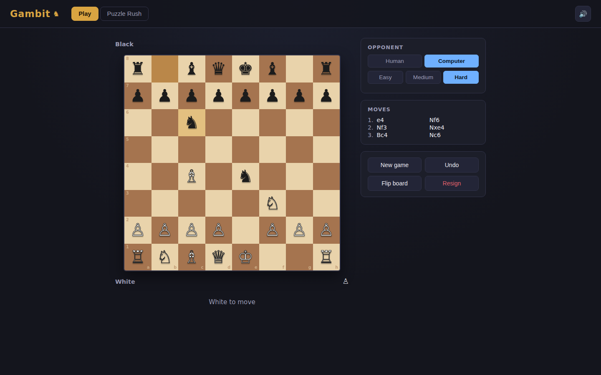
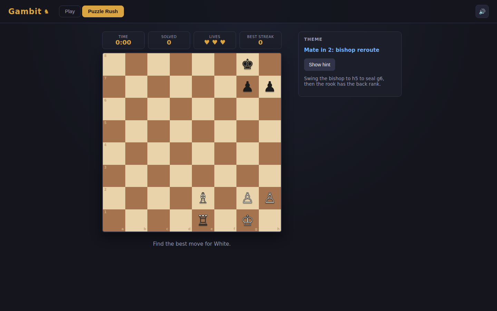

# Gambit

A self-contained browser chess app: play a full, rule-correct game against a
local AI (or pass-and-play with a friend), or drill tactical vision in
**Puzzle Rush** — a timed run through a hand-curated, mechanically-verified
puzzle bank.

| Play vs. Computer | Puzzle Rush |
|:---:|:---:|
|  |  |

See [PRD.md](PRD.md) for the full product spec and rationale.

## What it does

**Play**
- Click-to-select board with legal-move highlighting, check/checkmate/
  stalemate/draw detection, castling, en passant, and promotion — all
  driven by a vendored [chess.js](https://github.com/jhlywa/chess.js)
  (BSD-2-Clause) rules engine, so the chess itself is never in question.
- Opponent is **Human** (pass-and-play on one screen) or **Computer** at
  Easy / Medium / Hard — a depth-limited minimax search with alpha-beta
  pruning and piece-square-table evaluation, all in plain JS with no
  Web Worker or WASM engine.
- Move list in SAN, captured-piece trays, undo, flip board, resign, and
  synthesized sound effects (move/capture/check/game-end) via Web Audio —
  no audio files.

**Puzzle Rush**
- Pick a difficulty tier and solve as many tactics puzzles as you can
  before 3 wrong answers end the run. A stopwatch runs for the session;
  your best streak per tier is saved in `localStorage`.
- Every puzzle in `data/puzzles.js` is mechanically checked before
  shipping — see [`dev/validate-puzzles.mjs`](dev/validate-puzzles.mjs)
  — so every FEN parses, every scripted move is legal, and the final
  position matches the claimed outcome (checkmate, or the tactical
  capture).

## Run it

```bash
cd showcase/apps/gambit
python -m http.server 8080
# open http://localhost:8080
```

ES modules require an HTTP server — `file://` won't work.

To re-check the puzzle bank after editing `data/puzzles.js`:

```bash
node dev/validate-puzzles.mjs
```

## Stack

Vanilla JS (ES modules), Canvas-free DOM board rendering, Web Audio for
sound, `localStorage` for the best-streak record, and a vendored
[chess.js](https://github.com/jhlywa/chess.js) v1.4.0 ESM build under
`vendor/` (see `vendor/chess.js.LICENSE`) for move generation and game-state
rules. No CDN dependencies, no build step, no backend.

## File layout

```
gambit/
├── index.html
├── style.css
├── PRD.md
├── vendor/chess.esm.js     # vendored chess.js rules engine
├── data/puzzles.js         # Puzzle Rush bank
├── dev/validate-puzzles.mjs
└── js/
    ├── main.js              # mode tabs, sound toggle, boot
    ├── boardView.js         # DOM board rendering + click handling
    ├── play.js              # Play mode controller
    ├── puzzleRush.js        # Puzzle Rush controller
    ├── ai.js                # minimax + alpha-beta opponent
    ├── sound.js              # synthesized SFX
    └── storage.js            # localStorage helpers
```
