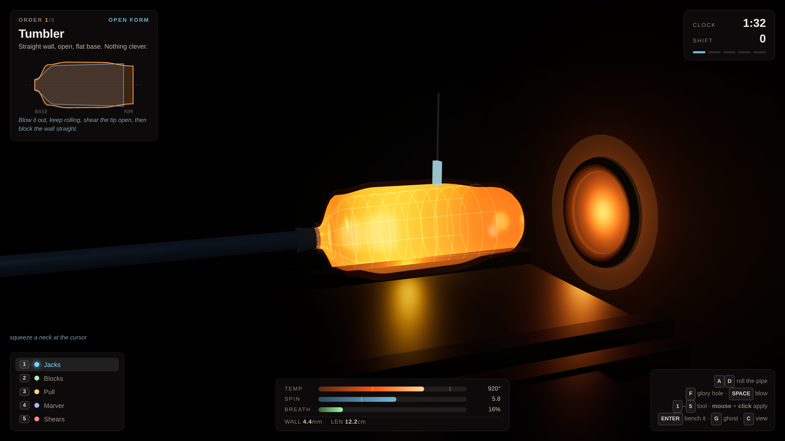
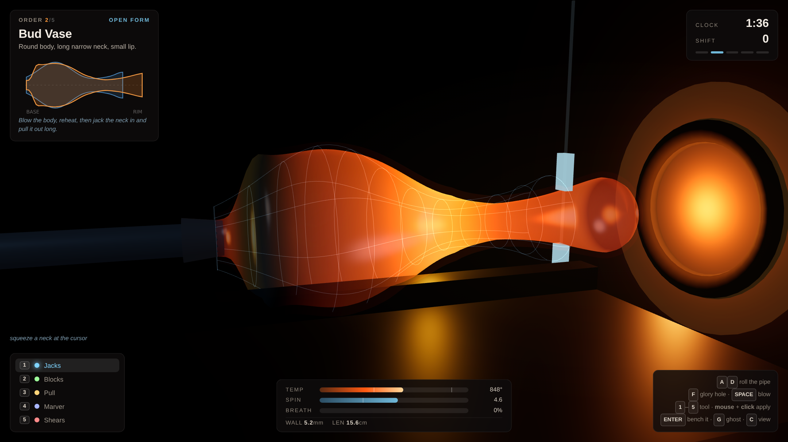
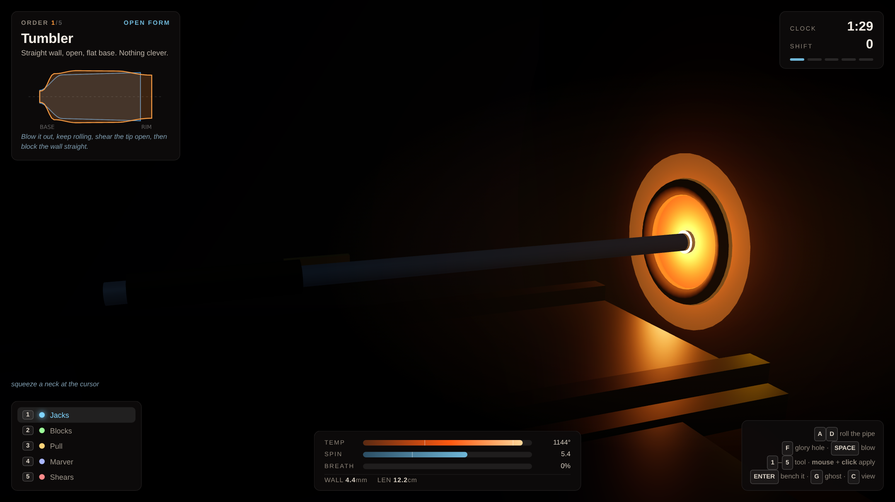
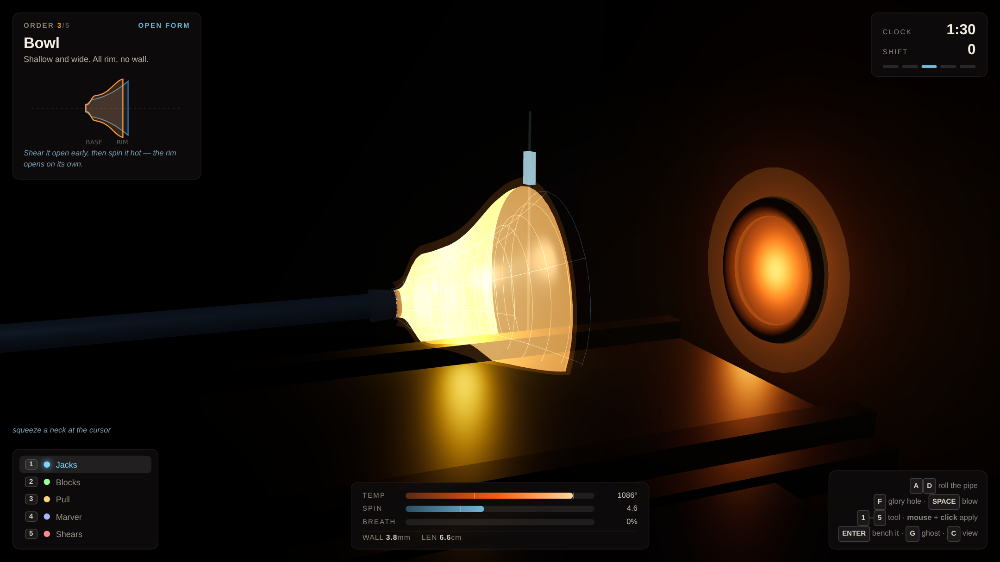

# Gather

A 3D glassblowing game where the material is the opponent. You never place a
vertex or pick a shape from a menu — you hold a blob of 1100 °C glass on the end
of a pipe and it is sagging, cooling and thinning the whole time you work it.
Every shape you make is the residue of how well you managed heat, rotation and
pressure in the ninety seconds you had.

| Working the bubble | Necking a bud vase |
|:---:|:---:|
|  |  |

| Back in the glory hole | Opened and flared on spin alone |
|:---:|:---:|
|  |  |

## Run it

```bash
cd showcase/apps/gather
python -m http.server 8080
# open http://localhost:8080
```

No build step, no dependencies to install. Three.js r163 is vendored in
`vendor/`, all audio is synthesised at runtime, and the app ships zero asset
files. ES modules need a real HTTP server — `file://` will not work.

## Controls

| Input | Action |
|---|---|
| `A` / `D` held | Roll the pipe. Friction bleeds the spin off, so you have to keep rolling |
| `F` held | Push into the glory hole — the longer you hold, the deeper it goes and the more of the piece reheats |
| `SPACE` held | Build breath pressure and let it into the piece |
| `1`–`5` | Jacks · Blocks · Pull · Marver · Shears |
| Mouse | Slide the tool cursor along the piece |
| Left mouse | Apply the selected tool at the cursor |
| `ENTER` | Bench the piece and have it scored |
| `G` · `C` · `M` | Target ghost · camera · mute |

## How the simulation works

The piece is a surface of revolution sampled as 64 rings along the pipe axis.
Each ring carries a radius, a conserved wall volume, a temperature and a 2D
centre offset. There is no per-shape scripting anywhere — every behaviour below
is a term in one update, and the interesting play comes from how they interact.

**Heat scales everything.** `softness = clamp((T − 620)/(1080 − 620), 0, 1)^1.5`
multiplies every deformation term, so there are no modes: hot glass moves, warm
glass moves slowly, cold glass does not move and **cracks if you touch it with a
tool**. Rings cool independently and thin wide rings shed heat much faster than a
thick gather does, so a piece you have already blown out is on a far shorter
clock than a fresh one.

**Rotation is not decoration.** Gravity is applied to each ring's centre in the
piece's *own rotating frame*, and it is never cancelled by a rule — it is
cancelled by integration. Spin fast and the gravity vector sweeps a circle and
sums to almost nothing; stop and it accumulates in one direction and the piece
visibly droops off its axis. Sag is scaled by distance from the pipe, so the tip
goes first. Surface tension only pulls the piece back toward true while it is
hot, which means a droop you earn in the fire is still there once it sets.

**Pressure finds the weakness.** Blowing adds `dr ∝ P · softness · 1/thickness`,
so the bubble does not grow where you point it — it grows wherever the glass is
hottest and thinnest, which is somewhere you created thirty seconds ago. Wall
thickness is derived from conserved shell volume (`t = V / 2πr·dz`), so expanding
thins and thinning accelerates expansion. Run away with it and the piece bursts.
The way to steer a bubble is to chill the part you want to keep.

**The shears are one-way.** Cutting the tip off makes an open form. Air no longer
pressurises, so blowing stops working entirely and the only shaping force left is
centrifugal: spin an open rim hot and fast and it flares outward on its own.
Bowls are made of spin, bottles are made of breath, and deciding when — or
whether — to open the piece is the real choice in every order after the second.

### Failure states, all emergent

| | |
|---|---|
| **Blowout** | wall thinner than 0.75 mm while hot and pressurised |
| **Crack** | any tool applied below roughly 620 °C |
| **Drop** | sag past 2.4 cm — the gather leaves the pipe |
| **Out of time** | the clock runs out with the piece nowhere near the order |

## The shift

Five orders, one gather each, 95–125 seconds on the clock:

| # | Piece | What it teaches |
|---|---|---|
| 1 | Tumbler | roll, blow, shear, keep it centred |
| 2 | Bud vase | jacks and pull; reheat one region and not another |
| 3 | Bowl | shear early, then flare on spin alone |
| 4 | Decanter | never open it; steer pressure by chilling |
| 5 | Amphora | every tool, in the right order, on one gather |

Each piece is resampled to 32 points and compared against the order:
**profile** (55%), **symmetry** (15%, from accumulated sag), **wall** (15%, area
weighted so a deliberately thick neck does not drag down the body) and **rim &
base** (15%). `≥90 Master · ≥75 Journeyman · ≥60 Apprentice`, and below that it
sells as a second. The live silhouette on the order card draws what you have
made in orange over what was ordered in blue, so you can steer against it while
the glass is still moving.

## Rendering notes

The glass mesh is coloured per vertex from a blackbody-ish ramp and drawn three
times: a translucent Phong shell for the cold look, an additive pass for the
glow, and a slightly inflated additive backside shell that stands in for bloom
without a post-processing chain. A point light at the piece takes its intensity
from the piece's own mean temperature, so as the glass cools **the room gets
darker** — which is both true and a heat gauge you never have to look at.

## Files

```
gather/
├── index.html          HUD and overlay markup
├── style.css
├── src/
│   ├── main.js         loop, shift state machine, presentation
│   ├── glass.js        the simulation — no Three.js dependency
│   ├── mesh.js         profile → geometry, heat colours, target cage
│   ├── scene.js        the hotshop, lights, cameras
│   ├── orders.js       target silhouettes and scoring
│   ├── hud.js          gauges, silhouette drawing, panels
│   ├── input.js        keys, mouse, tool table
│   └── audio.js        synthesised furnace and bench sounds
└── vendor/three.module.js
```

`glass.js` imports nothing, so the whole simulation can be run headless in Node
for balance work:

```js
import { Glass } from './src/glass.js';
const g = new Glass();
for (let i = 0; i < 120; i++) g.update(1/60, { rollRight: true, blow: true }, 21);
console.log(g.L, g.meanWall(), g.maxSag());
```
