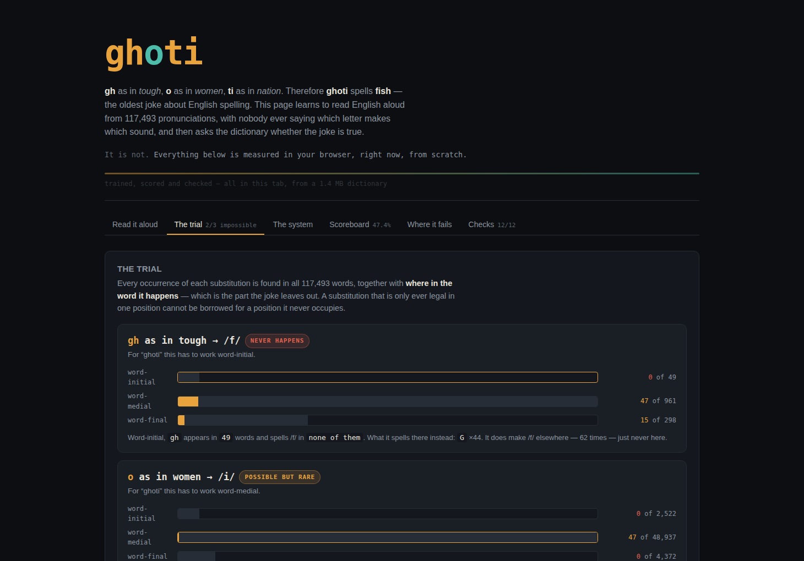
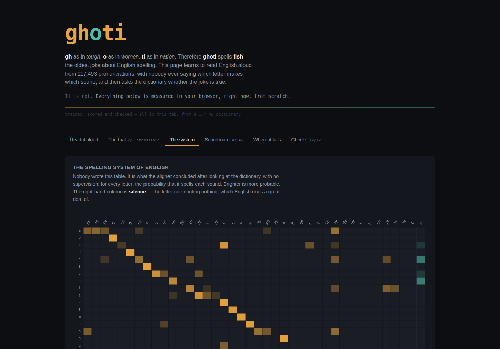
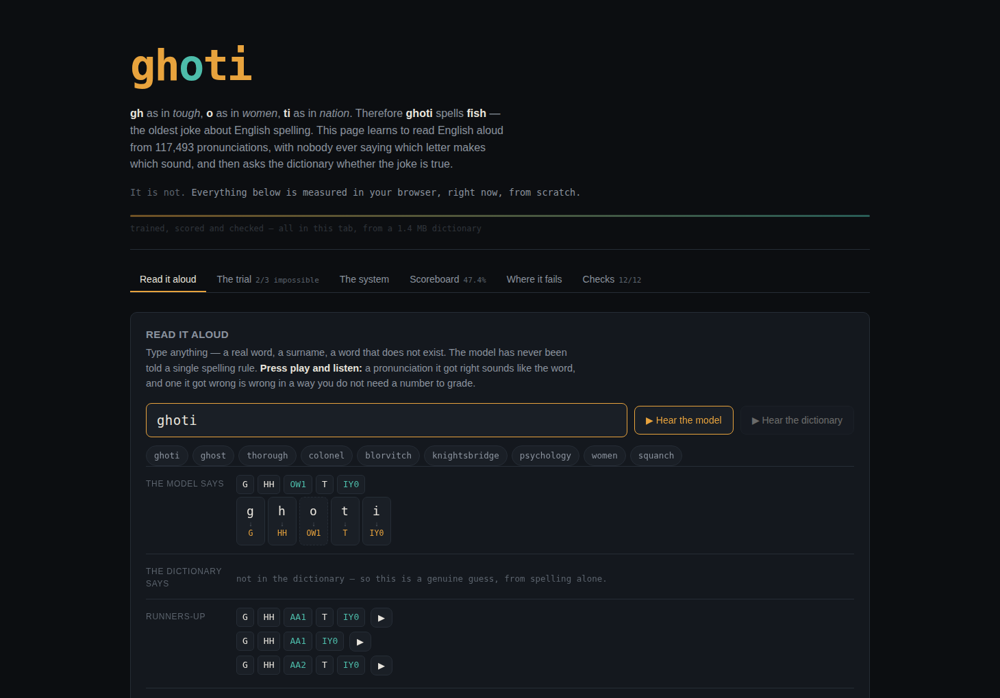
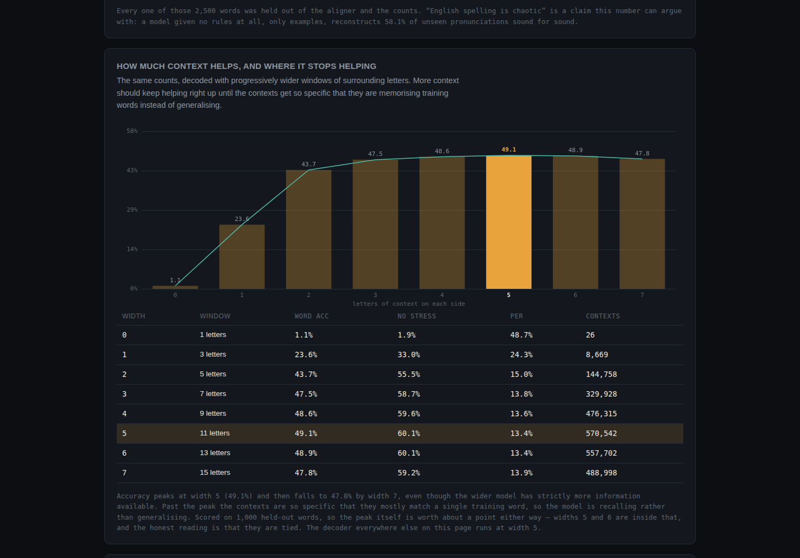
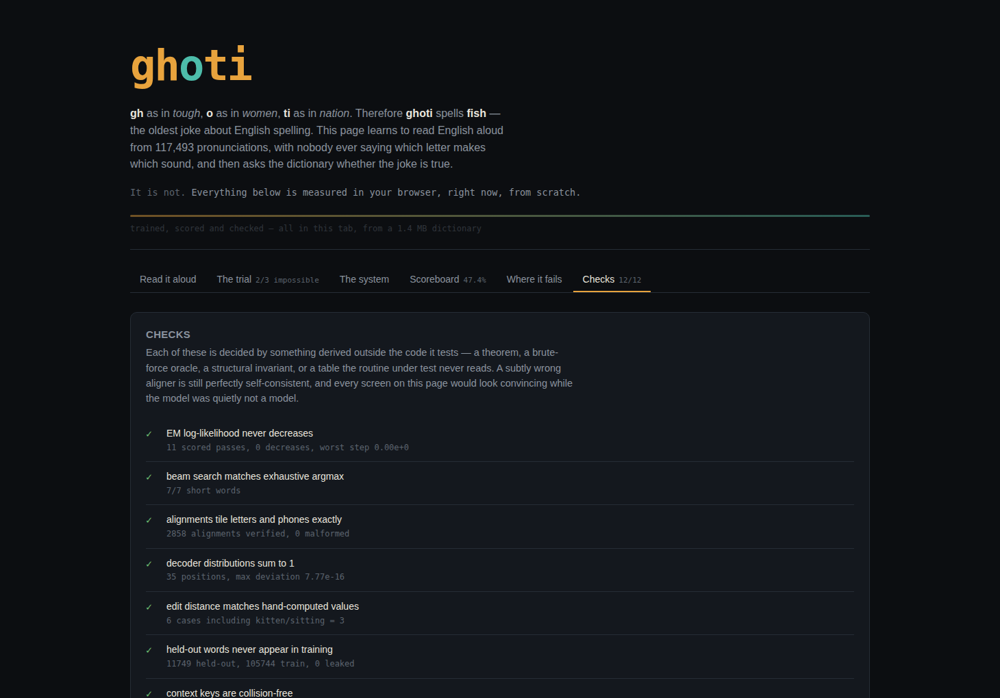

# ghoti

**gh** as in *tough*, **o** as in *women*, **ti** as in *nation* — therefore **ghoti** spells
**fish**. It is the oldest joke about English spelling, and it is wrong. This page learns to
read English aloud from 117,493 pronunciations, with nobody ever saying which letter makes
which sound, and then asks the dictionary whether the joke holds up.

It does not, and the refutation is not an argument — it is a count.

| The trial | The spelling system it discovered |
|:---:|:---:|
|  |  |

| Reading a word it has never seen | Where the context stops helping |
|:---:|:---:|
|  |  |

## Run it

```bash
cd showcase/apps/ghoti
python -m http.server 8080
# open http://localhost:8080
```

No build step, no backend, no network, no CDN. Training runs in a Web Worker and the whole
pipeline — align, count, prosecute, score, sweep, self-test — finishes in about 30 seconds
in the tab. The page answers typed words after roughly twelve.

## The problem

The dictionary says

```
knight  N AY1 T
```

and never says that `kn` makes `N`, `igh` makes `AY1`, and `t` makes `T`. Six letters, three
sounds, no correspondence given anywhere in the file. Recovering that correspondence is an
unsupervised learning problem, and it is the first half of this project.

## How it works

**1. Alignment by EM.** A many-to-many monotone lattice over chunk pairs — a letter may be
silent, spell one sound, or spell two (`x → K S`); two letters may spell one (`sh`, `kn`,
`gh`). Forward–backward over every legal alignment of every word, fractional counts,
renormalise, repeat. Uniform start; the model is told nothing about English.

**2. A context model.** Every chunk decision in every aligned word is counted, keyed by a
window of surrounding letters at every width from 0 to 7. Backoff is recursive Dirichlet
interpolation, so a wide context is trusted in proportion to how often it was actually seen.

**3. A beam decoder.** For an unseen word, beam search over positions.

**4. A formant synthesiser.** Source-filter, written sample by sample, so the payoff is
*audible*: a pronunciation the model got right sounds like the word, and one it got wrong is
wrong in a way nobody needs a number to grade.

## What it found

Held out from every training pass: **47.4%** of unseen words come back entirely correct,
stress marks included, **58.1%** correct ignoring stress, at a **13.7%** phoneme error rate
over 2,500 words.

### The joke dies on its own data

Position is the thing the joke leaves out. Each substitution is real; each is real only
where `ghoti` cannot use it.

| substitution | needs to be | happens there | what happens there instead |
|---|---|---|---|
| `gh` → /f/ | word-initial | **0 of 49** | `G` ×44 (*ghost*, *ghoul*, *ghetto*) |
| `o` → /ɪ/ | word-medial | 47 of 48,937 — **0.096%** | `AH`, `OW`, `AA`, `AO` |
| `ti` → /ʃ/ | word-final | **0 of 276** | `T IY` ×229 (*yeti*, *multi*) |

`gh` does make /f/ — 62 times, in *tough*, *laugh*, *enough*, *cough* — and never once at the
start of a word. `ti` does make /ʃ/ — 2,162 times — and never once at the end of one. Two of
the three substitutions are not rare in the position the joke needs; they are **absent**. The
third survives at one word in a thousand.

Handed `ghoti`, the trained model says **G HH OW1 T IY0**. You can listen to it.

### A bonus casualty

The model gets **women** wrong — it reads it as `W OW1 M AH0 N`. Having seen 105,744 words it
finds `o` → /ɪ/ so implausible that it will not produce it. The single word the joke leans on
for that substitution is the exception that the model has correctly learned to disbelieve.

### Claims that did not survive contact with the measurement

- **"More context keeps helping."** It does not. Accuracy climbs to width 5 and then falls —
  49.7% at width 5 against 48.9% at width 7, with the wider model holding strictly more
  information. Past the peak the contexts are so specific they match a single training word,
  so the model recalls instead of generalising. At the sweep's sample size widths 5 and 6 are
  tied and the page says so rather than picking a winner it cannot support.
- **"You need all the data to learn the correspondence."** You need almost none of it.
  8,000 words and 8 EM passes reach 48.4% held-out accuracy; 40,000 words and 20 passes reach
  48.6%. The letter–sound correspondence of English is essentially learned from the first few
  thousand words, and the remaining hundred thousand buy a fifth of a point.
- **"The hard words are English's famous irregulars."** They are not. The worst held-out
  words are *dussault*, *zizzo*, *sciara*, *davault*, *aquirre*, *guiffre*, *apercu*,
  *petit* — surnames and loanwords, carrying the spelling conventions of languages this model
  has never read. *Colonel*, the usual poster child, comes out right.
- **"English spelling is chaotic."** A model given no rules at all, only examples,
  reconstructs 58.1% of unseen pronunciations sound for sound. That is not chaos; that is a
  system with exceptions.

### Two things that had to be measured to get right

The aligner was wrong twice before it was right, and both fixes are in the code with the
reasons attached:

- **Allowing two letters to spell two sounds destroys everything.** With that move available,
  EM absorbs whole syllables into single chunks (`en:AH0+N`, `os:OW1+S`) and every downstream
  count is built on nonsense. Removing it is what recovers `ti:SH` in *nation* and `gh:F` in
  *tough*. Three priors were tried against it first and all three washed out — the move set,
  not the prior, was the problem.
- **Neither model was normalised over segmentations.** Without a learned distribution over
  chunk length, a coarser chunking wins simply by having fewer factors in the product. That
  bias produced alignments like `to:T` and cost 19 points of accuracy. Adding the term took
  held-out word accuracy from 28.3% to 46.7% and fixed the aligner at the same time. EM
  learns that 84.8% of chunks are one letter and 15.2% are two.

## Checks

Twelve self-tests run in the page, each decided by something derived outside the code it
tests. A subtly wrong aligner is still perfectly self-consistent, and every screen here would
look convincing while the model was quietly not a model.

- **EM's log-likelihood never decreases.** A theorem, so a dip is a bug rather than bad luck.
  The first pass is excluded and the page says why: its incoming parameters are the
  unnormalised prior, so its `Z` is not a likelihood.
- **Beam search matches exhaustive argmax** on short words, where every chunking can be
  enumerated by brute force.
- **Alignments tile the letters and reproduce the phones exactly** — verified structurally
  across 2,858 alignments, because every count downstream assumes it.
- **Decoder distributions sum to 1.** If they do not, hypotheses of different lengths are not
  comparable and the whole ranking is meaningless.
- **Held-out words never appear in training** — checked by set intersection, not by trust.
- **Synthesised vowels carry their formants**, measured by a DFT that shares no code with the
  synthesiser. This one *failed first* and the failure was in the test: 25 Hz resolution over
  a window still inside the formant glide. The synth was right.
- Plus edit distance against hand-computed values, context-key collisions, phone coverage,
  the forensic span logic on a case fixed by hand, and the verdicts against their own tallies.



## Data

The [CMU Pronouncing Dictionary](http://www.speech.cs.cmu.edu/cgi-bin/cmudict), BSD-2-Clause,
redistributable with attribution; the licence travels with the data in `data/`. 135,166 raw
entries reduce to 117,493 after dropping alternate pronunciations and any headword that is
not pure `[a-z]`. Packed by `tools/build-dict.py` into a front-coded binary — the word list is
sorted, so successive headwords share long prefixes — giving **1.37 MB** for 117,493 words and
their phones, loaded in one fetch.

To rebuild it: `pip install cmudict && python3 tools/build-dict.py`.

`ghoti` itself is not in the dictionary, so every pronunciation of it on the page is a genuine
guess from spelling alone.

## Files

```
index.html          shell and copy
main.js             views, tabs, playback
style.css
data/dict.bin       117,493 words, front-coded    (1.37 MB)
js/dict.js          binary decoder
js/align.js         EM many-to-many aligner
js/model.js         context counts + beam decoder
js/evaluate.js      held-out scoring, edit distance
js/forensics.js     the trial
js/synth.js         formant speech synthesis
js/checks.js        self-tests
js/charts.js        canvas figures
js/worker.js        the pipeline, off the main thread
tools/build-dict.py corpus packer (not needed at runtime)
```

## Notes

Peak memory is roughly 550 MB while the context sweep runs, since levels 6 and 7 exist only
to find where extra context starts to cost accuracy. They are dropped as soon as the sweep
finishes and the page settles around 350 MB.

The synthesiser is not trying to sound good. It is trying to sound *unambiguous*, so that a
correct pronunciation and an incorrect one are told apart by ear rather than by score.
