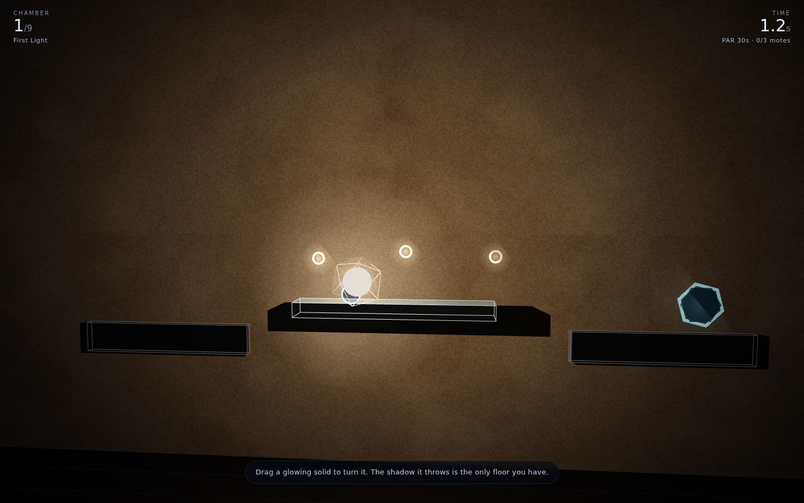
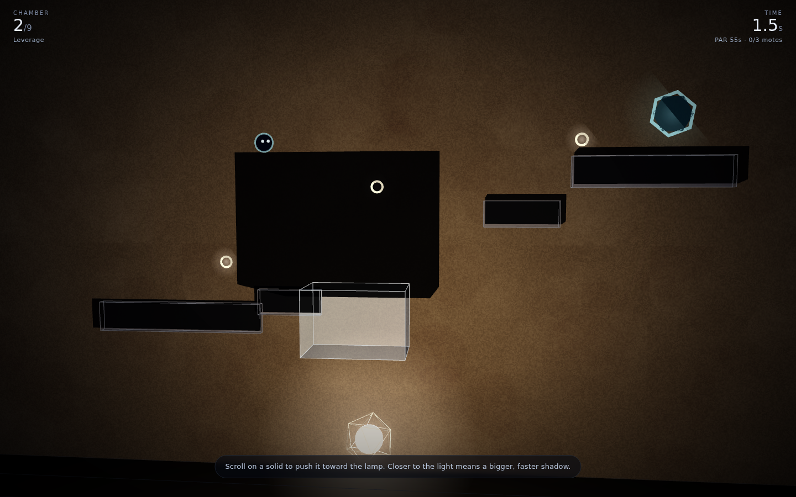
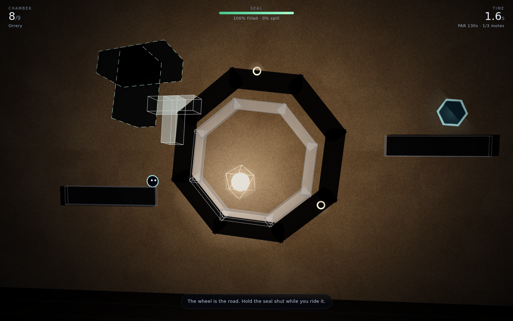
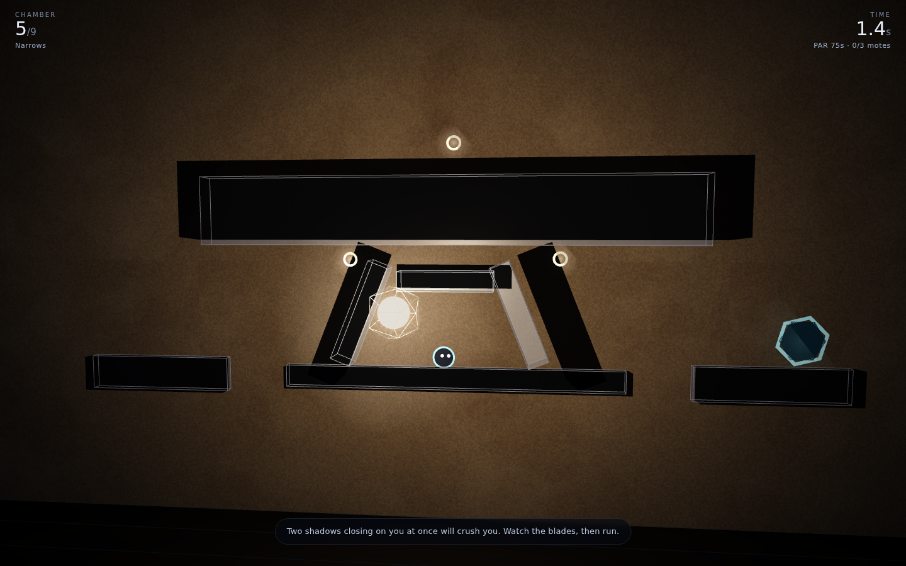

# Gnomon

**A 3D shadow platformer.** You are a flat thing that lives on a lit wall and is
afraid of the light. The platforms are not solid — they are the *shadows* of glass
solids hanging in the room in front of you, thrown by a single lamp. Turn a solid
and the ledge you are standing on tips. Push it toward the lamp and the ledge
doubles in size and runs away from you. Nothing pauses while you work.

| Chamber 1 — one slab, turned flat | Chamber 2 — depth is a gear ratio |
|:---:|:---:|
|  |  |

| Chamber 8 — the wheel, and a seal at 100% | Chamber 5 — blades closing on the corridor |
|:---:|:---:|
|  |  |

## The one idea

The wall is the plane `z = 0`. The lamp is a point at **L**. Every solid is a set of
convex parts, and a part with vertices `v` casts the convex hull of

```
p(v) = L + (v − L) · Lz / (Lz − vz)
```

That polygon is not a decoration drawn near the physics — **it is the physics**.
The same hull is triangulated into the shadow mesh you see and handed to the
collision solver you stand on, every frame, so the two can never disagree.

Three things fall out of that, and the nine chambers are built on them:

- **Leverage.** A solid near the lamp casts an enormous, fast shadow; the same solid
  near the wall casts a small, sluggish one. Depth is a gear ratio.
- **Merging.** Two solids whose shadows overlap are one continuous platform. You
  build bridges by overlapping, not by touching.
- **Inversion.** Move the lamp and *every* platform moves at once — each by
  `(lamp move) × (k − 1)`, so the ledges barely notice and the deep slabs swing
  twice as far as the lamp does. Chamber 7 gives you nothing but the lamp.

## Playing it

| | |
|---|---|
| `A` `D` or `←` `→` | run |
| `Space` / `W` / `↑` | jump (hold for height) |
| drag a glowing solid | turn it — horizontal drag yaws, vertical drag pitches |
| `Shift`+drag, or right-drag | slide it parallel to the wall |
| wheel over a solid | push it toward or away from the lamp |
| drag the lamp | where the chamber lets you |
| `Q` `E` | nudge the last solid you touched |
| `R` / `Esc` / `M` | restart · pause · mute |

Fall off the bottom and you respawn where you were last safely standing. Get caught
between two shadows closing from opposite sides and you are crushed — same result.
Motes are optional; the door is not. Some doors are held by a **seal**: an outline
on the wall that has to be filled by a shadow to at least 92 %, with no more than
12 % spilling outside it. That is the one puzzle whose answer is a shape rather than
a path, and the solid that makes the shape rarely looks like the shape.

## The nine chambers

| # | Name | What it is about |
|---|------|------------------|
| 1 | First Light | one slab; turn it flat and cross |
| 2 | Leverage | push a cube toward the lamp and ride its shadow up |
| 3 | Confluence | two slabs, overlapped into one bridge |
| 4 | The Vane | a motorised sweep that carries you around with it |
| 5 | Narrows | timing a corridor between two blades, without being crushed |
| 6 | Keyhole | the first seal |
| 7 | Lamplight | nothing turns; only the lamp moves |
| 8 | Orrery | ride the wheel, with a seal held open |
| 9 | Gnomon | lamp on a rail, a wheel, and a seal |

Par times, best times and motes persist in `localStorage` under `gnomon.v1`.

## Running it

```bash
cd showcase/apps/gnomon
python3 -m http.server 8080
# http://localhost:8080
```

No build step and no network: Three.js r163 is vendored in `vendor/`, the wall
texture is generated into a canvas at load, and every sound — room tone, the drone
that tracks how fast you are turning something, footsteps, the seal chord — is
synthesised in the Web Audio graph. There are no asset files at all.

## Checking it

The three scripts under `scripts/` are how the chambers were verified; each needs a
server on port 8099 (`python3 -m http.server 8099`) and drives the page through
Playwright.

```bash
node scripts/probe.mjs              # every chamber: where its shadows actually land
node scripts/probe.mjs 5 --shot x.png
node scripts/play.mjs 0 --set "2:yaw=0" --run 10   # bot-play a chamber to its door
node scripts/shots.mjs              # regenerate screenshots/
```

`probe` exists because a chamber is authored as 3D positions but is *played* in
shadow space, and eyeballing the difference is hopeless — it prints the wall-space
bounding box of every shadow so a ledge that lands two metres from where it was
meant to is obvious. `play` runs a dumb bot (hold a direction, jump on a timer)
and reports whether the door was actually reached; it is what caught a jump-press
that was never consumed, and a first step authored above jump height.

## Layout

```
gnomon/
├── index.html          overlays, HUD
├── style.css
├── src/
│   ├── geom.js         convex hull, circle-vs-convex-polygon MTV, point-in-poly
│   ├── solids.js       convex part builders (box, wedge, prism, L, T, cross, ring)
│   ├── caster.js       a solid: transform, meshes, and the projection to polygons
│   ├── player.js       platformer physics, analytic platform carry, crush test
│   ├── levels.js       the nine chambers, authored in shadow space
│   ├── scene.js        renderer, wall, lamp, the dynamic shadow mesh
│   ├── audio.js        every sound, synthesised
│   └── main.js         loop, manipulation, seals, progression
├── scripts/            probe / play / shots (Playwright, dev only)
└── vendor/three.module.js
```

Design notes and the reasoning behind the mechanic are in [PRD.md](PRD.md).
