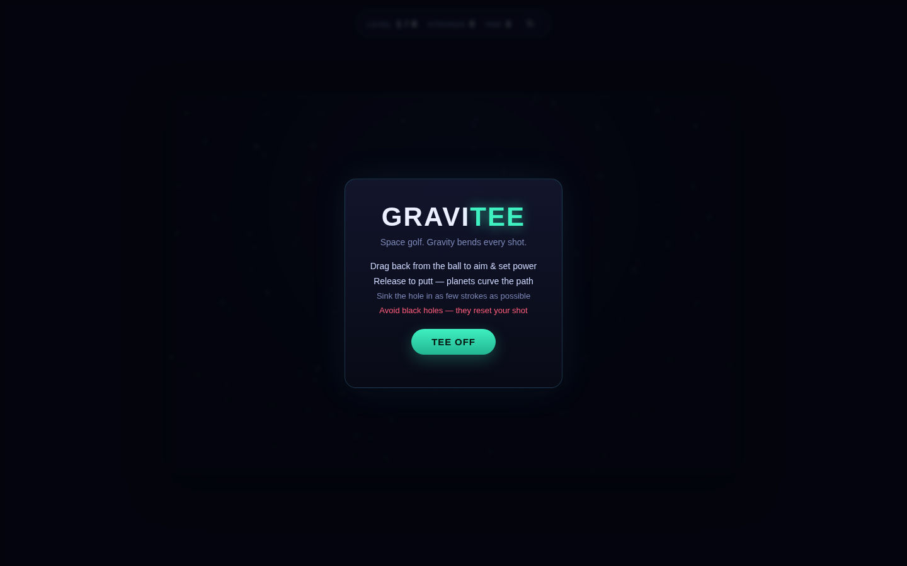
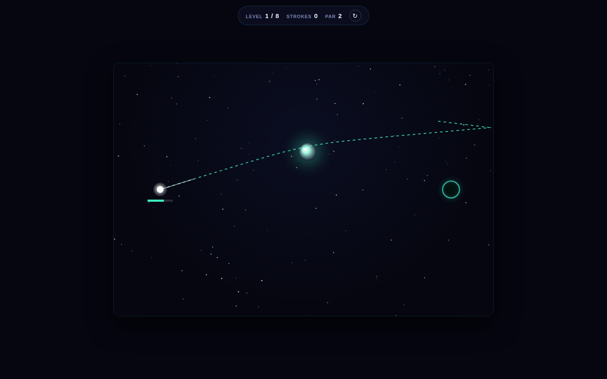

# Gravitee

Space golf, but the course has gravity. Drag back from the ball to aim and
set power — release to putt. There's no straight line to the hole: planets
and stars bend the ball's path in flight, so a good shot uses that curve on
purpose, slingshotting around a well to reach a hole hidden behind a wall.
Touch a black hole and you're yanked back to the start, stroke penalty and
all.

| Title screen | Mid-aim (curved trajectory preview) |
|:---:|:---:|
|  |  |

## How to play

| Action | Mouse | Touch |
|--------|-------|-------|
| Aim | click + drag back from the ball | touch + drag back from the ball |
| Set power | drag distance (capped, shown as a power meter) | same |
| Launch | release | release |
| Restart level | `R` / restart button | restart button |
| Next level | `Enter` / button (after sinking) | button |

- The dashed line while aiming is a **live simulated preview** — it's run
  through the exact same gravity integrator as the real shot, so what you
  see is what you get.
- Each launch costs one stroke. Sink the hole in as few strokes as possible
  against each level's par.
- Gravity wells always attract; color hints at strength (soft green =
  gentle, blue = medium, orange = strong).
- Black holes pull hard and are often the fastest route to a good angle —
  but cross the dashed event horizon and the ball resets to the last tee
  position with a stroke penalty.
- 8 hand-built levels, increasing in complexity: straight shots, undershoot
  puzzles, walls to curve around, twin-well corridors, and black-hole
  gauntlets.
- Best strokes-per-level and best total round are saved locally
  (`localStorage`), shown on the title screen once you've played a round.

## Running locally

```bash
cd showcase/apps/gravitee
python -m http.server 8080
# open http://localhost:8080
```

ES modules require an HTTP server — `file://` URLs will not work.

## Tech

- Vanilla JS (ES modules), Canvas 2D, CSS3. No frameworks, no build step.
- `physics.js` — a small fixed-timestep gravity integrator (semi-implicit
  Euler with substeps), shared identically between live ball flight and the
  aim-time trajectory preview so the two never diverge. Ball flight runs on
  its own fixed-dt accumulator decoupled from the render frame rate, which
  matters here: gravity slingshots near a well are chaotically sensitive to
  integration timing, so frame-rate-variable stepping could make the same
  shot land differently from what was previewed.
- `levels.js` — level data (wells, black holes, walls, hole, par).
- `render.js` — starfield, glowing wells/black hole/hole, ball trail,
  trajectory preview, particles.
- `input.js` — unified mouse/touch drag via Pointer Events.
- `main.js` — game state machine (aiming → flying → sunk/black-hole →
  level-complete → run-complete) and the render/update loop.

See [PRD.md](./PRD.md) for the full product spec.
