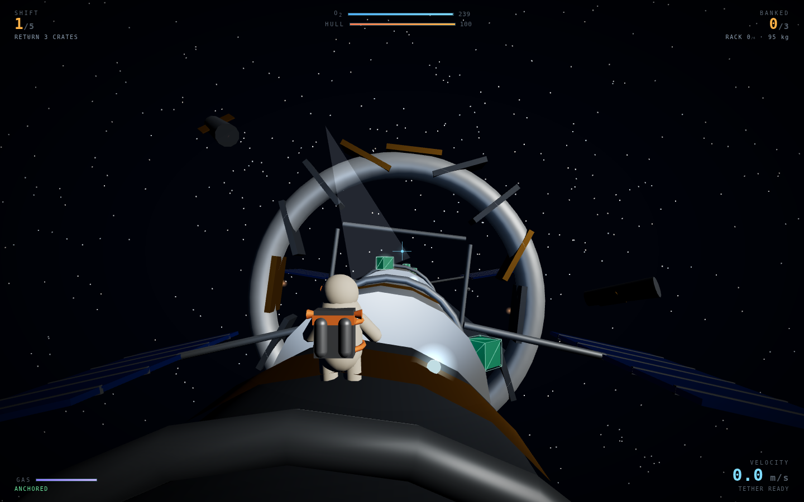
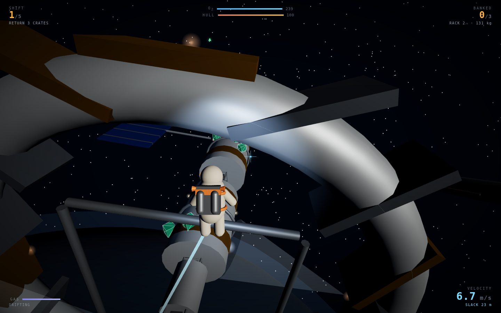
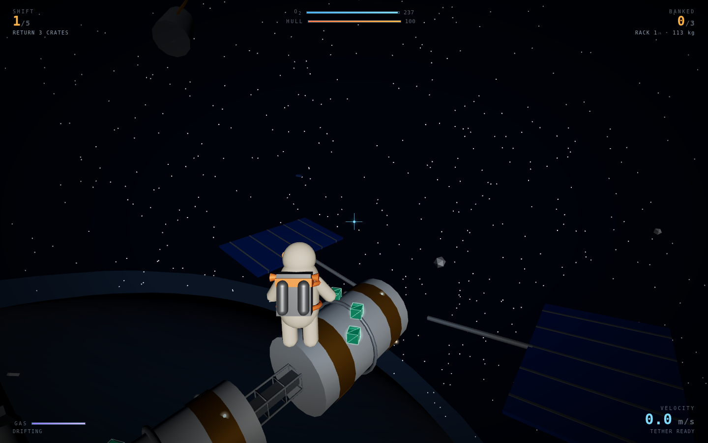
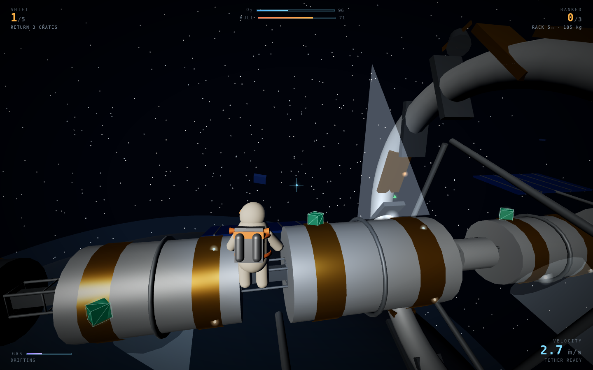

# Kessler

A zero-thrust EVA salvage game in the browser. You have no flight controls. You
move by kicking off hull plate, swinging on a magnetic tether, and throwing your
own cargo away — and the cargo you throw is the cargo you were sent to bring home.

| The dive | Tether swing |
|:---:|:---:|
|  |  |

| The rotating ring | Hauling a full rack |
|:---:|:---:|
|  |  |

## What it is

Every other 3D game hands you a thrust vector and lets you point it. Kessler takes
it away. Holding a movement key vents a puff from a reserve that does **not**
refill in the field, so every metre you cross was bought with an impulse you chose
earlier. The game is about paying for those impulses.

Five shifts on the wreck of Kessler Station. Fill the crate quota, get back to the
airlock before your air does.

## Running it

```bash
cd showcase/apps/kessler
python3 -m http.server 8080
# open http://localhost:8080
```

No build step, no network access, no dependencies to install — Three.js is vendored
in `vendor/`. ES modules need an HTTP server; `file://` will not work.

Desktop only: it needs a mouse and a keyboard.

## Controls

| Key | Does |
|---|---|
| `MOUSE` | Aim. The camera **is** your thrust vector. |
| `SPACE` (hold) | While anchored, charge a kick; release to launch. Charge time sets the impulse. |
| `E` | Grab / let go of hull within reach. |
| `LMB` | Fire the magnetic tether at the crosshair (again to release). |
| `RMB` (hold) | Reel the tether in. |
| `Q` | Throw a crate — momentum bought with cargo. |
| `WASD` | RCS puffs. Costs gas. Deliberately feeble. |
| `SHIFT` | Burn gas to match velocity (stop). |
| `ESC` | Pause. `M` mutes. |

## The four ways to move

| Move | Cost | Δv |
|---|---|---|
| Kick off | free | up to `760 / mass` — about 8 m/s empty, 5.2 m/s with a full rack |
| Tether reel | free | continuous pull, capped at 5.4 m/s closure so a reeled arrival always survives |
| Throw a crate | −1 crate | `18 × 11 / mass` — roughly 2 m/s |
| RCS puff / match | gas, no field refill | 3.4 m/s² while held |

Every impulse is divided by total mass, and total mass is suit (95 kg) plus cargo
(18 kg a crate). **A full rack turns you into a barge.** The last crate is always
the hardest one to carry home.

## Catching

Arrival speed is graded, and it is the main skill check:

- **under 3.5 m/s** — clean catch, anchored, no damage.
- **3.5–6.5 m/s** — hard catch, anchored, hull damage scaling with the overspeed.
- **over 6.5 m/s** — you fail to hold on, bounce at 35% restitution, and take real
  damage. A bounce in the wrong direction is usually the run.

So the HUD reports **closure rate to whatever is under the crosshair**, not just
speed — including the surface velocity of the rotating ring, which is the number
that actually matters when you approach it.

## The station

Procedurally generated per shift from a fixed per-shift seed: a spine of
pressurised modules and trusses, solar wings, drifting wrecks, and one
**counter-rotating ring** at 6–14 °/s. Ring surfaces carry real surface velocity —
anchor there and you rotate with it, kick off it and you inherit its tangential
speed, and crates mounted on it ride round out of reach until it comes back.

Hazards: tumbling debris on straight-line paths, venting hull breaches that push
anything inside their cone (free delta-v if you enter one deliberately), and the
void past 260 m where O2 burn triples.

Docking at the airlock banks your crates, refills O2 and gas, and patches 35 points
of hull. Two short trips or one long one is a real decision, because the trip home
costs air too.

## Shifts

| Shift | Quota | O2 | Debris | Ring |
|---|---|---|---|---|
| 1 | 3 crates | 240 s | 6 | 6 °/s |
| 2 | 5 | 235 s | 9 | 8 °/s |
| 3 | 7 | 230 s | 13 | 10 °/s |
| 4 | 9 | 225 s | 17 | 12 °/s |
| 5 | 12 | 220 s | 22 | 14 °/s |

Score is banked crates, air left and hull condition, summed across shifts; the best
run is kept in `localStorage`.

## How it is built

| File | Does |
|---|---|
| `src/main.js` | Game states, the loop, camera, docking, events → audio/HUD |
| `src/player.js` | The four movement verbs, anchoring, catch grading, tether constraint |
| `src/collide.js` | Sphere-vs-box and sphere-vs-cylinder closest-point queries |
| `src/world.js` | Station generation, colliders, crates, breach vents, ring rotation |
| `src/debris.js` | The tumbling debris field and its momentum exchange |
| `src/crates.js` | Jettisoned crates — still salvage, if you can catch them |
| `src/scene.js` | Renderer, lighting, starfield, planet |
| `src/hud.js` | Gauges, closure readout, prograde/retro markers |
| `src/audio.js` | Everything you hear, synthesised at runtime |

Notes on the physics: the player is a 0.85 m sphere with a velocity nothing damps —
no drag, no gravity. Station colliders are boxes and cylinders queried in their own
local frame, so rotating parts work by transforming the player into ring space
rather than by moving the collider. The tether is a rope constraint applied after
integration (removing only the outward velocity component), which is what makes
swinging preserve tangential speed.

All audio is synthesised in the Web Audio graph at runtime — suit breathing that
quickens as O2 drops, the thump of a catch conducted through the suit, the tether
servo, the hiss of a gas puff. No audio files are downloaded. The whole bus runs
through a lowpass, because nothing out there travels through vacuum.

See [PRD.md](PRD.md) for the design rationale.
