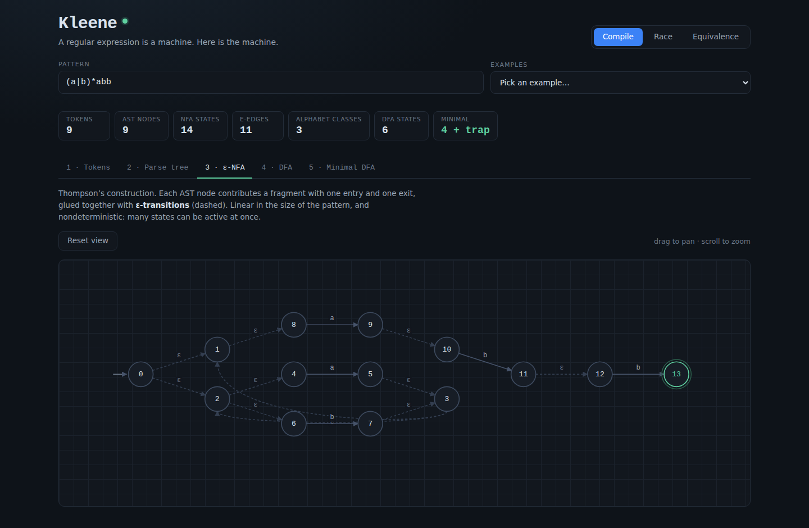
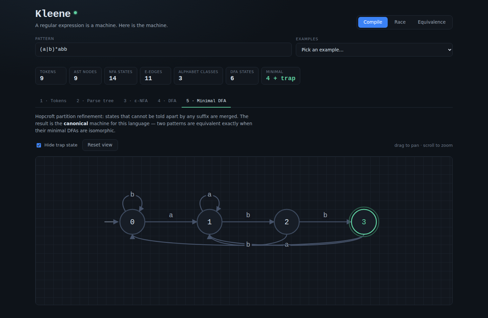
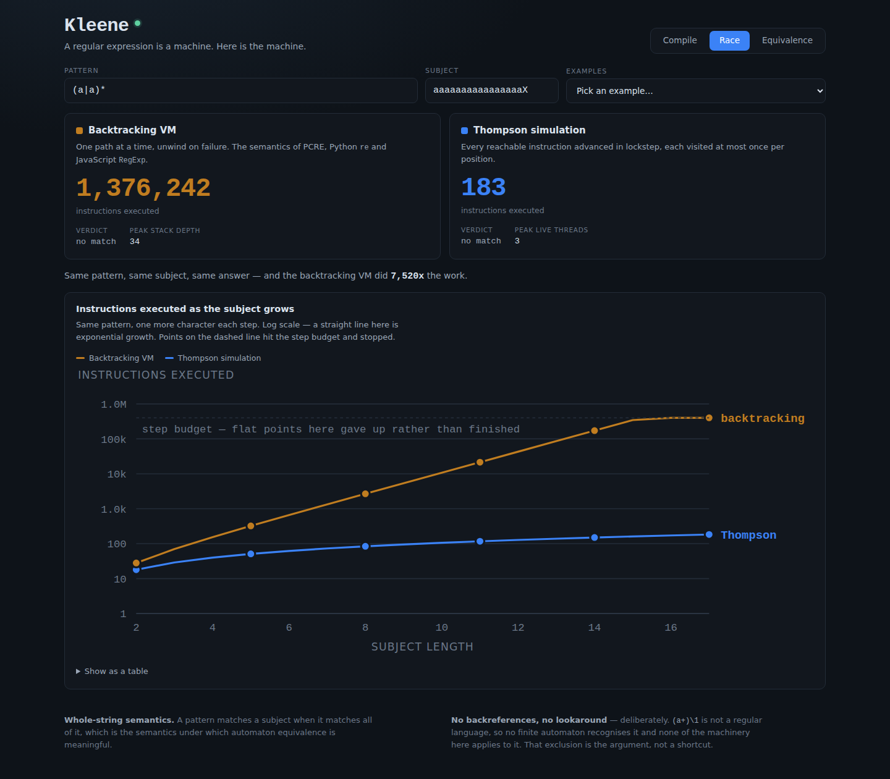
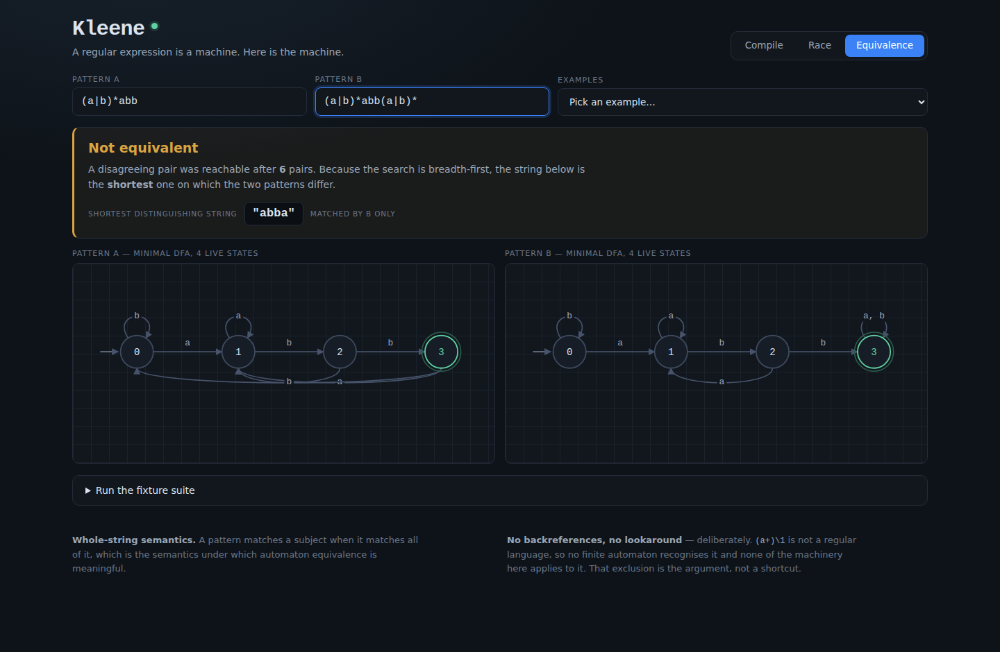
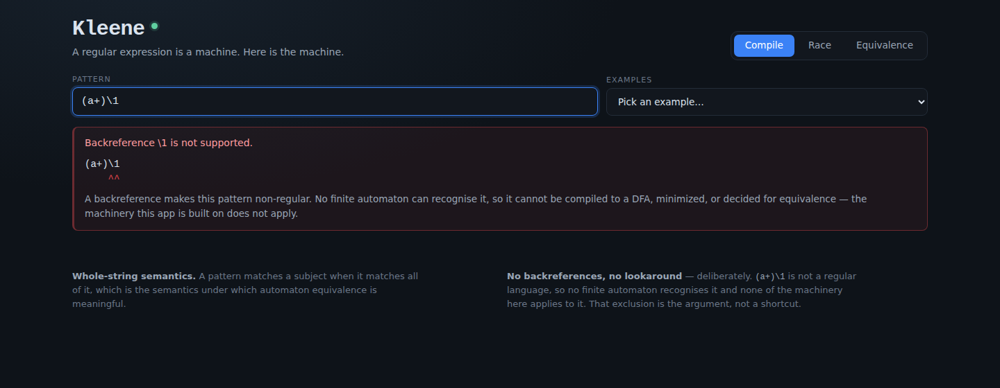

# Kleene

A regular expression is not a string-matching rule — it is a finite automaton,
and the pattern is surface syntax for a machine. Kleene builds that machine in
front of you, races the two strategies real engines use to run it, and then
answers the question no amount of testing can settle: **are these two patterns
the same language?**

| Thompson construction | Minimal DFA |
|:---:|:---:|
|  |  |

| The race — same pattern, same answer, 7,520× the work | Not equivalent, and here is the shortest string that proves it |
|:---:|:---:|
|  |  |

See [`PRD.md`](./PRD.md) for the full product spec.

## What it does

### Compile — the pipeline, stage by stage

The pattern is carried through five artifacts, all rendered and cross-linked:
**tokens** (escapes and classes resolved to character sets), the **parse tree**
(precedence made explicit), the **ε-NFA** (Thompson's construction), the **DFA**
(subset construction), and the **minimal DFA** (Hopcroft partition refinement).

Clicking a node in the parse tree lights up the NFA states that node produced.
Thompson's construction is compositional — every state belongs to exactly one
AST node — so this is the link that makes "the pattern *is* the machine"
concrete rather than a slogan.

### Race — two engines, one bytecode program

The pattern compiles to a single instruction sequence that both engines then
run, so what differs is purely the scheduling:

- **Backtracking VM** — one path at a time, unwinding on failure. An explicit
  continuation stack rather than recursion, so it can be stepped and bounded.
  This is what PCRE, Python `re` and JavaScript `RegExp` do.
- **Thompson simulation** — every reachable instruction advanced in lockstep,
  each visited at most once per input position.

On `(a|a)*` against sixteen `a`s and an `X`, the backtracker executes
**1,376,242** instructions and the Thompson simulation executes **183** — the
same verdict for 7,520× the work. Add one more `a` and one of those numbers
doubles. That is ReDoS, as a measurement rather than a folk tale.

### Equivalence — a decision procedure

Two patterns in, one verdict out. Both are minimized over a **shared** alphabet
partition, the product automaton is built over reachable state pairs, and a
breadth-first search looks for a pair that disagrees on acceptance.

- No disagreeing pair reachable → **the languages are equal**, over all
  infinitely many strings. That is a proof, not a sample.
- A disagreeing pair found → **the languages differ**, and because the search is
  breadth-first the BFS tree yields the *shortest* string on which they differ,
  printed along with which side accepts it.

`(a|b)*` and `(a*b*)*` are the same language. `(ab)*a` and `a(ba)*` are too.
`a{2,3}` and `a{2,4}` are not, and the shortest witness is `"aaaa"`.

## How to run

Static site, no build step, no dependencies:

```bash
cd showcase/apps/kleene
python -m http.server 8080
# open http://localhost:8080
```

ES modules need an HTTP server — `file://` will not work.

## The supported language, and where it stops

Supported: literals, `.`, escapes (`\d \w \s \D \W \S \n \t \r \f \v \0 \xNN
\uNNNN \u{...}` and escaped metacharacters), character classes `[a-z]` /
`[^a-z]`, concatenation, alternation `|`, `*`, `+`, `?`, `{n}` `{n,}` `{n,m}`,
lazy quantifiers, `(...)`, `(?:...)`, `(?<name>...)`, and the anchors `^` `$`.

**Backreferences and lookaround are rejected, deliberately.** `(a+)\1` is not a
regular language — no finite automaton recognises it — so it cannot be compiled
to a DFA, minimized, or decided for equivalence. Both are also exactly the
features that force an engine into the backtracking corner where the blowup
lives. The app says so, with the reason, rather than supporting them badly.



## Two semantics worth knowing about

**Matching is whole-string.** A pattern matches a subject when it matches all of
it. This is the semantics under which automaton equivalence is meaningful, and
it makes `^` and `$` redundant at the pattern boundaries — where they are
accepted as no-ops. An anchor in the *middle* of a pattern is refused: it
depends on the position it was reached at, which an automaton state does not
carry, and emitting an automaton for it would quietly accept the wrong language.

**The DFA alphabet is a partition, not Unicode.** Every character set the
pattern mentions is used to split the code-point space into the coarsest set of
disjoint classes such that each set is a union of classes. For `(a|b)*abb` that
is three classes — `a`, `b`, everything-else — so `[a-z]` draws one edge rather
than twenty-six. For equivalence the partition is built from *both* patterns
together; a class split by one machine and not the other would make the product
construction compare transitions that are not on the same input, which is
exactly how a checker returns a confident wrong answer.

One consequence worth stating: because the alphabet covers characters the
pattern never mentions, a complete DFA needs a **trap state**. It is hidden by
default, which is why `(a|b)*abb` shows the four states a textbook prints. The
stats line counts it separately.

## Key parameters

| Where | Name | Default | What it bounds |
|---|---|---|---|
| `js/dfa.js` | `MAX_DFA_STATES` | 600 | subset-construction blowup |
| `js/nfa.js` | `MAX_NFA_STATES` | 4000 | states after repeats expand |
| `js/compile.js` | `MAX_EXPANDED` | 2000 | literals after `{n,m}` expansion |
| `js/alphabet.js` | `MAX_CLASSES` | 200 | alphabet partition size |
| `main.js` | `RACE_BUDGET` | 4,000,000 | instructions before the VM gives up |
| `main.js` | `CHART_BUDGET` | 400,000 | per-point budget in the growth chart |

Every limit reports honestly in the UI when it is hit rather than truncating
silently.

## Correctness

A wrong equivalence verdict is the one failure this app cannot tolerate, so it
is checked rather than assumed:

- **In-page fixture suite** (Equivalence → *Run the fixture suite*) — 18 pattern
  pairs whose answer is known independently, plus the textbook invariant that
  `(a|b)*abb` minimizes to exactly 4 live states. 19/19 pass.
- **Witness self-check** — every "not equivalent" verdict re-runs its witness
  through both minimal DFAs independently. A bookkeeping bug in the BFS would
  surface as a failed self-check rather than as a confident wrong answer.
- **Differential testing** — during development the DFA, the backtracking VM and
  the Thompson simulation were checked against each other *and* against V8's own
  `RegExp` across 8,417 pattern/subject pairs, with zero mismatches.

## Files

```
kleene/
├── index.html
├── style.css
├── main.js              UI wiring, presets, fixture suite
└── js/
    ├── charset.js       character sets as code-point ranges
    ├── parser.js        recursive-descent parser -> tokens + AST
    ├── nfa.js           Thompson construction, anchor validation
    ├── alphabet.js      alphabet partitioning
    ├── dfa.js           subset construction + Hopcroft minimization
    ├── compile.js       the pipeline; shared-alphabet pair compilation
    ├── equiv.js         product automaton + BFS decision procedure
    ├── engine.js        bytecode, backtracking VM, Thompson simulation
    ├── layout.js        layered graph layout
    ├── render.js        SVG automata and parse trees
    └── chart.js         the growth chart
```

No dependencies, no build, no network calls, nothing vendored.
