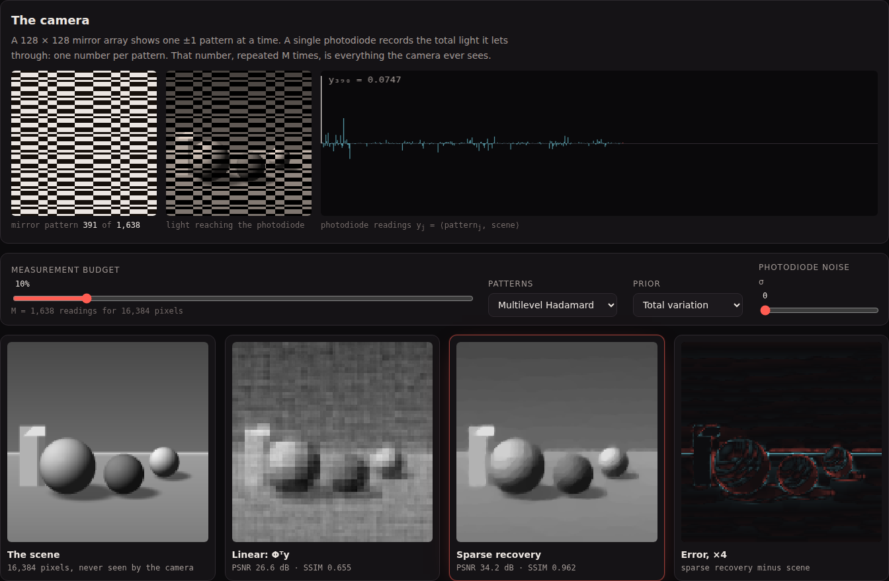
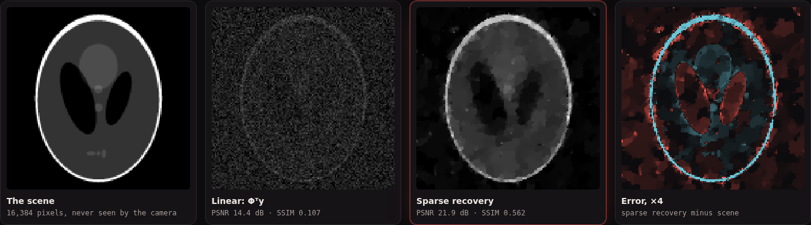
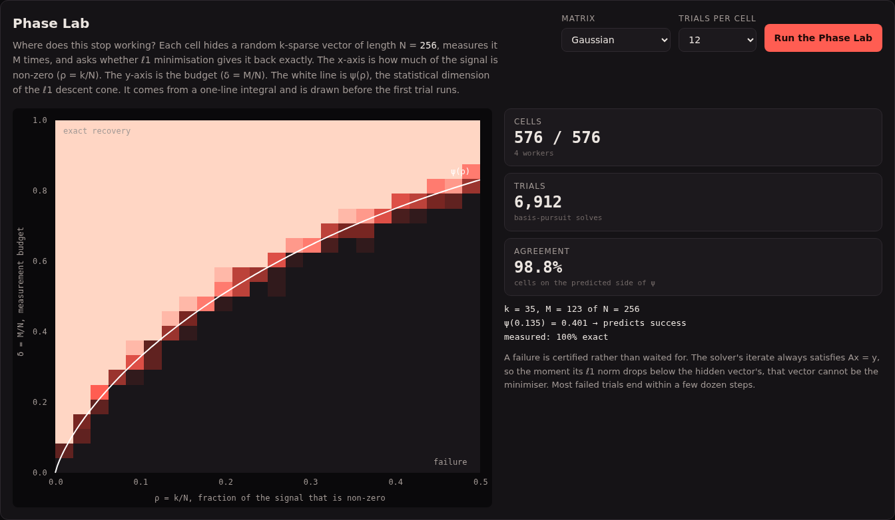
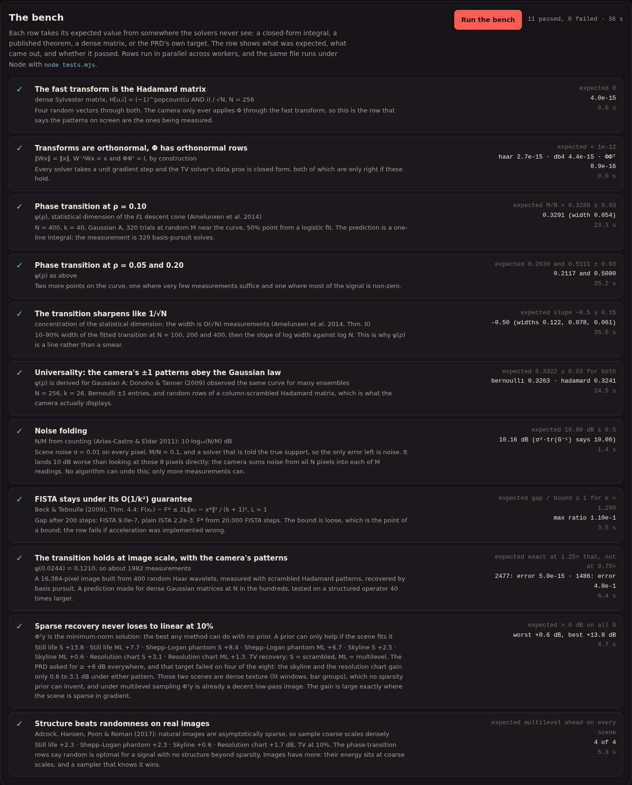

# Lacuna

A single-pixel camera in a browser tab. A simulated micromirror array flashes
±1 patterns at a scene, one photodiode records one number per pattern, and
compressed sensing rebuilds a 16,384-pixel photo from about 1,600 of those
numbers. Then a Phase Lab maps where that stops working. The line it finds
lands on a curve computed from a closed-form integral before the first trial
runs.

| The camera, at 10% of the measurements | Scrambled patterns: linear is noise, sparse is the phantom |
|:---:|:---:|
|  |  |

| Phase Lab: 6,912 basis-pursuit solves against ψ(ρ) | The bench, 11 of 11 |
|:---:|:---:|
|  |  |

See [`PRD.md`](./PRD.md) for the spec, and the end of this file for where the
build departed from it.

## Run it

```bash
cd showcase/apps/lacuna
python -m http.server 8080
# open http://localhost:8080
```

It has no build step, no dependencies and no GPU work. The same modules run in
the page, in the worker pool, and under Node:

```bash
node tests.mjs              # the whole bench, about 2 minutes on one core
node tests.mjs rho10 exact  # any of: fwht ortho rho10 rho05-20 width universal folding fista exact linear coherence
```

In the page the bench spreads across `hardwareConcurrency` workers and takes
about 35 s on 4 cores. Query flags `?sweep`, `?lab` and `?bench` start those
panes on load.

## What you can do

- **Pick a scene**: a still life, the Shepp–Logan phantom, a skyline, or a
  resolution chart. All four are procedural. You can also drop in your own
  image, which stays in the browser.
- **Set the measurement budget** from 1% to 60% of the pixel count. The
  mirror array replays the actual patterns, and the trace shows the reading
  each one produced.
- **Choose the patterns.** Multilevel Hadamard takes coarse patterns densely
  and fine ones sparsely. Scrambled Hadamard takes random rows of a
  pixel-shuffled Hadamard matrix.
- **Choose the prior**: total variation (Chambolle–Pock), or ℓ1 in Haar or
  Daubechies-4 wavelets (FISTA with continuation).
- **Add photodiode noise** and watch the regulariser trade detail for
  smoothness.
- **Sweep the budget** to see PSNR against M/N for the linear and sparse
  reconstructions side by side.
- **Run the Phase Lab**: 576 cells × 12 trials of basis pursuit on random
  sparse vectors, with a choice of Gaussian, Bernoulli or partial-Hadamard
  matrices.
- **Run the bench.**

## How it works

**The camera never stores Φ.** A dense 1,638 × 16,384 matrix would be 107 MB.
Instead Φ = S·H·P: an optional pixel permutation, the orthonormal fast
Walsh–Hadamard transform, and a row selector. Applying Φ or Φᵀ costs one
O(N log N) transform, and ΦΦᵀ = I exactly. Two things follow from that.
FISTA can take unit steps. And the TV solver's data-fidelity prox has a
closed form, x = v + τ/(1+τ)·Φᵀ(y − Φv), so Chambolle–Pock never solves a
linear system.

**Linear recovery** is Φᵀy: the minimum-norm image that reproduces the
readings. **Sparse recovery** picks, from all consistent images, the one with
the least total variation or the smallest wavelet ℓ1 norm.

**Multilevel sampling** weights each Hadamard row by (1 + r)⁻², where r is
the row's 2D sequency radius. It then draws M rows without replacement using
Efraimidis–Spirakis keys. Row 0, the all-ones pattern, is the scene's total
brightness, and scrambled mode always includes it.

**The Phase Lab** solves exact basis pursuit, min ‖x‖₁ subject to Ax = y, by
over-relaxed ADMM. The x-step is an exact projection onto Ax = y through a
Cholesky factor of AAᵀ, so every x-iterate is feasible. That gives a
certificate of failure for free. Once a feasible iterate's ℓ1 norm drops
below the hidden vector's, the hidden vector cannot be the minimiser, and the
trial stops. Most failures end within a few dozen steps instead of running to
the iteration cap. That made the lab about 10× faster, with identical
classifications. Success is relative error below 1e-4, and successes actually
land near 1e-7, so the split is bimodal.

**The curve** is the statistical dimension of the ℓ1 descent cone at a k-sparse
point (Amelunxen, Lotz, McCoy & Tropp, *Living on the edge*, 2014):

```
M/N ≈ ψ(ρ) = inf over τ ≥ 0 of  ρ(1 + τ²) + 2(1 − ρ)·[(1 + τ²)Q(τ) − τφ(τ)]
```

It is minimised by golden-section search in `js/theory.js`. It never sees a
solver.

## The bench

Every row takes its expected value from outside the code it grades.

| Row | Expected | Measured |
|---|---|---|
| FWHT equals the dense Sylvester matrix, N = 256 | 0 | 4.0e-15 |
| Haar, DB4 orthonormal; ΦΦᵀ = I | < 1e-12 | ≤ 4.4e-15 |
| Phase transition at ρ = 0.10, N = 400 | 0.3288 ± 0.03 | **0.3291** |
| Phase transition at ρ = 0.05 and 0.20 | 0.2039, 0.5111 | 0.2117, 0.5080 |
| Transition width against N (100, 200, 400) | slope −0.5 ± 0.15 | **−0.50** |
| Bernoulli and partial Hadamard follow the Gaussian curve (N = 256) | 0.3322 ± 0.03 | 0.3263, 0.3241 |
| Noise folding at M/N = 0.1 | 10.00 ± 0.5 dB | 10.16 dB |
| FISTA gap under Beck–Teboulle's 2L‖x₀ − x*‖²/(k+1)² | ratio ≤ 1 | max 0.11 |
| 128 × 128 image, exactly 400-sparse in Haar, scrambled Hadamard patterns | exact at 1.25 ψN, not at 0.75 ψN | error 5e-15 at 2,477; 0.48 at 1,486 |
| TV recovery vs Φᵀy at 10%, 4 scenes × 2 patterns | > 0 dB everywhere | +0.6 to +13.8 dB |
| Multilevel beats scrambled on every scene (TV, 10%) | 4 of 4 | 4 of 4 (+0.6 to +2.3 dB) |

The row worth pausing on is the image-scale one. ψ(ρ) was derived for dense
Gaussian matrices, and the lab checks it at N in the hundreds. The same number
predicts exact recovery of a 16,384-pixel image measured by the camera's own
structured ±1 patterns. At 1.25× the predicted count the error is at machine
precision. At 0.75× it is 48%.

## Where the build departed from the PRD

- **The "+6 dB over linear on every scene" target failed.** The skyline and
  the resolution chart gain only 0.6–3.1 dB under either pattern. Those scenes
  are dense texture, and multilevel Φᵀy is already a decent low-pass image. The
  row now asserts what theory supports, "sparse never loses to linear". Its
  detail line records the miss and the per-scene gains.
- **Bernoulli patterns are Phase Lab only.** For images they would need the
  107 MB dense matrix or a regenerate-per-apply loop about 100× slower than the
  fast transform. The image pane uses the two Hadamard families, and the
  universality row shows Bernoulli and Hadamard obey the same law.
- **No DCT prior.** A dense 128-point DCT costs about 4M multiply-adds per 2D
  transform, which is too slow for a live 300-iteration solve without an FFT.
  In the 10% runs, TV beat both wavelet priors on every scene anyway.
- **No oracle "best k-term" panel.** The PRD called it a ceiling, but a best
  k-term approximation is not an upper bound on what recovery can reach, so
  the panel would have claimed something false. The image-scale exact-recovery
  row replaced it.
- **The FISTA row grades against the theorem, not a slope.** The PRD asked
  for a log-log slope ≤ −1.8. A slope is not what Beck and Teboulle prove, and
  it depends on the problem's conditioning. The row now checks the objective
  gap against their bound at every one of 200 steps, and reports ISTA's gap
  (2.2e-3 vs FISTA's 9.0e-7) for contrast.
- **Row 11 was a prediction that could fail, and it held.** Multilevel
  sampling beat scrambled on all four scenes.
- **Webcam capture** (the PRD's open question) is not in v1. Drag-and-drop
  images cover "your own scene" without a permission prompt.

## Files

| Path | What it is |
|---|---|
| `js/transforms.js` | FWHT, sequency, Haar/DB4 2D wavelets, gradient/divergence |
| `js/sensing.js` | The camera: Φ = S·H·P, multilevel and scrambled row selection, mirror patterns |
| `js/recover.js` | Φᵀy, FISTA (wavelet ℓ1), Chambolle–Pock (TV) |
| `js/bp.js` | Dense matrices, ADMM basis pursuit with certified failure, one Donoho–Tanner trial |
| `js/theory.js` | ψ(ρ), Q(t), logistic fit of success against δ |
| `js/metrics.js` | PSNR, SSIM (Wang et al. 2004 constants) |
| `js/scenes.js` | Procedural scenes |
| `js/bench.js` | The 11 rows |
| `js/worker.js` | Recover, sweep, lab cell and bench jobs |
| `main.js` | Page: camera animation, panels, sweep chart, heatmap, worker pool |
| `tests.mjs` | The bench under Node |
