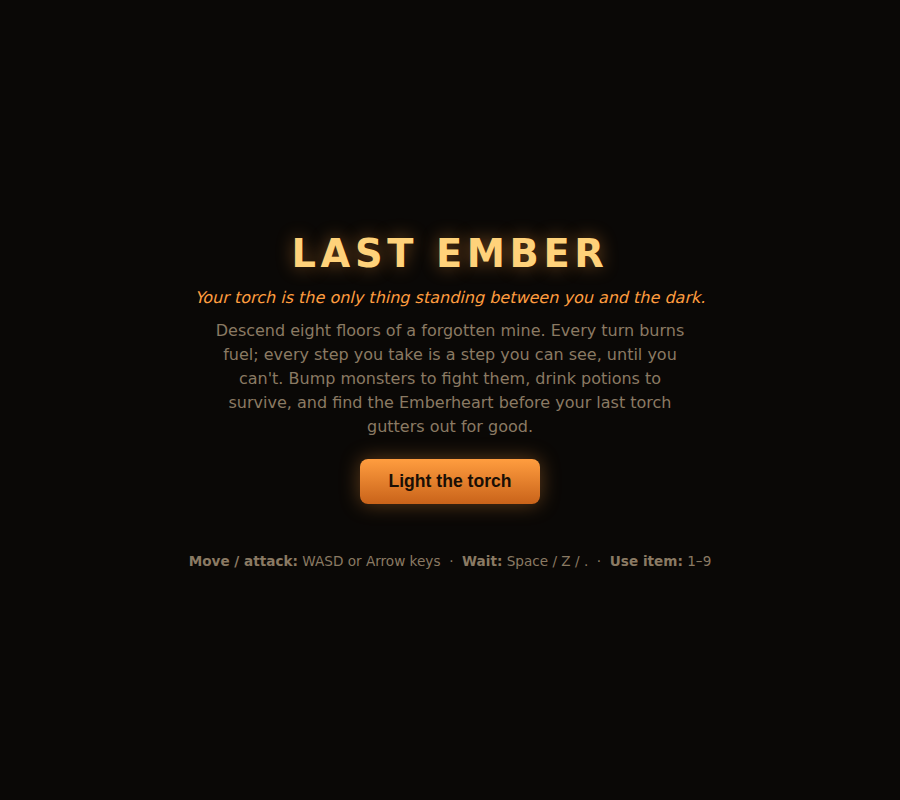
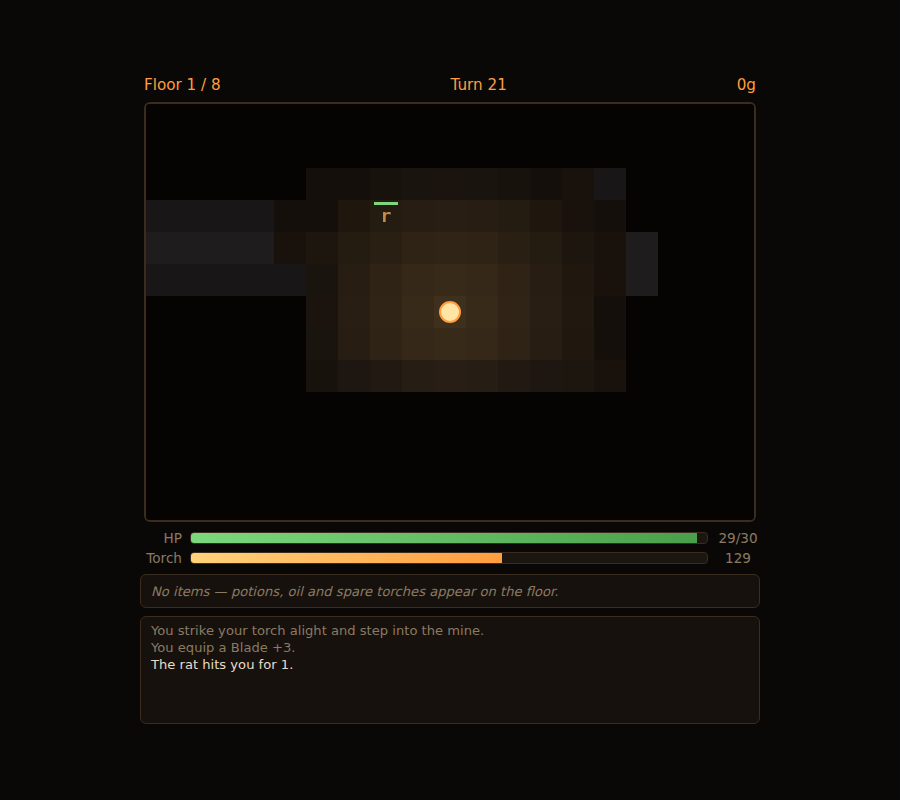

# Last Ember

A turn-based roguelike dungeon crawl. Your only light source is a torch that
**burns down every turn you carry it** — how far you can see is a resource
you spend, not a fixed camera setting. Bump into monsters to fight them,
drink potions to survive, and find the Emberheart eight floors down before
your last torch gutters out for good. Permadeath: die, and the run is over.

| Title | Deep in a run |
|:---:|:---:|
|  |  |

## How to run

```bash
cd showcase/apps/last-ember
python3 -m http.server 8080
# open http://localhost:8080
```

ES modules require an HTTP server — opening `index.html` via `file://` will not work.

## How to play

| Input | Action |
|---|---|
| `WASD` / arrow keys | Move one tile — walking into a monster attacks it instead |
| `Space` / `Z` / `.` | Wait one turn in place |
| `1`–`9` | Use the inventory item in that slot |
| On-screen d-pad | Same moves, for touch devices |

Nothing in the dungeon moves until you do — every keypress is exactly one
turn, for you and for everything else in the mine.

- **The torch** drains 1 fuel per turn. Your light radius shrinks as fuel
  drops (6 tiles → 4 → 2 → 1, adjacent-only once it's out). Oil flasks
  top it up; a spare torch swaps in a fresh one.
- **Combat** is bump-to-attack — no miss chance, so a bad fight is always a
  decision you made, not a bad roll.
- **Potions** heal or permanently boost your power; **weapons/armor**
  auto-equip if they beat what you're carrying; **gold** is score.
- **Stairs** (`>`) take you to the next floor the moment you step on them.
  Floor 8 has no stairs — it has the **Emberheart**, guarded by the Warden.
- Die at any point and the run ends. Your deepest floor and win count are
  the only things that persist (`localStorage`) — the point is getting
  better at the run itself, not grinding a save file.

## Key parameters

| Constant (`src/constants.js`) | Default | Meaning |
|---|---|---|
| `FUEL_HIGH` / `FUEL_MED` | 60 / 25 | Fuel thresholds that shrink the light radius |
| `MAX_FLOOR` | 8 | Floors to clear; floor 8 holds the Emberheart |
| `INVENTORY_CAP` | 9 | Consumable slots (weapons/armor auto-equip, no slot needed) |
| `DUNGEON_W` / `DUNGEON_H` | 60 × 34 | Per-floor grid size |

Monster stats and spawn tables live in `src/entities.js`
(`MONSTER_TYPES`); item effects in `src/items.js`.

## Architecture

- `src/dungeon.js` — procedural floor generation: random non-overlapping
  rooms connected by L-shaped corridors, a BFS distance field to place the
  stairs (or the Emberheart, on floor 8) at the farthest reachable tile from
  the player's start, and monster/item spawning on the leftover floor tiles.
- `src/fov.js` — field of view via per-tile Bresenham raycasting within the
  current light radius (simpler and just as fast as recursive shadowcasting
  at this grid size), plus a shared line-of-sight check monster AI uses to
  decide when they spot the player.
- `src/entities.js` — monster stat table and depth-scaled instantiation,
  player stats, and the shared damage formula.
- `src/items.js` — potion/oil/torch/weapon/armor/gold definitions, pickup
  rules (auto-equip gear, cap consumables), and item-use effects.
- `src/game.js` — the turn engine: player move/attack/wait/use-item, torch
  fuel ticking with one-time low-fuel log messages, monster AI (wander +
  flee for rats, BFS chase for skeletons/ghouls/the Warden, erratic
  double-move for bats), floor transitions, win/death, and localStorage
  meta-stats.
- `src/renderer.js` — Canvas 2D tile rendering: camera follows the player,
  visible tiles get a warm brightness falloff from the light radius with a
  subtle flicker, remembered-but-unseen tiles render flat and desaturated
  (fog of war).
- `src/audio.js` — every sound effect synthesized at runtime via Web Audio
  (hit, death, pickup, refuel, low-fuel drone, stairs, win fanfare) — no
  audio files, matching the repo's established convention.
- `src/input.js`, `src/main.js` — keyboard + touch input, and the
  title/playing/dead/win state machine wiring the HUD to the game state.

## Dependencies

None. Vanilla JS, ES modules, Canvas 2D, Web Audio API.

See [PRD.md](PRD.md) for the full product spec.
