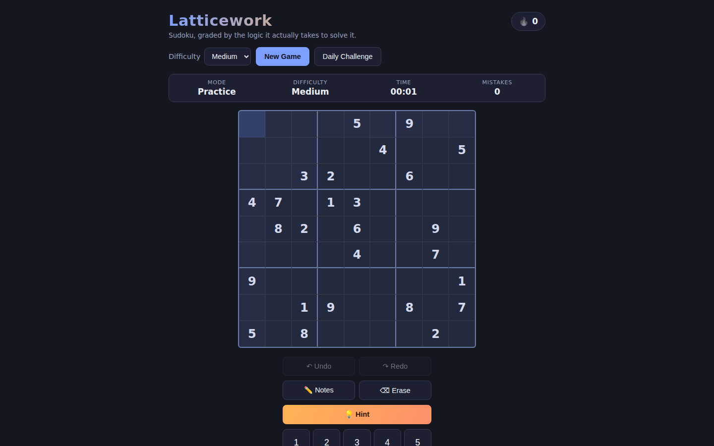
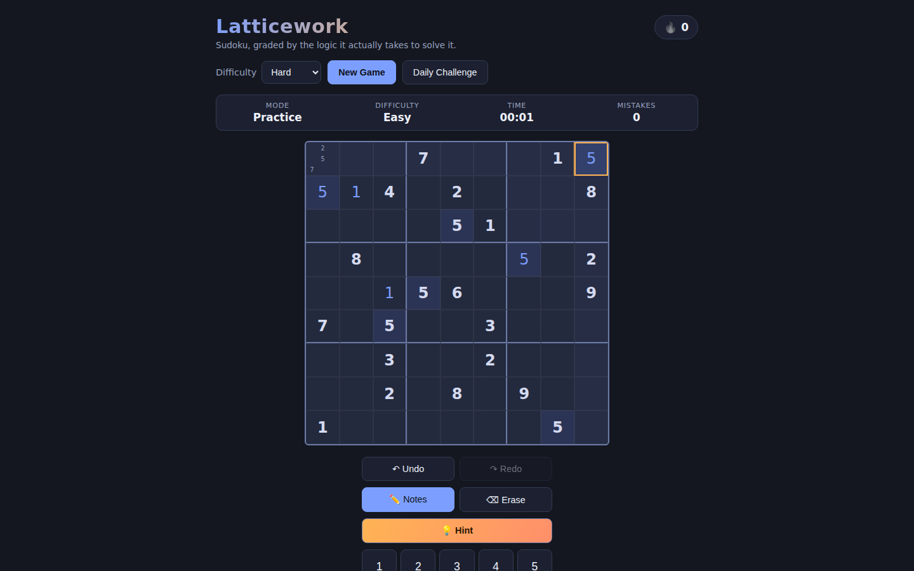

# Latticework

Sudoku, graded by the logic it actually takes to solve it — not by clue
count. Every puzzle is generated with a guaranteed unique solution and
labelled Easy/Medium/Hard/Expert by which human solving techniques (up
through X-Wing) are actually required to finish it. The hint button never
just fills in an answer: it runs the same technique search against your
current board and explains the one logical step it found.

| Early state | Settled state |
|:---:|:---:|
|  |  |

See [`PRD.md`](./PRD.md) for the full product spec.

## What it does

- **Technique-graded difficulty** — the generator carves clues out of a
  full grid and only accepts a removal if the puzzle still has exactly one
  solution *and* still solves within the target tier's technique set. An
  "Expert" puzzle genuinely needs an X-Wing somewhere, not just fewer clues.
- **Hint, not autosolve** — click Hint (or press `H`) to reveal the next
  cell the *logic* supports, with a plain-language reason (naked single,
  hidden single, pointing pair, box-line reduction, naked/hidden pairs and
  triples, or X-Wing). If no pure logical step exists, it says so instead of
  guessing.
- **Daily Challenge** — one Medium puzzle per calendar date, the same for
  everyone (deterministically seeded from the date). A streak counter
  tracks consecutive days completed, kept in `localStorage`.
- **Full play controls** — pencil-mark notes mode, undo/redo, a timer, a
  live mistake counter, keyboard support (arrow keys to move, `1`-`9` to
  fill, `N` for notes, `H` for hint, `U` for undo), and a number pad for
  touch.
- **Never loses your place** — the in-progress puzzle, notes, timer, and
  streak persist to `localStorage`, so a reload picks up exactly where you
  left off.

Puzzle generation runs in a Web Worker (Hard/Expert carving can take over a
second), so the UI never freezes while a new game is built.

## How to run

Static site, no build step:

```bash
cd showcase/apps/latticework
python -m http.server 8080
# open http://localhost:8080
```

## Key parameters

- **Difficulty** (`js/solver.js` `TIERS`) — four tiers, each defined by the
  hardest technique it may require: singles / pointing+box-line+naked pair
  / naked+hidden triple / X-Wing.
- **Clue floor** (`js/generator.js` `FLOOR_CLUES`, default 20) — the
  generator never carves a puzzle below this many clues, regardless of
  tier.
- **Carve attempts per tier** (`ATTEMPTS_FOR_TIER`) — how many removal
  orders are tried on the same solved grid before settling for the hardest
  one found; higher for rarer tiers (Expert tries the most).
- **Daily tier** (`main.js` `DAILY_TIER`) — fixed at Medium so the daily
  puzzle stays approachable for everyone.

## Dependencies

None — vanilla JS ES modules, no CDN libraries, works fully offline.
