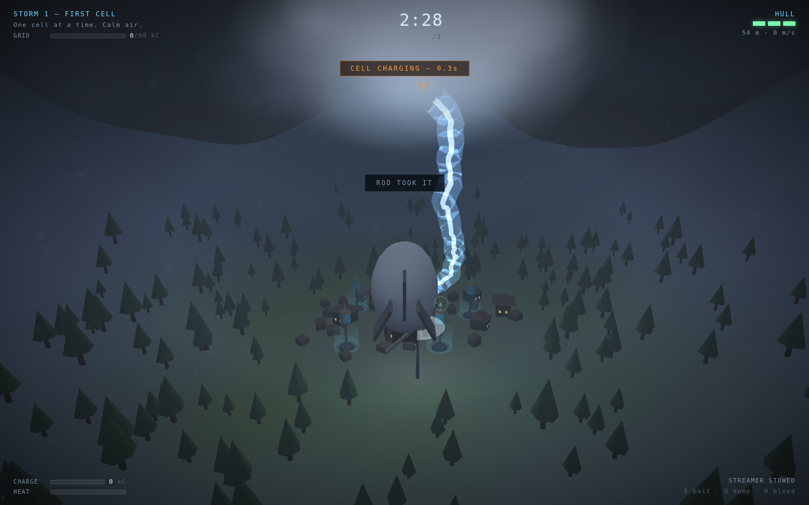
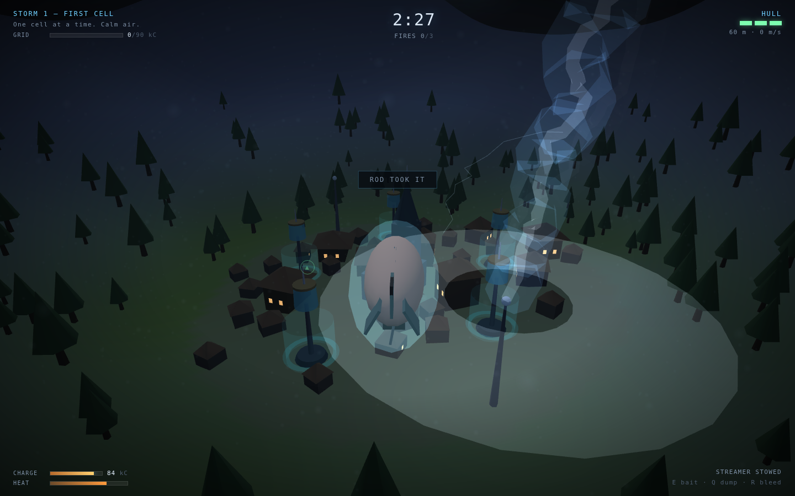
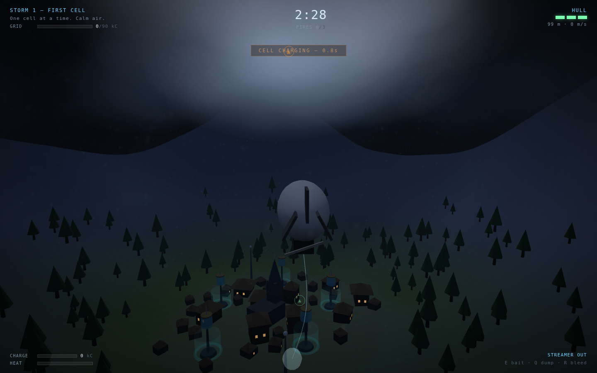
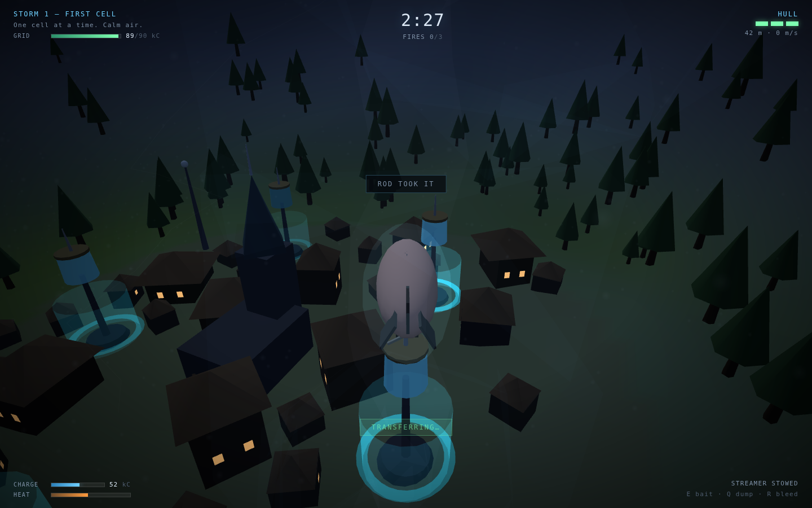

# Leyden

A 3D storm-flying game where **lightning is the resource, not the enemy**. You fly an
airship into a thundercloud, deliberately make yourself the most attractive thing in
the sky, take the strike on your own hull, and run the charge down to the town's
capacitor jars before the heat cooks you.

| The strike | Carrying it home |
|:---:|:---:|
|  |  |

| Baiting a charging cell | Delivering into a jar |
|:---:|:---:|
|  |  |

## The idea

You have no weapon and nothing to shoot. The only verb is **bait**: hold `E` to drop a
conductive streamer, which multiplies how attractive you are to the next bolt by about
six. The threat and the reward are the same object, and the whole game is deciding how
much of it to invite onto yourself.

Every bolt is grown, not scripted. A leader starts at the firing cell and walks
downward one 4.6 m step at a time; at each step it samples fourteen candidate
directions, scores each by the local field potential, and picks one with probability
proportional to the normalised gradient raised to `eta`. Every object in the valley —
the spire, the rods, the powder mill, the five jars, and you — contributes to that
field. Raising your own attractiveness bends the distribution; it never guarantees the
hit. Two runs of the same storm produce different paths and different victims.

Measured attachment odds, hovering under a live cell at 118 m:

| Situation | Bolt attaches to you |
|---|---|
| Streamer stowed, empty, 45 m off the cell | 8% |
| Streamer stowed, empty, directly under it | 32% |
| **Streamer out**, empty, 45 m off | 37% |
| **Streamer out**, empty, directly under it | 78% |
| **Streamer out**, already carrying 60 kC | 82% |
| Stowed, carrying 60 kC, down at delivery height | 3% |

That last row is the shape of the game: you cannot be near the charge and near the
delivery point at the same time.

## Running it

```bash
cd showcase/apps/leyden
python3 -m http.server 8080
# open http://localhost:8080
```

No build step, no npm install, no network. Three.js r163 is vendored in `vendor/`.
ES modules need a real HTTP server — `file://` will not work.

## Controls

| Input | Effect |
|---|---|
| Mouse | Look. The ship flies where the camera points. |
| `W` `A` `S` `D` | Prop thrust — fore/aft is stronger than lateral |
| `Space` / `Shift` | Trim up / vent down. Deliberately laggy: you cannot dive out of a bolt's way. |
| `E` (hold) | Drop the streamer — the bait |
| `Q` (hold) | Dump charge into a jar you are close enough to |
| `R` (hold) | Bleed charge to the air and lose it |
| `M` / `Esc` | Mute / pause |

Touch devices get a virtual stick, a look area on the right half of the screen, and
BAIT / DUMP / climb / descend buttons.

## Rules

- **Charge** fills only from a direct hit (52–72 kC). Cap is 100.
- **Heat** rises in proportion to what you are carrying, so a full hull is a ~12 second
  fuse. Past 100 you lose a hull point every 1.4 s until you shed charge.
- **Hull** is 3 points. Also lost by taking a second strike while already above ~68%
  charge — the arrestor only copes with one.
- **Delivering** needs you within 16 m of a jar horizontally and below 58 m altitude,
  holding `Q`. Transfer runs at 30 kC/s and each jar holds 120.
- **Fires** start when a bolt finds a hazard building. They burn out on their own after
  ~42 s, can spread once to a neighbour within 26 m, and are doused by rain columns.
  Three burning at once ends the run.
- A bolt that hits a **jar** directly gives the town 16 kC — the slow, safe way to play.
  A bolt that hits the **spire or a rod** is free protection and does nothing.

## Storms

| # | Name | Quota | Clock | What's new |
|---|---|---|---|---|
| 1 | First Cell | 90 kC | 150 s | One cell at a time, calm air, predictable bolts |
| 2 | Crosswind | 150 kC | 165 s | Steady shear — every hover is a correction |
| 3 | Squall Line | 210 kC | 180 s | Rain columns drain your charge and douse fires |
| 4 | Anvil | 280 kC | 195 s | Two cells fire together, branchier and less predictable |
| 5 | Supercell | 380 kC | 210 s | Fast cadence, wandering bolts, cells drifting over the town |

Score is delivered charge, plus 12 per second left on the clock, plus 250 for a storm
with no fires and 400 for one finished with a full hull. Best run persists in
`localStorage` under `leyden.best`.

## How it's built

| File | Does |
|---|---|
| `src/storm.js` | Cloud cells, the dielectric-breakdown leader walk, bolt geometry and the two-stage leader/return-stroke animation, rain columns, wind |
| `src/world.js` | Valley heightfield, town, capacitor jars, hazards and fire spread, and the attractiveness field every bolt is scored against |
| `src/player.js` | Airship flight model, charge/heat/hull, streamer and corona |
| `src/main.js` | Game loop, storm state machine, delivery link and transfer arc, chase camera |
| `src/audio.js` | Wind, corona crackle, cell hum, and thunder — all synthesised, zero audio files |
| `src/scene.js` | Renderer, night lighting, the flash a return stroke throws, sky and rain |
| `src/hud.js`, `src/input.js`, `src/levels.js`, `src/rng.js` | HUD, keyboard/touch, storm tuning, seeded RNG |

Thunder is delayed by `distance / 340` seconds, which doubles as the game's range cue:
a bang you hear a beat after the flash was never going to hit you.

See [PRD.md](PRD.md) for the design document this was built from.
