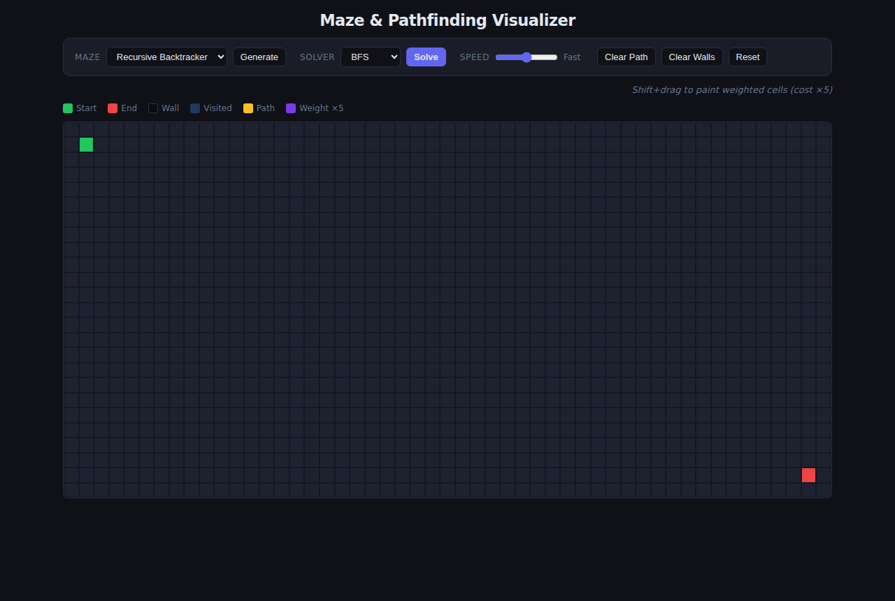
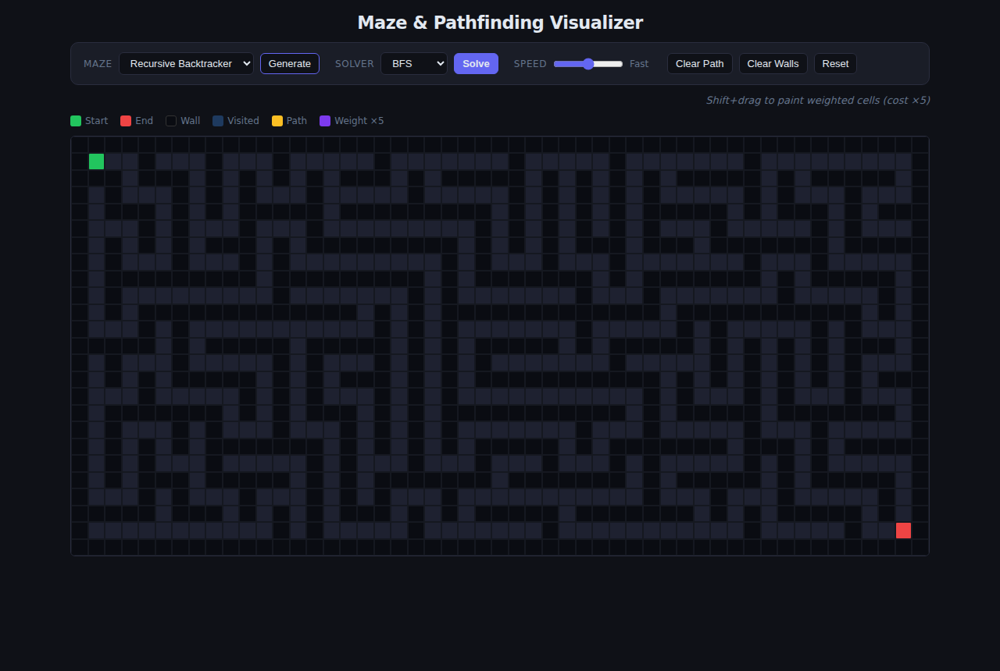
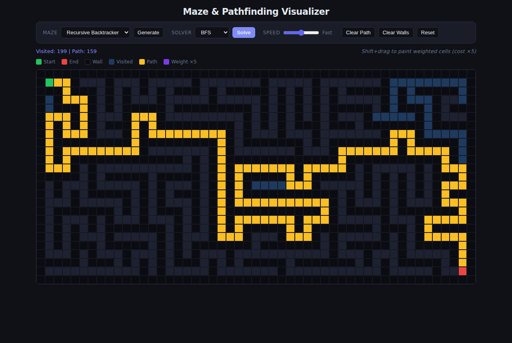

# Maze & Pathfinding Visualizer

Interactive grid where you generate mazes and watch pathfinding algorithms explore them step by step.

## Screenshots

| Blank grid | Generated maze | BFS solved |
|---|---|---|
|  |  |  |

## How to run

```bash
cd showcase/apps/maze-pathfinder
python -m http.server 8080
# open http://localhost:8080
```

ES modules require an HTTP server — `file://` URLs will not work.

## Features

### Maze generation
- **Recursive Backtracker** — long winding corridors via DFS
- **Prim's Algorithm** — uniform texture with many short dead-ends

### Pathfinding
- **BFS** — shortest path (unweighted), floods outward in even waves
- **Dijkstra** — respects cell weights, finds optimal weighted path
- **A\*** — Dijkstra + Manhattan heuristic, explores far fewer cells

### Interaction
- **Click/drag** to toggle walls
- **Shift+drag** to paint weighted cells (cost ×5) — makes Dijkstra and A* diverge from BFS
- **Drag** the green start or red end marker anywhere
- Speed slider controls animation delay
- Stats show cells visited and final path length

## Stack

Vanilla HTML/CSS/JS with ES modules. No build step.

| File | Purpose |
|------|---------|
| `grid.js` | Grid model, cell state, neighbor lookup |
| `pathfinders.js` | BFS, Dijkstra, A* — pure functions returning `{ visitedOrder, path }` |
| `generators.js` | Recursive backtracker, Prim's |
| `animator.js` | Replays a trace onto the DOM at a given speed |
| `main.js` | Controls, DOM wiring, interaction |
